<p align="center">
  
  
  
</p>

<h1 align="center">CogniMesh</h1>

<p align="center">
  <strong>Multimodal Cognitive Data Mesh &amp; Marketplace</strong><br/>
  Zero-code pipelines · Proof-gated publication · Agentic AI · Fine-grained governance
</p>

<p align="center">
  <a href="docs/drag-drop-pipeline-flow.md">Drag-and-drop E2E</a> ·
  <a href="docs/data-contract-spec.md">Data Contract</a> ·
  <a href="infra/terraform/README.md">Terraform</a> ·
  <a href="https://github.com/vaquarkhan/aws-serverless-datamesh-framework/blob/main/docs/vaquar-pattern.md">Vaquar Pattern</a>
</p>

---

## What is CogniMesh?

CogniMesh is an end-to-end data platform where **non-technical users** design pipelines in a drag-and-drop portal, and the platform automatically generates **`DataContract.yaml`**, enforces governance, compiles **AWS Step Functions**, registers products in a **marketplace**, and optionally deploys to AWS.

It combines:

| Capability | Technology |
|------------|------------|
| Zero-code design | React + React Flow portal |
| Declarative contracts | `cognimesh.io/v1` DataContract schema |
| Security | Amazon Cognito (admin-only users, no self-registration) |
| Governance | Vaquar-inspired integrity gate + Lake Formation |
| Structured writes | Vaquar [PVDM](https://github.com/vaquarkhan/aws-serverless-datamesh-framework/blob/main/docs/vaquar-pattern.md) via `serverless-data-mesh` bridge |
| Cognitive writes | EKS transactional runtime (epoch / frontier / compensation) |
| Infrastructure | Production Terraform (VPC, S3, Cognito, SFN, DynamoDB, LF) |

---

## System architecture (four planes)

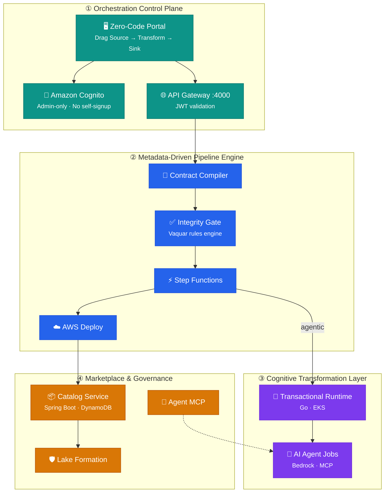

---

## End-to-end journey (implemented)

From login to marketplace in one flow:

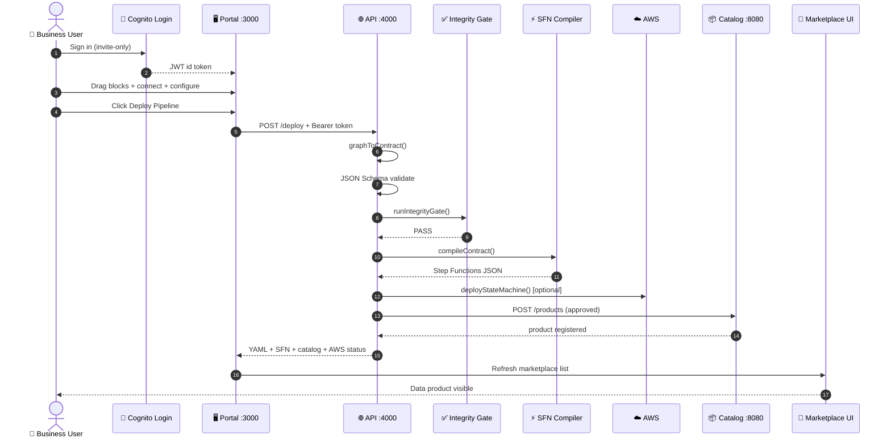

---

## Zero-code portal (drag-and-drop)

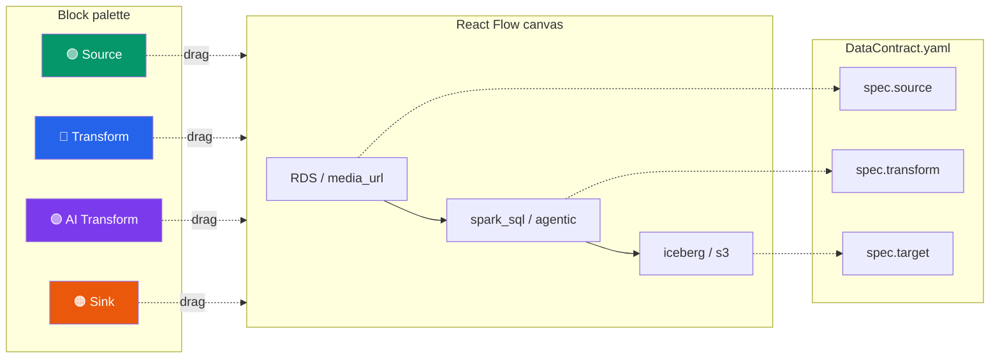

| Portal block | Contract field | Values |
|--------------|----------------|--------|
| Source | `spec.source` | `rds`, `mysql`, `s3`, `kafka`, `media_url`, `api` |
| Transform | `spec.transform` | `spark_sql`, `glue_etl`, `agentic`, `passthrough` |
| AI Transform | `spec.transform.agentic` | Bedrock model, prompt, compensation handler |
| Sink | `spec.target` | `s3`, `iceberg`, `redshift`, `delta` |

Deep dive: [docs/drag-drop-pipeline-flow.md](docs/drag-drop-pipeline-flow.md)

---

## Security: Cognito (no self-registration)

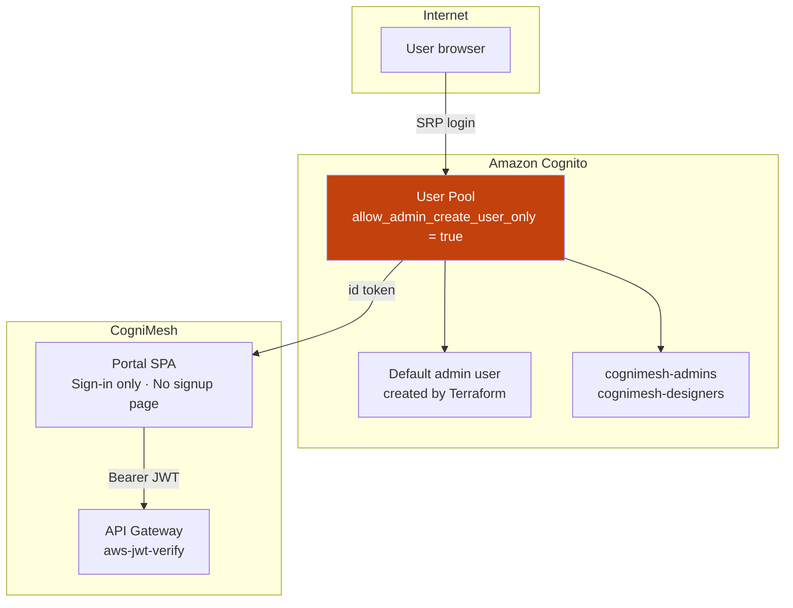

| Security control | Implementation |
|------------------|----------------|
| Self-registration | **Disabled** (`allow_admin_create_user_only`) |
| Default user | Terraform creates admin with random initial password |
| Password policy | 12+ chars, upper, lower, number, symbol |
| MFA | Optional TOTP |
| API protection | JWT required on `/api/v1/pipelines/*` |
| Local dev | `AUTH_DISABLED=true` in `.env` |

---

## Vaquar Pattern (PVDM) integration

CogniMesh aligns with the [Vaquar Pattern](https://github.com/vaquarkhan/aws-serverless-datamesh-framework/blob/main/docs/vaquar-pattern.md): **Physical → Verify → Durable → Metadata**, with invariant `commit_metadata ⟹ VRP = PASS`.

### Building block stack

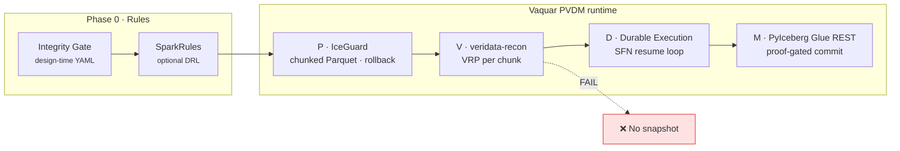

| Building block | Role | CogniMesh status |
|----------------|------|------------------|
| **Integrity gate** | Design-time rules (SparkRules-style YAML) | ✅ Implemented (`rules/default-policies.yaml`) |
| **SparkRules** | Runtime DRL before physical write | ✅ `services/pvdm-runtime/` + `rules/default-policies.yaml` |
| **IceGuard** | Chunked Parquet, timeout rollback, S3 resume | ✅ `services/pvdm-runtime/` IceGuardWriter |
| **veridata-recon** | VRP multiset proof per chunk | ✅ `services/pvdm-runtime/` generateVRP |
| **AWS Durable Execution** | 15-min Lambda segments → 90+ min | ✅ `lib/vaquar/pvdm-sfn.js` SFN resume loop |
| **PyIceberg Glue REST** | SigV4 metadata commit after VRP PASS | ✅ `validateThenCommit` in pvdm-runtime |
| **Integrity gate Lambda** | Runtime gate in Step Functions | ✅ Packaged + Terraform module |

Bridge path:

```
DataContract.yaml  →  mesh.yaml compiler  →  serverless-data-mesh apply  →  AWS Lambda + SFN
```

---

## Dual pipeline model

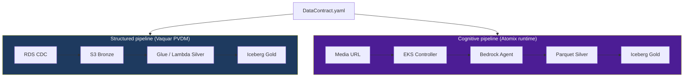

### Structured: CDC → Iceberg

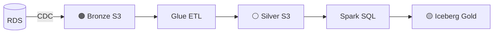

Example: [`contracts/examples/structured-cdc-pipeline.yaml`](contracts/examples/structured-cdc-pipeline.yaml)

### Cognitive: Media → Agent → Parquet

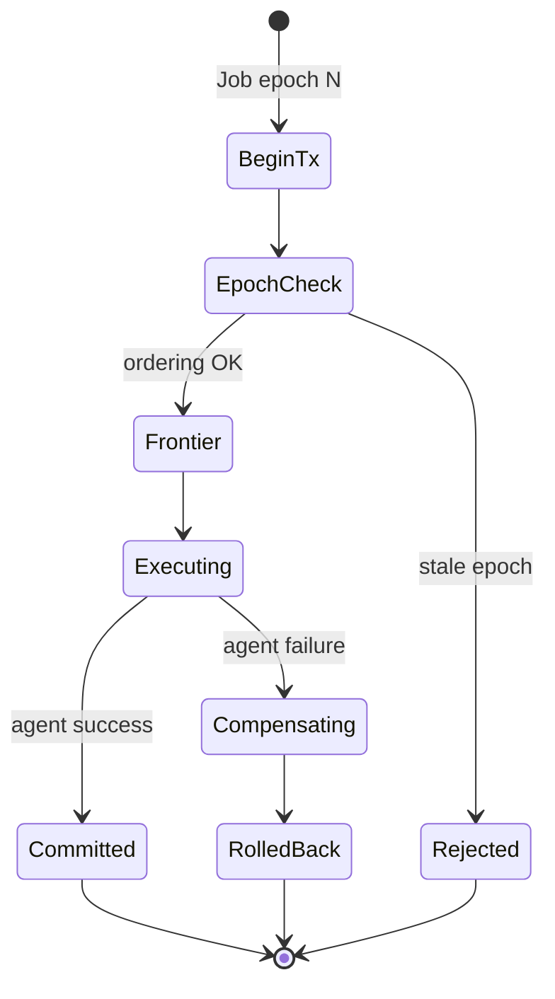

| Concept | Purpose |
|---------|---------|
| **Epoch** | Monotonic sequence; rejects duplicate commits |
| **Frontier** | Strict ordering (N before N+1) |
| **Compensation** | Rollback on agent failure |

Example: [`contracts/examples/cognitive-media-pipeline.yaml`](contracts/examples/cognitive-media-pipeline.yaml)  
Runtime: [`services/cognitive-runtime/`](services/cognitive-runtime/)

---

## Marketplace & governance

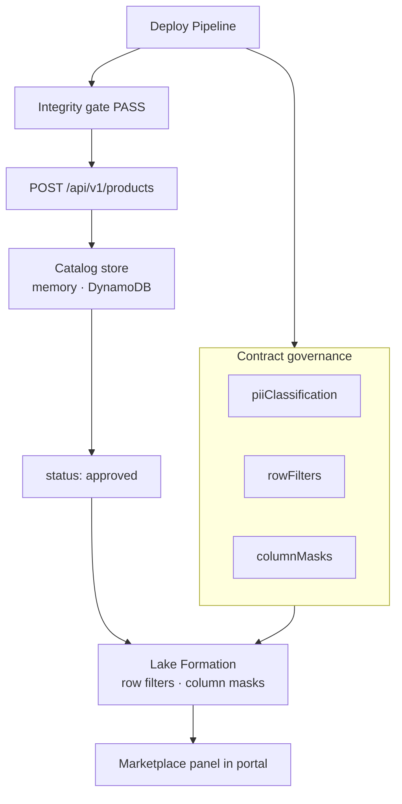

---

## AWS infrastructure (Terraform)

Production-grade IaC aligned with [aws-serverless-datamesh-framework](https://github.com/vaquarkhan/aws-serverless-datamesh-framework):

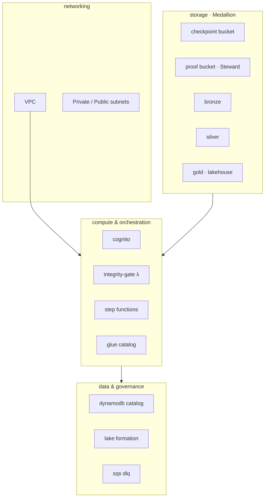

| Module | Purpose |
|--------|---------|
| `cognito` | Admin-only user pool + default user |
| `storage` | Checkpoint, proof, bronze/silver/gold (encrypted) |
| `iam` | Orchestrator + domain writer (LF-aware) |
| `glue` | Glue Data Catalog database |
| `dynamodb` | Marketplace product registry |
| `orchestration` | SFN with integrity-gate-first ASL |
| `governance` | Lake Formation consumer SELECT |
| `messaging` | SQS DLQ |
| `lambda` | Integrity gate + domain writer functions |
| `eks` | EKS cluster for cognitive runtime |
| `portal-cdn` | S3 + CloudFront static portal hosting |

Details: [infra/terraform/README.md](infra/terraform/README.md)

---

## Feature matrix (agreed & implemented)

| Feature | Status | Location |
|---------|--------|----------|
| Zero-code drag-and-drop portal | ✅ | `portal/` |
| Block palette + properties panel | ✅ | `portal/src/components/` |
| DataContract schema + validator | ✅ | `schemas/`, `scripts/validate-contract.js` |
| Graph → contract compiler | ✅ | `lib/contract-builder/` |
| Integrity gate (Vaquar rules) | ✅ | `lib/integrity-gate/`, `rules/` |
| Step Functions compiler | ✅ | `services/pipeline-engine/` |
| API gateway + JWT auth | ✅ | `services/api-gateway/` |
| Cognito login (no signup) | ✅ | `portal/src/auth/`, `infra/terraform/modules/cognito/` |
| Catalog + marketplace UI | ✅ | `services/catalog/`, `MarketplacePanel.jsx` |
| DynamoDB catalog store | ✅ | `DynamoProductStore.java` |
| AWS Step Functions deploy | ✅ | `lib/aws/stepfunctions-deploy.js` |
| Cognitive transactional runtime | ✅ | `services/cognitive-runtime/` |
| Agent MCP (Bedrock) | ✅ | `services/agent-mcp/` |
| Integrity gate Lambda | ✅ | `services/lambda/integrity-gate/` |
| Domain writer Lambda (PVDM) | ✅ | `services/lambda/domain-writer/` |
| Vaquar contract → mesh bridge | ✅ | `lib/vaquar/contract-to-mesh.js` |
| PVDM Step Functions (durable) | ✅ | `lib/vaquar/pvdm-sfn.js` |
| PVDM runtime (IceGuard/VRP) | ✅ | `services/pvdm-runtime/` |
| EKS cognitive cluster | ✅ | `infra/terraform/modules/eks/` |
| Portal CloudFront CDN | ✅ | `infra/terraform/modules/portal-cdn/` |
| Production Terraform | ✅ | `infra/terraform/` |
| CI integrity gate workflow | ✅ | `.github/workflows/integrity-gate.yml` |
| HTTP E2E tests | ✅ | `scripts/test-api-e2e.js` |
| Vaquar bridge tests | ✅ | `scripts/test-vaquar-bridge.js` |
| PVDM runtime tests | ✅ | `scripts/test-pvdm-runtime.js` |

---

## Repository layout

```
cognimesh/
├── portal/                    # Zero-code SPA (React + React Flow + Cognito)
├── services/
│   ├── api-gateway/           # JWT auth, preview, deploy, catalog proxy
│   ├── catalog/                 # Marketplace API (Spring Boot)
│   ├── pipeline-engine/         # Contract → Step Functions
│   ├── cognitive-runtime/       # Epoch / frontier / compensation (Go)
│   ├── agent-mcp/               # MCP server for Bedrock
│   └── lambda/integrity-gate/   # Runtime integrity gate
├── lib/
│   ├── contract-builder/      # Graph → contract → deploy orchestration
│   ├── integrity-gate/          # Vaquar-inspired rules engine
│   └── aws/                     # Step Functions deploy
├── schemas/                     # DataContract JSON Schema
├── contracts/examples/          # Sample pipelines
├── rules/                       # Integrity gate policies
├── infra/terraform/             # Production IaC
├── docs/                        # Architecture + specs
└── scripts/                     # Validators + E2E tests
```

---

## Quick start (full stack)

```bash
git clone <repo>
cd atomix
npm install
cp .env.example .env
npm start
```

| Service | URL |
|---------|-----|
| Portal | http://localhost:3000 |
| API | http://localhost:4000 |
| Catalog | http://localhost:8080 |

**Workflow:** Sign in → drag Source → Transform → Sink → connect edges → **Deploy Pipeline** → view YAML, Step Functions, marketplace.

---

## Tests

```bash
npm test              # Graph → contract → schema → compile → integrity gate
npm run test:api      # Full HTTP E2E (requires npm start)
npm run test:integrity-gate -- contracts/examples/structured-cdc-pipeline.yaml
```

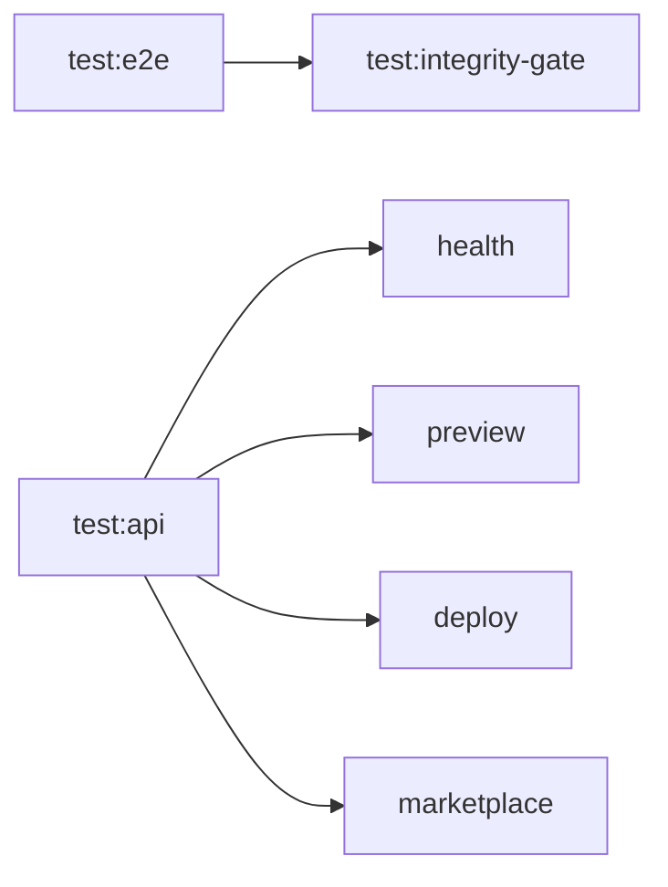

---

## AWS production deploy

```bash
# 1. Package integrity gate Lambda
npm run package:lambda

# 2. Terraform
cd infra/terraform/environments/prod
cp terraform.tfvars.example terraform.tfvars
# Edit bucket names + default_admin_email
terraform init && terraform apply

# 3. Retrieve Cognito admin password
terraform output -raw cognito_default_admin_initial_password
terraform output cognito_user_pool_id
terraform output cognito_client_id
```

**`.env` for production:**

```env
AUTH_DISABLED=false
COGNITO_USER_POOL_ID=us-east-1_xxxxx
COGNITO_CLIENT_ID=xxxxxxxx
AWS_DEPLOY_ENABLED=true
AWS_REGION=us-east-1
AWS_STEP_FUNCTIONS_ROLE_ARN=arn:aws:iam::ACCOUNT:role/cognimesh-prod-pipeline-orchestrator
```

**Catalog with DynamoDB:**

```yaml
# services/catalog/src/main/resources/application-prod.yml
cognimesh:
  catalog:
    storage: dynamodb
    table-name: cognimesh-prod-cognimesh-data-products
```

---

## Data contract

Every pipeline is declared in `DataContract.yaml` (`cognimesh.io/v1`):

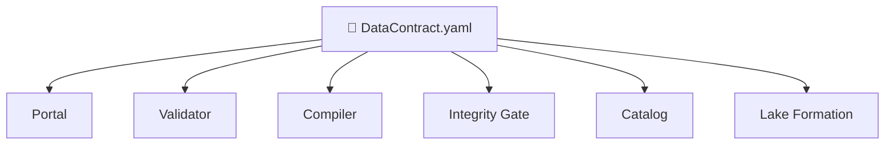

| Section | Contents |
|---------|----------|
| `metadata` | name, domain, version, owner, tags |
| `spec.execution` | `batch` / `stream`, schedule, SLA |
| `spec.source` | connection, CDC, schema |
| `spec.transform` | `spark_sql`, `agentic`, layers |
| `spec.target` | iceberg, S3 location, catalog |
| `spec.governance` | PII, row filters, column masks |

Spec: [docs/data-contract-spec.md](docs/data-contract-spec.md)

---

## CI pipeline

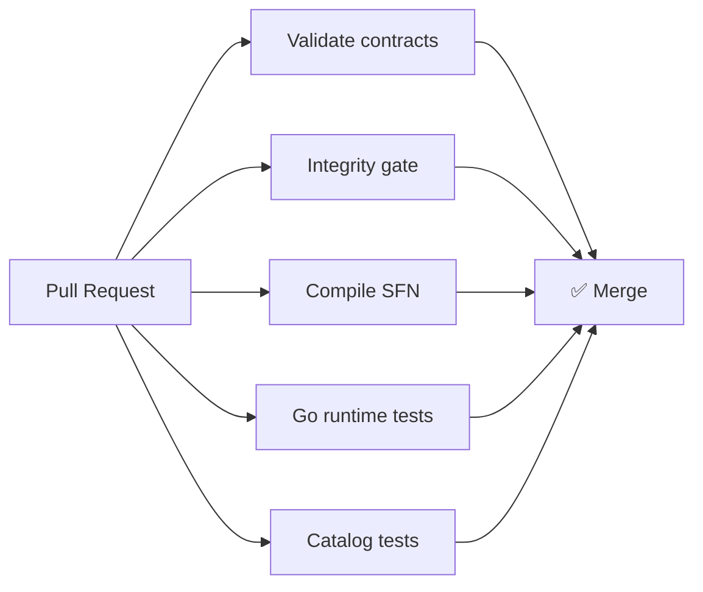

Workflow: [`.github/workflows/integrity-gate.yml`](.github/workflows/integrity-gate.yml)

---

## Documentation index

| Document | Description |
|----------|-------------|
| [docs/drag-drop-pipeline-flow.md](docs/drag-drop-pipeline-flow.md) | Portal → deploy E2E |
| [docs/architecture.md](docs/architecture.md) | Architecture deep-dive |
| [docs/data-contract-spec.md](docs/data-contract-spec.md) | Appendix A: YAML spec |
| [infra/terraform/README.md](infra/terraform/README.md) | IaC modules + Cognito |
| [Vaquar Pattern](https://github.com/vaquarkhan/aws-serverless-datamesh-framework/blob/main/docs/vaquar-pattern.md) | PVDM reference pattern |
| [Serverless Data Mesh](https://github.com/vaquarkhan/aws-serverless-datamesh-framework) | Reference AWS implementation |

---

## License

Proprietary. CogniMesh Platform Team.

<p align="center">
  <sub>Domain teams own the pipeline design. The mesh proves correctness before publication.</sub>
</p>
