<p align="center">
  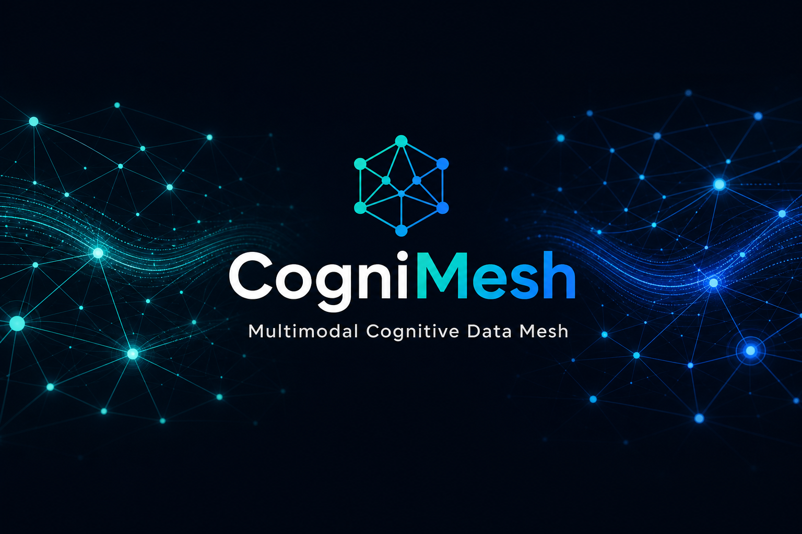
</p>

<p align="center">
  
  
  
  
</p>

<p align="center">
  <a href="https://pypi.org/project/cognimesh/"></a>
  <a href="https://pypi.org/project/cognimesh/"></a>
  <a href="https://github.com/vaquarkhan/CogniMesh/pkgs/container/cognimesh-api"></a>
  <a href="https://github.com/vaquarkhan/CogniMesh/actions/workflows/publish.yml"></a>
  <a href="docs/DISTRIBUTION.md#npm-nodejs"></a>
  <a href="docs/DISTRIBUTION.md#maven-java-catalog"></a>
  <a href="docs/DISTRIBUTION.md#go-cognitive-runtime"></a>
</p>

<p align="center">
  <strong>📦 Python SDK: install anytime from <a href="https://pypi.org/project/cognimesh/">PyPI</a></strong>
</p>

<p align="center">
  <code>pip install cognimesh</code>
  &nbsp;·&nbsp;
  <a href="https://pypi.org/project/cognimesh/#files">Download wheels</a>
  &nbsp;·&nbsp;
  <a href="https://pypi.org/project/cognimesh/">pypi.org/project/cognimesh</a>
</p>

<h1 align="center">CogniMesh</h1>

<p align="center">
  <strong>Multimodal Cognitive Data Mesh &amp; Marketplace</strong>
</p>

<p align="center">
  Zero-code pipelines · Proof-gated publication · Agentic AI · Fine-grained governance
</p>

---

## Start here (plain English)

**Version 1.0.0** - CogniMesh is a **control plane for trustworthy data products on AWS**. You design pipelines in a visual portal (no coding required to start), the platform checks your design, runs the pipeline, and **only publishes data to the marketplace when integrity checks pass**.

| If you are… | Read this first |
|-------------|-----------------|
| **C-suite / executive (CEO, CFO, CDO, CISO)** | **[Business guide - C-suite summary](docs/README-business-stewards.md#for-c-suite--executive-leadership)** (2 min) |
| **Business / product owner** | **[Business & steward guide](docs/README-business-stewards.md)** (plain language only) |
| **Data steward / governance** | **[Business & steward guide](docs/README-business-stewards.md)** - approvals, proof, marketplace, audit |
| **Everyone (repeat questions)** | **[FAQ](docs/FAQ.md)** - proof, PASS/FAIL, features, agents, ops |
| **Engineer / architect** | [At a glance](#at-a-glance), [Quick start](#quick-start), [Repository layout](#repository-layout), [Vaquar Pattern](docs/vaquar-pattern.md) |

**The problem:** Teams ship dashboards and datasets that *look* fine but nobody can prove the numbers match the source. When something breaks, you discover it in production-not at publish time.

**What CogniMesh does:** You drag blocks on a canvas (sources → transforms → outputs). CogniMesh turns that into a governed **data contract**, runs it on AWS, and attaches a **cryptographic proof** that source and published data match-before the product goes live in the **marketplace**.

**In one sentence:** *Design visually → prove before publish → operate with lineage and access control → let consumers discover governed data products.*

<p align="center">
  <a href="docs/README-business-stewards.md"><strong>📘 Business &amp; data steward guide</strong></a>
  &nbsp;·&nbsp;
  <a href="docs/README-business-stewards.md#for-c-suite--executive-leadership"><strong>👔 C-suite summary (2 min)</strong></a>
  &nbsp;·&nbsp; plain language · no code required
</p>

<details>
<summary><strong>Key terms (non-technical)</strong></summary>

| Term | Plain meaning |
|------|----------------|
| **Data product** | A governed dataset (or API) your team owns and others can subscribe to |
| **Marketplace** | Catalog where consumers find and request access to data products |
| **Proof / Vaquar Pattern** | Evidence that published data was not silently changed or dropped in the pipeline |
| **Agent** | An AI assistant (e.g. Bedrock) that reads your data and takes actions-with guardrails |
| **Data contract** | Machine-readable rules for what the pipeline must do (generated from your canvas) |

</details>

> **Technical documentation** - install commands, APIs, Terraform, and runtime details begin after the platform demos below.

---

### Platform features (how it works)

<p align="center">
  <a href="docs/assets/cognimesh-features-demo.mp4">
    
  </a>
  <br />
  <em>Sidebar + header panels · AWS review · ops · lineage · marketplace · agent tools</em>
</p>

### Pipeline creation (end-to-end)

<p align="center">
  <a href="docs/assets/cognimesh-pipeline-demo.mp4">
    
  </a>
  <br />
  <em>Pattern library → load pattern → AWS review → fix all → preview → deploy → marketplace</em>
</p>

### Agent creation (end-to-end)

<p align="center">
  <a href="docs/assets/cognimesh-agent-demo.mp4">
    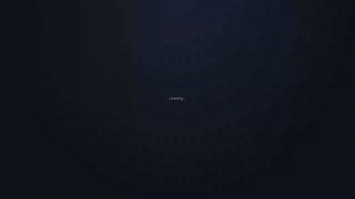
  </a>
  <br />
  <em>Templates &amp; blocks → load agent → guardrail review → preview → export → deploy</em>
  <br />
  <code>npm run docs:demo</code> to regenerate all three · portal build + Playwright · optional ffmpeg for MP4/GIF
</p>

<p align="center">
  <a href="docs/README-business-stewards.md"><b>📘 Business &amp; steward guide</b></a> ·
  <a href="docs/FAQ.md"><b>❓ FAQ</b></a> ·
  <a href="docs/vaquar-pattern.md"><b>⭐ The Vaquar Pattern</b></a> ·
  <a href="docs/vaquar-pattern.md#vrp-features"><b>VRP features</b></a> ·
  <a href="docs/PIPELINE_E2E_DIAGRAM.md"><b>📐 Pipeline E2E Diagram</b></a> ·
  <a href="docs/drag-drop-pipeline-flow.md">Drag-and-drop E2E</a> ·
  <a href="docs/data-contract-spec.md">Data Contract</a> ·
  <a href="infra/terraform/README.md">Terraform</a> ·
  <a href="docs/architecture.md">Architecture</a>
</p>

---

## At a glance

> **Business summary:** Visual designer → governance checks → AWS execution → proof before publish → marketplace. No YAML required to start.

CogniMesh lets **business users** design data pipelines in a visual portal. The platform generates **`DataContract.yaml`**, runs governance checks, compiles **AWS Step Functions**, registers products in a **marketplace**, and deploys to AWS when enabled.

Built on **[The Vaquar Pattern](docs/vaquar-pattern.md)** by [Vaquarkhan](https://github.com/vaquarkhan): structured pipelines use **PVDM** (Physical → Verify → Durable → Metadata); cognitive pipelines use an **EKS transactional runtime** with Bedrock agents.

<table>
<tr>
<td width="50%">

**Structured pipelines**
- RDS CDC → Bronze → Silver → Iceberg Gold
- Vaquar PVDM + VRP proof
- Lambda + Step Functions

</td>
<td width="50%">

**Cognitive pipelines**
- Media URL → Bedrock agent
- Epoch / frontier / compensation
- EKS + Agent MCP

</td>
</tr>
</table>

---

## Why CogniMesh: everything in one place

**Design data products visually. Prove them before publish. Operate them in production. Let consumers discover and access governed datasets on AWS, with contracts instead of tribal knowledge.**

CogniMesh is a full **data mesh control plane**: zero-code portal, proof-gated writes ([Vaquar Pattern](docs/vaquar-pattern.md)), marketplace, and an **Operations** layer for live ops, cost, lineage, and steward workflows. **v1.0.0** ships on [Docker (GHCR)](https://github.com/vaquarkhan/CogniMesh/pkgs/container/cognimesh-api), [PyPI](https://pypi.org/project/cognimesh/), and Terraform.

### Design & build (zero code)

| You get | What it means |
|---------|----------------|
| **Visual pipeline designer** | Drag Source → Transform → Sink on React Flow. No YAML hand-editing required. |
| **28+ architecture patterns** | Ready-made pipeline blueprints (see [what this means](#what-28-patterns-means-no-code-required)) |
| **AWS-native blocks** | Glue, Kinesis, MSK, DMS, Firehose, Step Functions Parallel/Choice/Map |
| **AI Pipeline Designer** | Describe a pipeline in English → auto-load pattern + blocks + explanation |
| **Agent Builder** | Bedrock AgentCore canvas: templates, guardrails, KB, tools, manifest export |
| **AI Agent Generator** | Natural language → agent graph in Agent Builder |
| **AWS Design Review** | Live security/architecture score before deploy |
| **DataContract compiler** | Graph → `cognimesh.io/v1` YAML + Step Functions ASL + Vaquar mesh artifacts |
| **Business rules editor** | DQ rules on transform blocks → Spark SQL expressions |
| **Undo / redo · toasts · mobile-aware** | Production-grade portal UX |

→ [Pattern catalog](docs/PORTAL_UI.md) · [26 pipeline + 8 agent tutorials](docs/tutorials/README.md) · [Developer customization](docs/developer/README.md)

### What “28+ patterns” means (no code required)

**Patterns are not separate products.** They are **ready-made pipeline canvases** in the portal: a full diagram of sources, transforms, sinks, and governance blocks already wired for a well-known data architecture or industry use case. You **do not write code to start**: you pick a pattern, then adjust names, connections, and settings in the UI.

| Question | Answer |
|----------|--------|
| **What is a pattern?** | A pre-built visual pipeline (React Flow canvas) with realistic AWS services labeled on each block: Glue, Kinesis, RDS, Iceberg, Step Functions, Bedrock, and so on. |
| **Do I need to code?** | **No** to get started. Open **Architectures → Use pattern** and the canvas loads. Change block properties, SQL, schedules, and domains in forms. Code is optional later (Python SDK, custom Spark, or Terraform from exported artifacts). |
| **What does “28+” count?** | **27 entries** in the pattern library today: **26 fully wired examples** across architecture styles and industries, plus a **blank canvas**. The “+” reflects ongoing additions and the separate **8 agent tutorials** in Agent Builder (agents are not the same as data-pipeline patterns). |
| **What do they cover?** | End-to-end **data mesh**, **lake / lakehouse**, **Kappa & Lambda λ**, **streaming**, **medallion** bronze→silver→gold, **CDC & batch ingest**, **finance & healthcare**, **retail clickstream**, **fraud & data quality**, **GenAI RAG & media enrichment**, **IoT**, **SCD2**, **feature store**, and **multi-source Step Functions** workflows. |
| **What happens after I pick one?** | Customize blocks → run **AWS Design Review** → compile to **DataContract YAML** + Step Functions → deploy with **Vaquar proof** (PVDM/VRP) before gold commits. Same portal flow for every pattern. |

**By category (all in the Architectures tab):**

| Category | What you get (plain English) |
|----------|------------------------------|
| **Data Mesh** | Single-domain data product with catalog + Lake Formation share; multi-domain **Customer 360** with parallel domains merging to gold. |
| **Data Lake** | Classic **raw → curated → consumption** zone layout on S3. |
| **Lakehouse** | **Iceberg medallion** with ACID gold tables. |
| **Kappa** | **Stream-only** path: Kinesis → Flink → Iceberg (no batch layer). |
| **Lambda λ** | **Batch + speed** layers in parallel, merged for serving (e.g. Athena). |
| **Streaming** | **Kinesis → Firehose → analytics**; **MSK → Glue streaming → lakehouse**. |
| **ETL / ELT** | **Glue multi-stage factory**; **load-first ELT into Redshift** marts. |
| **Medallion** | Canonical **bronze → silver → gold** lakehouse stack. |
| **Structured starters** | **RDS CDC → Iceberg** (Vaquar); **S3 files → Iceberg**; **Kafka → Iceberg**; **MySQL → Redshift**; **multi-source parallel → choice** routing. |
| **Finance** | **Double-entry payment ledger** with strict audit / SOX-style quality. |
| **Healthcare** | **FHIR clinical resources → HIPAA-aware gold** tables. |
| **Retail** | **Clickstream → real-time funnel / dashboard** feeds. |
| **Cognitive** | **Media URL → Bedrock enrichment → gold**; **documents → RAG knowledge base**. |
| **Compliance & analytics** | **Fraud scoring** (rules + ML in parallel); **DQ quarantine lane**; **IoT sensor fleet**; **SCD Type 2** customer dimension; **ML feature store** pipeline. |
| **Blank canvas** | Empty designer when you already know your layout. |

For screenshots and filters, see [Zero-code portal](#zero-code-portal) below. For step-by-step walkthroughs, see **[docs/tutorials/README.md](docs/tutorials/README.md)** (26 pipeline lessons + 8 agent lessons).

### Trust & proof (Vaquar Pattern)

| You get | What it means |
|---------|----------------|
| **Integrity gate** | Design-time policy checks before anything hits AWS |
| **PVDM runtime** | Physical → Verify → Durable → Metadata. Proof before Iceberg commit. |
| **VRP verification** | Multiset proof with PASS/FAIL/UNVERIFIED per run (fail-closed; KMS signing in prod) |
| **IceGuard checkpoints** | Durable rollback on failed commits |
| **Run History + observability** | VRP badges, drop trends, pass rate, S3 proof/console deep links |
| **Deploy Vaquar tab** | Full proof panel at deploy time |
| **Offline VRP verify** | `lib/vrp/verify.js` + `scripts/verify-vrp-proof.js` |
| **Agent decision attestation** | `lib/vrp/decision-attestation.js` · Agent MCP `/mcp/invoke` |

→ [The Vaquar Pattern](docs/vaquar-pattern.md) · [Top 3 product loop](docs/TOP3_FEATURES.md)

### Deploy & run on AWS

| You get | What it means |
|---------|----------------|
| **One-click deploy** | Integrity gate → catalog register → SFN compile → optional live execution |
| **Live Step Functions status** | Running / Succeeded / Failed with AWS Console links |
| **Deploy impact analysis** | Blast radius before you confirm |
| **Deploy approval workflow** | Steward gate when `DEPLOY_APPROVAL_REQUIRED=true` |
| **Pipeline versioning & rollback** | Snapshots per deploy: diff versions and roll back the canvas |
| **Import existing assets** | Pull Glue jobs or Step Functions into the canvas |
| **Agent deploy to Bedrock** | CreateAgent + KB/guardrail association |
| **Multi-cloud compile targets** | AWS-first with extension points |

### Operations panel (platform ops)

Open **Operations** in the portal header as your control tower after deploy:

| Tab | Capability |
|-----|------------|
| **Live ops** | Dashboard of pipelines, status, running jobs |
| **Versions** | History, side-by-side contract diff, rollback |
| **Health** | Per-product health scores + SLA subscriptions |
| **Cost** | Domain cost attribution dashboard |
| **Columns** | Column-level lineage from canvas schema |
| **Federated** | Cross-org mesh product catalog |
| **Billing** | Cross-org usage and rate-card billing |
| **Audit** | Compliance report in JSON, Markdown, or printable HTML |
| **Multi-cloud** | Deploy target registry |
| **Plugins** | Custom source/transform/sink blocks (sandboxed registry) |
| **Copilot** | Rule-based + optional **Bedrock LLM** ops assistant |
| **Open spec** | Machine-readable contract spec + public HTML site |
| **Import** | SFN ARN or Glue job → canvas |
| **Alerts** | Notification channel config |

**Live data preview:** sample rows from S3, **Athena**, or **JDBC/RDS Data API** on source blocks.

→ [Platform Operations API](docs/PLATFORM_OPS.md)

### Govern & consume (marketplace)

| You get | What it means |
|---------|----------------|
| **Data product marketplace** | Producers publish; consumers discover schema + samples |
| **Request access workflow** | Consumer requests → steward **Approvals** panel |
| **Lake Formation grants** | SELECT on approve (real AWS or local simulation) |
| **Lineage catalog** | Medallion graph, schema evolution, freshness badges |
| **PII & row/column policies** | `piiClassification`, `rowFilters`, `columnMasks` on contracts |
| **Athena consumer links** | Pre-filled query from product detail |

### Production & platform engineering

| You get | What it means |
|---------|----------------|
| **Production Terraform** | VPC, S3 medallion, Cognito (invite-only), Lambda, SFN, EKS, CloudFront |
| **Platform-ops module** | DynamoDB platform state, Athena workgroup, Bedrock/RDS Data API IAM |
| **DynamoDB persistence** | Versions, approvals, plugins, billing (`PLATFORM_STORE=dynamodb`) |
| **Docker images (GHCR)** | `cognimesh-api`, `cognimesh-portal`, `cognimesh-catalog` @ **1.0.0** |
| **Python SDK (PyPI)** | `pip install cognimesh==1.0.0` for contract validate, health, lineage CLI |
| **CI + tests** | Unit, portal E2E (Playwright), integration, Terraform validate |
| **OpenAPI** | `docs/openapi.yaml` + `/schemas/data-contract-v1.schema.json` |
| **Structured logs · metrics · audit API** | `/health`, `/metrics`, `/api/v1/audit` |

### Cognitive & agentic pipelines

| You get | What it means |
|---------|----------------|
| **Bedrock agent transforms** | Agentic blocks with compensation handlers |
| **Go cognitive runtime** | Epoch, frontier, compensation on EKS |
| **Bedrock Agent MCP** | Tooling surface for agent workflows |
| **Media / document cognitive patterns** | URL → agent → enriched Iceberg gold |

---

## Table of contents

| | Section |
|---|---------|
| ✨ | [Why CogniMesh: feature list](#why-cognimesh-everything-in-one-place) |
| 🏗️ | [System architecture](#system-architecture) |
| 📐 | [Pipeline E2E diagram](docs/PIPELINE_E2E_DIAGRAM.md) |
| 🔄 | [End-to-end journey](#end-to-end-journey) |
| 🖥️ | [Zero-code portal](#zero-code-portal) · **[Tutorials](docs/tutorials/README.md)** · [Pattern catalog](docs/PORTAL_UI.md) · [Agent Builder](docs/AGENT_BUILDER.md) |
| 🔐 | [Security](#security-cognito) |
| ⭐ | [Vaquar Pattern](docs/vaquar-pattern.md) · [Top 3 features](docs/TOP3_FEATURES.md) |
| 🔀 | [Dual pipeline model](#dual-pipeline-model) |
| 🏪 | [Marketplace](#marketplace--governance) |
| ☁️ | [Terraform](#aws-infrastructure-terraform) |
| 📦 | [Distribution](#distribution) |
| 🚀 | [Quick start](#quick-start) |
| 📚 | [Documentation](#documentation) |

---

## System architecture

Four cooperating planes:

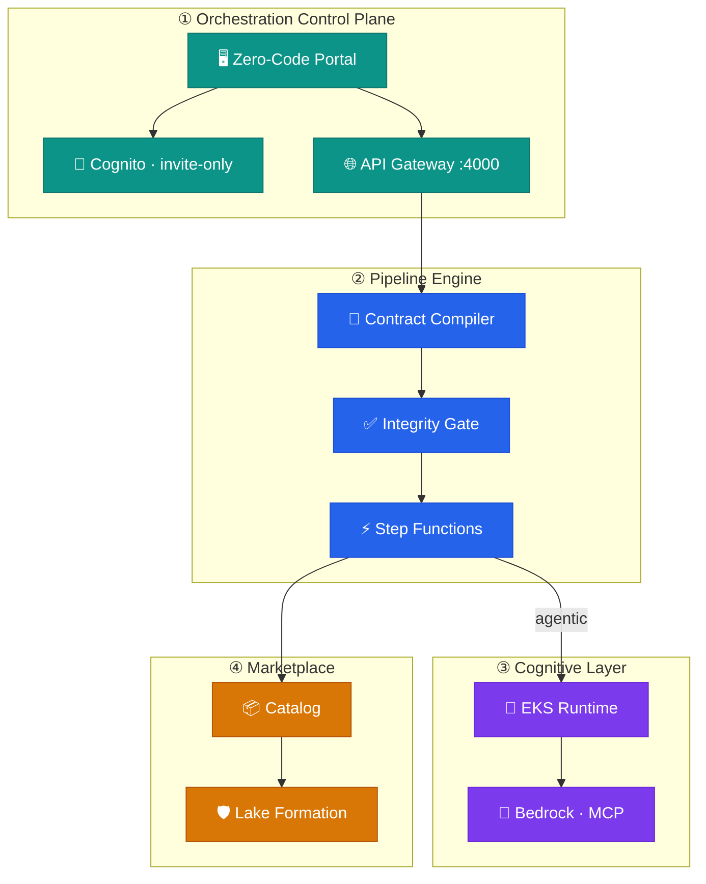

| Capability | Technology |
|------------|------------|
| Zero-code design | React + React Flow |
| Contracts | `cognimesh.io/v1` DataContract |
| Structured writes | [Vaquar PVDM](docs/vaquar-pattern.md) |
| Cognitive writes | Go runtime · epoch / frontier |
| Security | Cognito (no self-registration) |
| Infrastructure | Terraform · VPC · S3 · EKS · CloudFront |

---

## End-to-end journey

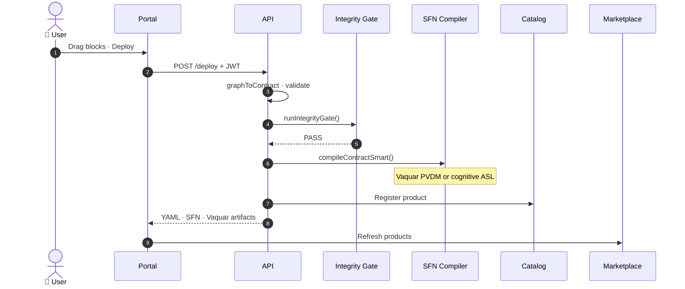

---

## Zero-code portal

Visual pipeline designer with a **pattern library** (see [what “28+ patterns” means](#what-28-patterns-means-no-code-required)): pick a blueprint, customize in the UI without writing code, then deploy. Includes AWS service blocks (Glue, Kinesis, MSK, DMS, Firehose), **AI Builder** (describe a pipeline or agent in English), **Agent Builder** (Bedrock AgentCore canvas), live AWS security/architecture review, VRP observability, and a consumer marketplace.

→ Full pattern catalog: **[docs/PORTAL_UI.md](docs/PORTAL_UI.md)**  
→ **Step-by-step tutorials (26 pipelines + 8 agents):** **[docs/tutorials/README.md](docs/tutorials/README.md)**  
→ **Developer customization (screenshots + code):** **[docs/developer/README.md](docs/developer/README.md)**

### Portal screenshots

<p align="center">
  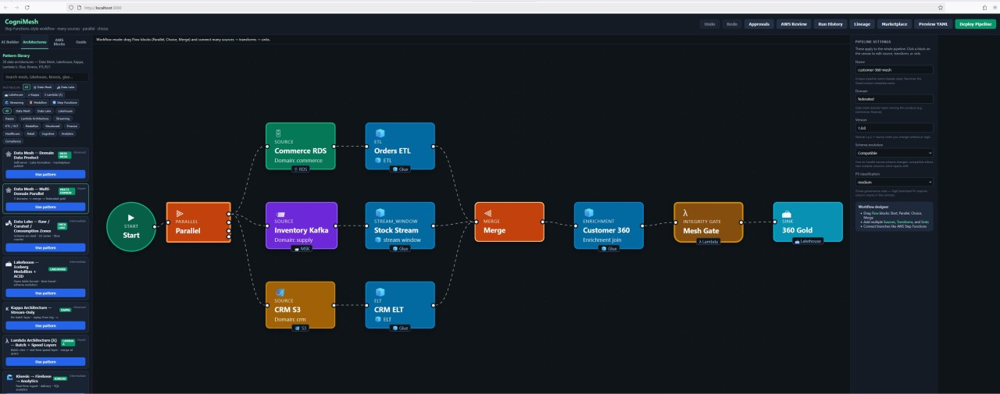
  <br /><em>Architectures tab · Multi-domain Data Mesh (Customer 360) · Three AWS accounts · Commerce RDS / Inventory Kafka / CRM S3 → Mesh integrity gate → Iceberg gold</em>
</p>

<p align="center">
  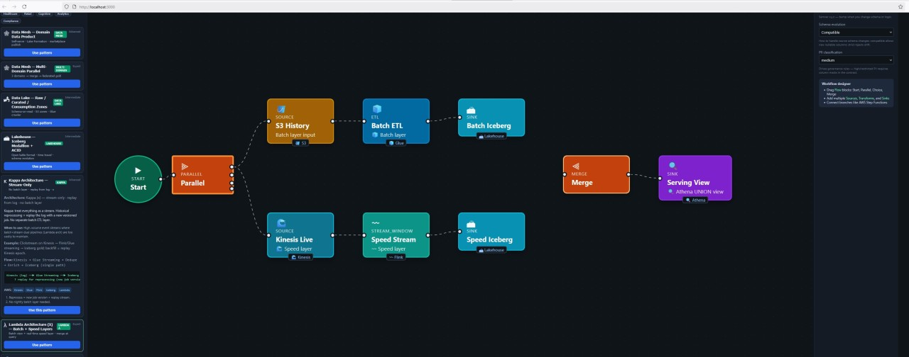
  <br /><em>Lambda (λ) architecture - Parallel batch (S3 → Glue ETL → Iceberg) + speed (Kinesis → Flink → Iceberg) → Merge → Athena serving view</em>
</p>

<p align="center">
  
  <br /><em>Agent Builder mode · Templates (customer support, RAG, fraud, steward) · Guardrails · AgentCore manifest export</em>
</p>

<table>
<tr>
<td width="50%">

**Pattern library & architecture filters**

<p>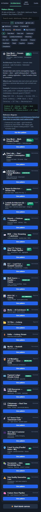</p>

Data Mesh · Data Lake · Lakehouse · Kappa · Lambda λ · Streaming · ETL/ELT

</td>
<td width="50%">

**AWS Blocks palette**

<p>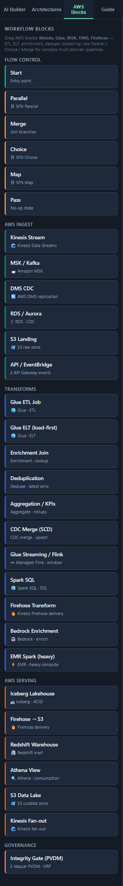</p>

Glue ETL/ELT · enrichment · dedupe · CDC merge · stream windows

</td>
</tr>
<tr>
<td width="50%">

**Design canvas overview**

<p>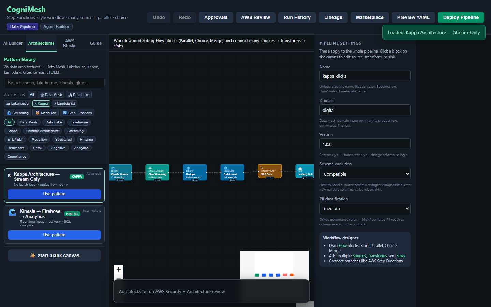</p>

AWS Design Review HUD · VRP-ready pipeline

</td>
<td width="50%">

**AI Builder - pipeline & agent**

<p>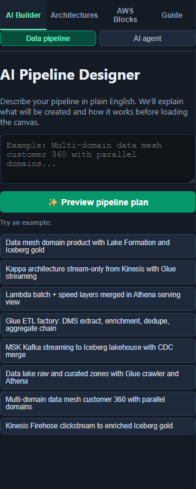 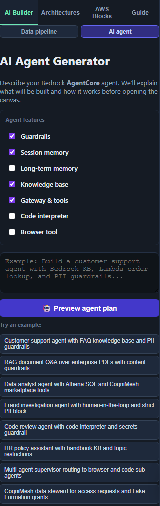</p>

Data pipeline (preview plan + natural-language explanation) · AI agent → Agent Builder

</td>
</tr>
</table>

Regenerate all UI images: `npm run docs:screenshots` (builds portal, starts API + preview, writes `docs/assets/` and `docs/images/`).

Regenerate the README demo GIFs/MP4s: `npm run docs:demo` (Playwright records pipeline + agent walkthroughs; install [ffmpeg](https://ffmpeg.org/) for MP4/GIF export).

**Agent Builder:** use feature checkboxes (guardrails, memory, KB, tools) when creating agents - see **[docs/AGENT_BUILDER.md](docs/AGENT_BUILDER.md)**.

<details>
<summary><strong>All patterns in the UI (click to expand)</strong></summary>

| Category | Patterns |
|----------|----------|
| **Data Mesh** | Domain Data Product · Multi-Domain Parallel (Customer 360) |
| **Data Lake** | Raw / Curated / Consumption zones |
| **Lakehouse** | Iceberg Medallion · Glue ETL Factory |
| **Kappa** | Stream-only (Kinesis → Flink → Iceberg) |
| **Lambda λ** | Batch layer + Speed layer → Athena serving |
| **Streaming** | Kinesis + Firehose · MSK + Glue streaming |
| **ETL / ELT** | Glue multi-stage factory · Redshift ELT marts |
| **Medallion** | Full Bronze → Silver → Gold |
| **Finance** | Payment ledger (SOX / double-entry) |
| **Healthcare** | FHIR → HIPAA gold |
| **Retail** | Clickstream funnel |
| **Cognitive** | Media Bedrock · GenAI RAG documents |
| **Compliance** | Fraud parallel · DQ quarantine |
| **Structured** | Vaquar CDC · Multi-source Parallel → Choice |
| **Analytics** | IoT fleet · SCD2 · Feature store |

Regenerate automated screenshots: `npm run build --prefix portal && npx playwright install chromium && npm run docs:screenshots` (output: `docs/assets/`). Manual UI captures live in **`docs/images/`**.

</details>

### Blocks → DataContract

| Block | Contract | Examples |
|-------|----------|----------|
| Source | `spec.source` | `rds`, `s3`, `kinesis`, `kafka`, `media_url`, `api` |
| Transform | `spec.transform` | `spark_sql`, `glue_etl`, `agentic` + modes: ETL, ELT, enrichment, dedupe, aggregate, CDC merge |
| Sink | `spec.target` | `iceberg`, `s3`, `redshift`, `delta`, Athena views |
| Flow | Step Functions ASL | `parallel`, `choice`, `merge`, `map`, `start` |
| Governance | Integrity gate | Vaquar PVDM · VRP proof before commit |

→ [Full drag-and-drop guide](docs/drag-drop-pipeline-flow.md)

---

## Security (Cognito)

| Control | Setting |
|---------|---------|
| Self-registration | **Disabled** |
| Default admin | Created by Terraform |
| API | JWT on `/api/v1/pipelines/*` |
| Local dev | `AUTH_DISABLED=true` |

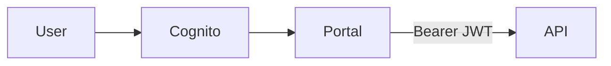

---

## Vaquar Pattern

CogniMesh implements **[The Vaquar Pattern](docs/vaquar-pattern.md)** (author: **Vaquarkhan**): proof-gated serverless writes with invariant **`commit_metadata ⟹ VRP = PASS`**.

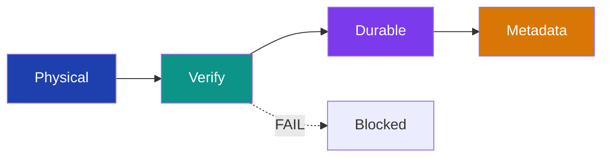

| Block | Status |
|-------|--------|
| Integrity gate · SparkRules · IceGuard · VRP · Durable SFN · Metadata commit | ✅ |

**Read the full pattern spec:** [docs/vaquar-pattern.md](docs/vaquar-pattern.md)

---

## Dual pipeline model

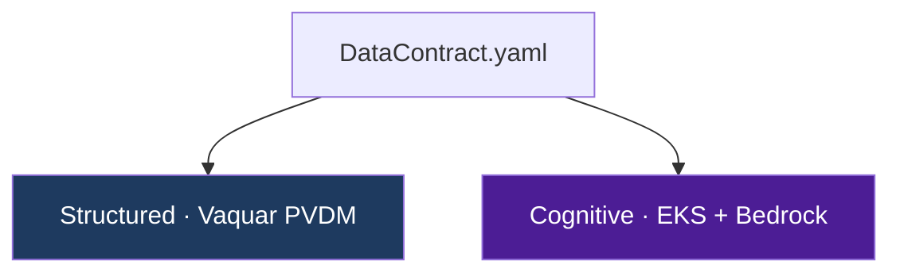

| Type | Example | Runtime |
|------|---------|---------|
| Structured CDC → Iceberg | [`structured-cdc-pipeline.yaml`](contracts/examples/structured-cdc-pipeline.yaml) | PVDM Lambda + SFN |
| Cognitive media → Parquet | [`cognitive-media-pipeline.yaml`](contracts/examples/cognitive-media-pipeline.yaml) | [`cognitive-runtime/`](services/cognitive-runtime/) |

---

## Marketplace & governance

Deploy → integrity gate **PASS** → catalog registration → Lake Formation policies → marketplace UI.

Governance fields: `piiClassification`, `rowFilters`, `columnMasks`.

---

## AWS infrastructure (Terraform)

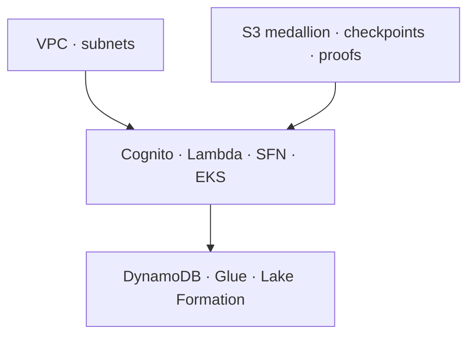

| Module | Purpose |
|--------|---------|
| `cognito` | Admin-only auth |
| `storage` | Bronze / silver / gold / checkpoint / proof |
| `lambda` | Integrity gate + domain writer |
| `orchestration` | Step Functions |
| `eks` | Cognitive runtime |
| `portal-cdn` | CloudFront + S3 portal |
| `platform-ops` | DynamoDB state · Athena · Bedrock/RDS IAM |

→ [Terraform guide](infra/terraform/README.md)

---

## Distribution

Install and run CogniMesh via Docker, npm, PyPI, Maven, or Go. Full details: **[docs/DISTRIBUTION.md](docs/DISTRIBUTION.md)**.

| Channel | Install | Use case |
|---------|---------|----------|
| **Docker** | [`docker compose up --build`](docs/DISTRIBUTION.md#docker-recommended-for-local-full-stack) · [pull from GHCR](https://github.com/vaquarkhan/CogniMesh/pkgs/container/cognimesh-api) | Full stack - no local Java/Maven |
| **npm** | `npm install && npm start` | Monorepo dev - API, portal, contract compiler |
| **PyPI** | [`pip install cognimesh`](https://pypi.org/project/cognimesh/) | Python SDK + CLI for contracts & API |
| **Maven** | `cd services/catalog && mvn spring-boot:run` | Marketplace catalog service |
| **Go** | `cd services/cognitive-runtime && go run ./cmd/controller` | Cognitive epoch runtime |

### Docker

```bash
docker compose up --build
# Portal :3000 · API :4000 · Catalog :8080
```

| Image | Tag |
|-------|-----|
| [`ghcr.io/vaquarkhan/cognimesh-api`](https://github.com/vaquarkhan/CogniMesh/pkgs/container/cognimesh-api) | `1.0.0` |
| [`ghcr.io/vaquarkhan/cognimesh-portal`](https://github.com/vaquarkhan/CogniMesh/pkgs/container/cognimesh-portal) | `1.0.0` |
| [`ghcr.io/vaquarkhan/cognimesh-catalog`](https://github.com/vaquarkhan/CogniMesh/pkgs/container/cognimesh-catalog) | `1.0.0` |

### PyPI

```bash
pip install cognimesh==1.0.0
cognimesh validate contracts/examples/structured-cdc-pipeline.yaml
cognimesh health --api http://localhost:4000
```

```python
from cognimesh import CogniMeshClient, load_contract
client = CogniMeshClient("http://localhost:4000")
print(client.health())
```

Related Vaquar package: [`serverless-data-mesh`](https://pypi.org/project/serverless-data-mesh/) (`pip install serverless-data-mesh`).

---

## Quick start

```bash
git clone git@github.com:vaquarkhan/CogniMesh.git
cd CogniMesh
npm install
cp .env.example .env
npm start
```

| Service | URL |
|---------|-----|
| Portal | http://localhost:3000 |
| API | http://localhost:4000 |
| Catalog | http://localhost:8080 |

**Workflow:** Sign in → drag Source → Transform → Sink → **Deploy Pipeline** → view YAML, Step Functions, Vaquar mesh artifacts, marketplace.

### Tests

```bash
npm run test:unit         # 90+ unit tests (platform, API, compiler, gate, VRP security)
npm run test:vrp-security # VRP fail-closed, JCS, KMS signing, offline verify, decision attestation
npm run test:portal-e2e   # Playwright: Operations panel + approvals
npm test                  # offline integration (no servers)
npm run dev:api           # API only: embedded catalog, no Java
npm run dev:minimal       # API + portal (no catalog)
npm run test:api          # SKIPs marketplace when catalog offline
```

### Docker Compose (full stack, no local Java/Maven)

```bash
npm run docker:up
```

→ [docs/LOCAL_DEV.md](docs/LOCAL_DEV.md)

### AWS production

```bash
npm run package:lambda
npm run package:domain-writer
cd infra/terraform/environments/prod
cp terraform.tfvars.example terraform.tfvars
terraform init && terraform apply
```

---

## Repository layout

```
CogniMesh/
├── portal/                 # React + React Flow SPA
├── services/
│   ├── api-gateway/        # JWT · preview · deploy
│   ├── catalog/            # Marketplace (Spring Boot)
│   ├── pipeline-engine/    # SFN compiler
│   ├── pvdm-runtime/       # Vaquar PVDM (IceGuard · VRP)
│   ├── cognitive-runtime/  # Go · epoch / frontier
│   ├── agent-mcp/          # Bedrock MCP
│   └── lambda/             # Integrity gate · domain writer
├── lib/
│   ├── vaquar/             # contract → mesh · PVDM SFN
│   ├── contract-builder/   # Graph → deploy orchestration
│   ├── integrity-gate/     # Design-time rules
│   ├── vrp/                # VRP proofs · JCS · KMS signing
│   └── platform/           # Operations APIs · store · copilot · plugins
├── docs/
│   └── vaquar-pattern.md   # ⭐ The Vaquar Pattern (author: Vaquarkhan)
├── infra/terraform/          # Production IaC
├── contracts/examples/     # Sample pipelines
└── rules/                    # Integrity gate policies
```

---

## Documentation

| Document | Description |
|----------|-------------|
| **[CONTRIBUTING.md](CONTRIBUTING.md)** | How to contribute · local setup · tests |
| **[docs/vaquar-pattern.md](docs/vaquar-pattern.md)** | **The Vaquar Pattern** · PVDM · VRP · building blocks |
| **[docs/developer/README.md](docs/developer/README.md)** | **Developer customization hub** - 21 UI screenshots · pipelines · agents · code |
| **[docs/tutorials/README.md](docs/tutorials/README.md)** | Tutorial hub - one guide per architecture & agent |
| [docs/AGENT_BUILDER.md](docs/AGENT_BUILDER.md) | Agent Builder · feature checkboxes · manifest export |
| [docs/PORTAL_UI.md](docs/PORTAL_UI.md) | Portal patterns · screenshots · AI & Agent Builder |
| [docs/PORTAL_DEV.md](docs/PORTAL_DEV.md) | Portal developer guide |
| [docs/drag-drop-pipeline-flow.md](docs/drag-drop-pipeline-flow.md) | Portal → deploy E2E |
| [docs/architecture.md](docs/architecture.md) | Architecture deep-dive |
| [docs/data-contract-spec.md](docs/data-contract-spec.md) | DataContract YAML spec |
| [docs/LINEAGE_CATALOG.md](docs/LINEAGE_CATALOG.md) | Lineage catalog · schema evolution |
| [docs/PLATFORM_OPS.md](docs/PLATFORM_OPS.md) | Operations API reference |
| [docs/PIPELINE_E2E_DIAGRAM.md](docs/PIPELINE_E2E_DIAGRAM.md) | **AWS E2E diagram** (draw.io) · all pipelines |
| [docs/DISTRIBUTION.md](docs/DISTRIBUTION.md) | Docker · npm · PyPI · Maven · Go |

---

## License

Proprietary - see [LICENSE](LICENSE). Pattern by [Vaquarkhan](https://github.com/vaquarkhan).

Security: [SECURITY.md](SECURITY.md) · Changelog: [CHANGELOG.md](CHANGELOG.md)

<p align="center">
  <sub>Domain teams own the pipeline design. The mesh proves correctness before publication.</sub>
</p>
