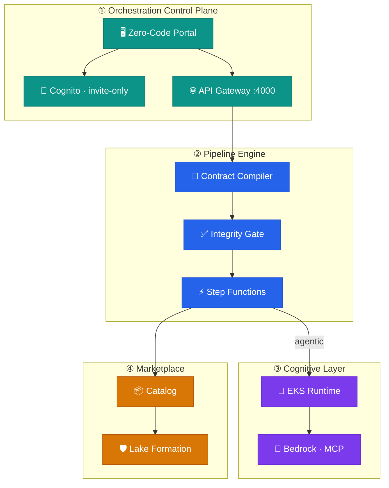
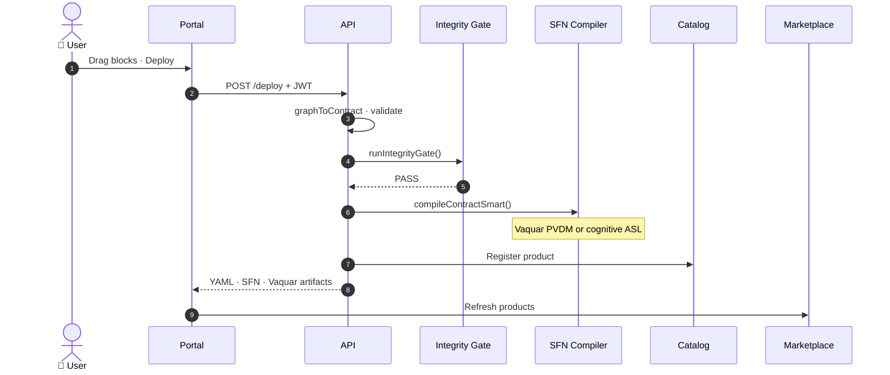
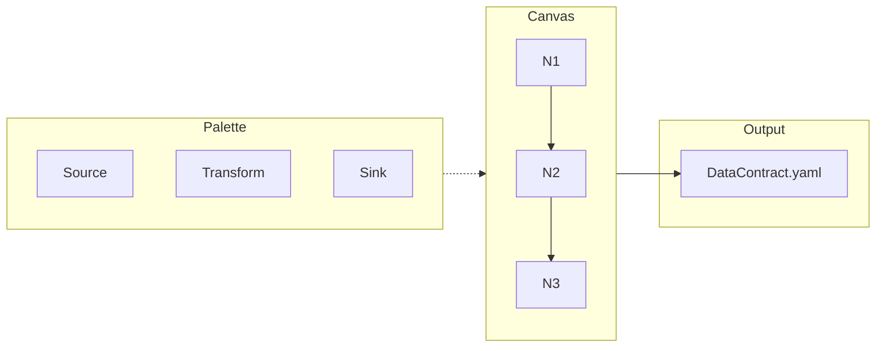
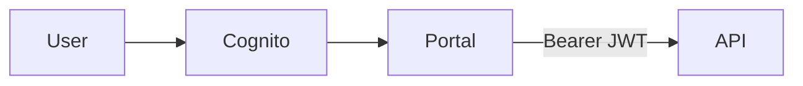
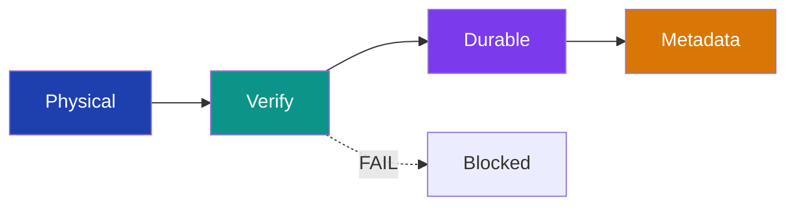
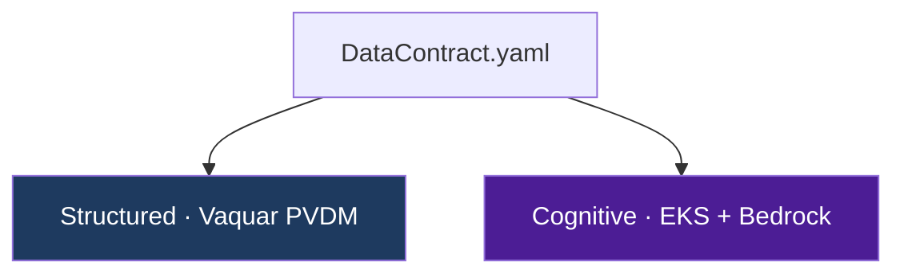
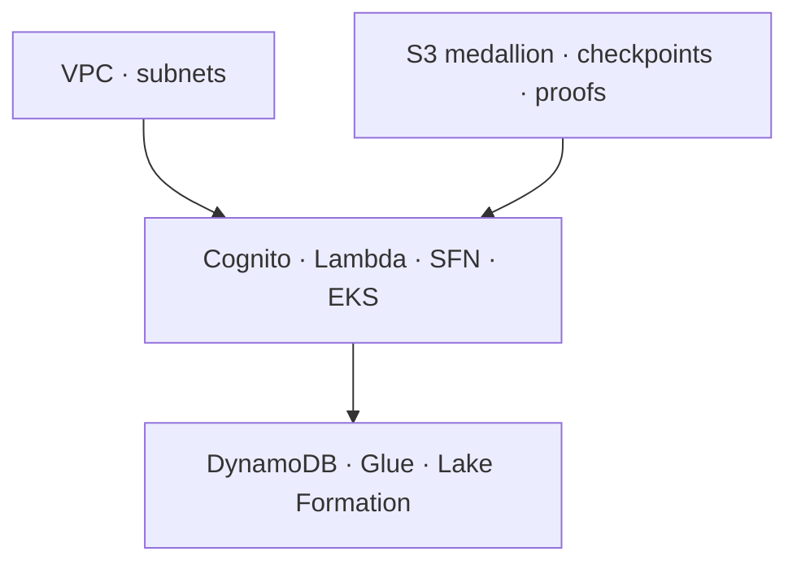

<p align="center">
  
  
  
  
</p>

<h1 align="center">CogniMesh</h1>

<p align="center">
  <strong>Multimodal Cognitive Data Mesh &amp; Marketplace</strong>
</p>

<p align="center">
  Zero-code pipelines · Proof-gated publication · Agentic AI · Fine-grained governance
</p>

<p align="center">
  <a href="docs/vaquar-pattern.md"><b>⭐ The Vaquar Pattern</b></a> ·
  <a href="docs/drag-drop-pipeline-flow.md">Drag-and-drop E2E</a> ·
  <a href="docs/data-contract-spec.md">Data Contract</a> ·
  <a href="infra/terraform/README.md">Terraform</a> ·
  <a href="docs/architecture.md">Architecture</a>
</p>

---

## At a glance

CogniMesh lets **business users** design data pipelines in a visual portal. The platform generates **`DataContract.yaml`**, runs governance checks, compiles **AWS Step Functions**, registers products in a **marketplace**, and deploys to AWS when enabled.

Built on **[The Vaquar Pattern](docs/vaquar-pattern.md)** by [Vaquarkhan](https://github.com/vaquarkhan): structured pipelines use **PVDM** (Physical → Verify → Durable → Metadata); cognitive pipelines use an **EKS transactional runtime** with Bedrock agents.

<table>
<tr>
<td width="50%">

**Structured pipelines**
- RDS CDC → Bronze → Silver → Iceberg Gold
- Vaquar PVDM + VRP proof
- Lambda + Step Functions

</td>
<td width="50%">

**Cognitive pipelines**
- Media URL → Bedrock agent
- Epoch / frontier / compensation
- EKS + Agent MCP

</td>
</tr>
</table>

---

## Table of contents

| | Section |
|---|---------|
| 🏗️ | [System architecture](#system-architecture) |
| 🔄 | [End-to-end journey](#end-to-end-journey) |
| 🖥️ | [Zero-code portal](#zero-code-portal) |
| 🔐 | [Security](#security-cognito) |
| ⭐ | [Vaquar Pattern](docs/vaquar-pattern.md) |
| 🔀 | [Dual pipeline model](#dual-pipeline-model) |
| 🏪 | [Marketplace](#marketplace--governance) |
| ☁️ | [Terraform](#aws-infrastructure-terraform) |
| ✅ | [Feature matrix](#feature-matrix) |
| 🚀 | [Quick start](#quick-start) |
| 📚 | [Documentation](#documentation) |

---

## System architecture

Four cooperating planes:



| Capability | Technology |
|------------|------------|
| Zero-code design | React + React Flow |
| Contracts | `cognimesh.io/v1` DataContract |
| Structured writes | [Vaquar PVDM](docs/vaquar-pattern.md) |
| Cognitive writes | Go runtime · epoch / frontier |
| Security | Cognito (no self-registration) |
| Infrastructure | Terraform · VPC · S3 · EKS · CloudFront |

---

## End-to-end journey



---

## Zero-code portal



| Block | Contract | Examples |
|-------|----------|----------|
| Source | `spec.source` | `rds`, `s3`, `media_url`, `kafka` |
| Transform | `spec.transform` | `spark_sql`, `agentic` |
| Sink | `spec.target` | `iceberg`, `s3`, `delta` |

→ [Full drag-and-drop guide](docs/drag-drop-pipeline-flow.md)

---

## Security (Cognito)

| Control | Setting |
|---------|---------|
| Self-registration | **Disabled** |
| Default admin | Created by Terraform |
| API | JWT on `/api/v1/pipelines/*` |
| Local dev | `AUTH_DISABLED=true` |



---

## Vaquar Pattern

CogniMesh implements **[The Vaquar Pattern](docs/vaquar-pattern.md)** (author: **Vaquarkhan**): proof-gated serverless writes with invariant **`commit_metadata ⟹ VRP = PASS`**.



| Block | Status |
|-------|--------|
| Integrity gate · SparkRules · IceGuard · VRP · Durable SFN · Metadata commit | ✅ |

**Read the full pattern spec:** [docs/vaquar-pattern.md](docs/vaquar-pattern.md)

---

## Dual pipeline model



| Type | Example | Runtime |
|------|---------|---------|
| Structured CDC → Iceberg | [`structured-cdc-pipeline.yaml`](contracts/examples/structured-cdc-pipeline.yaml) | PVDM Lambda + SFN |
| Cognitive media → Parquet | [`cognitive-media-pipeline.yaml`](contracts/examples/cognitive-media-pipeline.yaml) | [`cognitive-runtime/`](services/cognitive-runtime/) |

---

## Marketplace & governance

Deploy → integrity gate **PASS** → catalog registration → Lake Formation policies → marketplace UI.

Governance fields: `piiClassification`, `rowFilters`, `columnMasks`.

---

## AWS infrastructure (Terraform)



| Module | Purpose |
|--------|---------|
| `cognito` | Admin-only auth |
| `storage` | Bronze / silver / gold / checkpoint / proof |
| `lambda` | Integrity gate + domain writer |
| `orchestration` | Step Functions |
| `eks` | Cognitive runtime |
| `portal-cdn` | CloudFront + S3 portal |

→ [Terraform guide](infra/terraform/README.md)

---

## Feature matrix

<details open>
<summary><b>All features implemented</b></summary>

| Feature | Location |
|---------|----------|
| Zero-code portal | `portal/` |
| DataContract schema | `schemas/` |
| Graph → contract compiler | `lib/contract-builder/` |
| **[Vaquar Pattern](docs/vaquar-pattern.md)** | `docs/vaquar-pattern.md`, `lib/vaquar/` |
| PVDM runtime (IceGuard · VRP) | `services/pvdm-runtime/` |
| Integrity gate | `lib/integrity-gate/`, `rules/` |
| API + JWT | `services/api-gateway/` |
| Marketplace catalog | `services/catalog/` |
| Bedrock Agent MCP | `services/agent-mcp/` |
| Cognitive runtime | `services/cognitive-runtime/` |
| Production Terraform | `infra/terraform/` |
| CI + tests | `.github/workflows/`, `scripts/test-*.js` |

</details>

---

## Quick start

```bash
git clone git@github.com:vaquarkhan/CogniMesh.git
cd CogniMesh
npm install
cp .env.example .env
npm start
```

| Service | URL |
|---------|-----|
| Portal | http://localhost:3000 |
| API | http://localhost:4000 |
| Catalog | http://localhost:8080 |

**Workflow:** Sign in → drag Source → Transform → Sink → **Deploy Pipeline** → view YAML, Step Functions, Vaquar mesh artifacts, marketplace.

### Tests

```bash
npm test                 # offline unit/e2e (no servers)
npm run dev:api          # API only — embedded catalog, no Java
npm run dev:minimal      # API + portal (no catalog)
npm run test:api         # SKIPs marketplace when catalog offline
```

### Docker Compose (full stack, no local Java/Maven)

```bash
npm run docker:up
```

→ [docs/LOCAL_DEV.md](docs/LOCAL_DEV.md)

### AWS production

```bash
npm run package:lambda
npm run package:domain-writer
cd infra/terraform/environments/prod
cp terraform.tfvars.example terraform.tfvars
terraform init && terraform apply
```

---

## Repository layout

```
CogniMesh/
├── portal/                 # React + React Flow SPA
├── services/
│   ├── api-gateway/        # JWT · preview · deploy
│   ├── catalog/            # Marketplace (Spring Boot)
│   ├── pipeline-engine/    # SFN compiler
│   ├── pvdm-runtime/       # Vaquar PVDM (IceGuard · VRP)
│   ├── cognitive-runtime/  # Go · epoch / frontier
│   ├── agent-mcp/          # Bedrock MCP
│   └── lambda/             # Integrity gate · domain writer
├── lib/
│   ├── vaquar/             # contract → mesh · PVDM SFN
│   ├── contract-builder/   # Graph → deploy orchestration
│   └── integrity-gate/     # Design-time rules
├── docs/
│   └── vaquar-pattern.md   # ⭐ The Vaquar Pattern (author: Vaquarkhan)
├── infra/terraform/          # Production IaC
├── contracts/examples/     # Sample pipelines
└── rules/                    # Integrity gate policies
```

---

## Documentation

| Document | Description |
|----------|-------------|
| **[docs/vaquar-pattern.md](docs/vaquar-pattern.md)** | **The Vaquar Pattern** · PVDM · VRP · building blocks |
| [docs/drag-drop-pipeline-flow.md](docs/drag-drop-pipeline-flow.md) | Portal → deploy E2E |
| [docs/architecture.md](docs/architecture.md) | Architecture deep-dive |
| [docs/data-contract-spec.md](docs/data-contract-spec.md) | DataContract YAML spec |
| [docs/LOCAL_DEV.md](docs/LOCAL_DEV.md) | Docker Compose · embedded catalog · dev modes |

---

## License

Proprietary — see [LICENSE](LICENSE). Pattern by [Vaquarkhan](https://github.com/vaquarkhan).

Security: [SECURITY.md](SECURITY.md) · Changelog: [CHANGELOG.md](CHANGELOG.md) · [10/10 checklist](docs/PLATFORM_CHECKLIST.md)

<p align="center">
  <sub>Domain teams own the pipeline design. The mesh proves correctness before publication.</sub>
</p>
