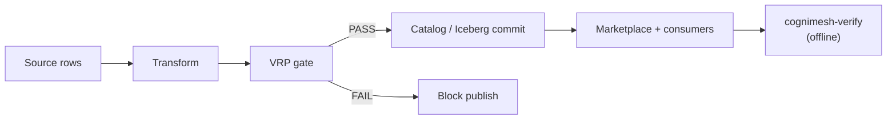

# CogniMesh

[](https://github.com/vaquarkhan/CogniMesh/actions/workflows/ci.yml)

[](LICENSE)

**CogniMesh attaches a cryptographically checkable proof that published gold data matches its source on declared fields, and blocks the catalog commit when it does not.**

It is a proof gate for lakehouse pipelines (portal + API + AWS wiring optional). It is not a catalog or dbt replacement — see [What this is not](#what-cognimesh-is-not).

[Watch 2-min demo](docs/assets/cognimesh-howto-demo.mp4) · [Docs map](docs/README.md) · [Positioning](docs/POSITIONING.md) · [VERIFY.md](docs/VERIFY.md)

---

## How it works


```mermaid
flowchart LR
  S[Source rows] --> T[Transform]
  T --> G[VRP gate]
  G -->|PASS| C[Catalog / Iceberg commit]
  G -->|FAIL| X[Block publish]
  C --> M[Marketplace + consumers]
  M --> V["cognimesh-verify\n(offline)"]
```

1. Pipeline writes candidate gold (or you run the local demo below).
2. CogniMesh builds a **Verifiable Reconciliation Proof (VRP)**: multiset hashes over declared identity/content fields, optional KMS/Ed25519 signature, snapshot pin.
3. On **FAIL / UNVERIFIED**, metadata commit is blocked (fail-closed on the Vaquar / PVDM path).
4. Consumers verify the proof **without** CogniMesh infra: `npx cognimesh-verify proof.json`.

The publish path is named the [Vaquar Pattern](docs/vaquar-pattern.md) (PVDM: Physical → Verify → Durable → Metadata). Paper: [arXiv:2608.14643](https://arxiv.org/abs/2608.14643).

---

## 60-second quickstart (produce + verify a proof)

Requires Node 20+.

```bash
git clone https://github.com/vaquarkhan/CogniMesh.git
cd CogniMesh
npm ci
npm run demo:proof
npx cognimesh-verify .demo-proof.json
```

Expected shape:

```json
{
  "ok": true,
  "verdict": "PASS",
  "proof_id": "…",
  "source_hash": "d576c2c931ee0d73…",
  "sink_hash": "d576c2c931ee0d73…",
  "verify": "PASS — source and sink hashes match on declared fields"
}
```

```text
npx cognimesh-verify .demo-proof.json
→ { "valid": true, "verdict": "VERIFIED", "proof_id": "…", … }
```

**Before / after (what the proof claims):**

| | Source | Sink (gold) | Result |
|---|--------|-------------|--------|
| Declared fields `id`, `amount` | rows hashed | read-back hashed | equal → **PASS**, catalog may commit |
| Tamper sink `amount` | unchanged | hash changes | **FAIL**, commit blocked |

Tiny excerpt of a PASS proof (full file is `.demo-proof.json`):

```json
{
  "proof_version": "3",
  "verdict": "PASS",
  "multiset": {
    "identity_fields": ["id"],
    "content_fields": ["id", "amount"],
    "source_hash": "d576c2c931ee0d73…",
    "sink_hash": "d576c2c931ee0d73…",
    "sink_materialization": "read_back"
  }
}
```

Signed proofs (when KMS/dev signing is on):

```bash
npx cognimesh-verify .demo-proof.json --require-signature --public-key steward.pem
# or fetch steward signing keys:
# npx cognimesh-verify proof.json --key-url http://localhost:4000/.well-known/cognimesh-steward-keys.json
```

---

## Why it is different

| Tool | Role | Gap vs CogniMesh |
|------|------|------------------|
| **DataHub / OpenMetadata** | Lineage & discovery | Describe lineage; do not verify content equality |
| **dbt tests / Great Expectations / Soda** | In-pipeline assertions | Same trust domain as the writer; no independent signed read-back |
| **Unity Catalog / Horizon** | Warehouse governance | Strong ops; not a cross-engine signed reconcile proof |

**One line:** use CogniMesh when an auditor or downstream consumer must be able to prove published gold was not silently altered on declared fields — then verify that claim offline.

---

## What CogniMesh is not

- **Not** a replacement for Glue Catalog, Unity Catalog, or OpenMetadata — it is the **proof layer** that can sit beside them.
- **Not** a replacement for dbt or Spark — use [SDP / dbt export](docs/tutorials/sdp-and-dbt.md) for portable transforms; **Iceberg publish still requires VRP PASS** on the Vaquar path.
- **Not** the Python [IceGuard / veridata](https://github.com/vaquarkhan/veridata) package — this repo is the control plane + **JS VRP gate** ([POSITIONING](docs/POSITIONING.md)).
- **Not** “deploy to AWS by cloning” — live Step Functions / LF / KMS need Terraform + credentials; local demo above needs none of that.

---

## Status and scope (honest)

| Area | Today | Notes |
|------|--------|--------|
| **VRP generate + verify** | Ships | `lib/vrp/`, `npm run demo:proof`, `cognimesh-verify` |
| **Fail-closed publish (PVDM path)** | Ships | Catalog commit gated on PASS when enabled |
| **Offline verifier + steward keys** | Ships | [VERIFY.md](docs/VERIFY.md) · `/.well-known/cognimesh-steward-keys.json` |
| **Portal + marketplace** | Ships | Trust-ranked search, subscription tokens on serve, schema-diff |
| **Lake Formation grant on approve** | Opt-in | Live when `LAKE_FORMATION_GRANT_ENABLED=true`; otherwise **simulated** |
| **AWS deploy / Agent Bedrock** | Opt-in | Simulated locally unless deploy flags + IAM are set |
| **SDP / dbt export** | Ships | Observational zips — **not** a publish substitute |
| **Production readiness** | Partial | Strong VRP tests; agent deploy / multi-cloud / billing are shallow — do not treat as the product |

Roadmap and claims-vs-reality: [docs/POSITIONING.md](docs/POSITIONING.md) · [CHANGELOG](CHANGELOG.md).

---

## Run the portal (optional)

```bash
cp .env.example .env   # AUTH_DISABLED=true by default
npm run start:dev      # or: npm run dev:minimal
```

| Service | URL |
|---------|-----|
| Portal | http://localhost:3000 |
| API | http://localhost:4000 |

UI walkthrough: [docs/GETTING_STARTED.md](docs/GETTING_STARTED.md). Full stack Compose: `npm run docker:up` → [LOCAL_DEV](docs/LOCAL_DEV.md).

---

## Deep walkthroughs (prefer these over feature counts)

1. **Proof gate** — [Vaquar Pattern](docs/vaquar-pattern.md) · [proof-gated marketplace](docs/tutorials/proof-gated-marketplace.md) · [VERIFY.md](docs/VERIFY.md)
2. **Export beside dbt/Spark** — [SDP + dbt](docs/tutorials/sdp-and-dbt.md)
3. **Consume with trust** — [Marketplace API](docs/MARKETPLACE.md) (rubric, tokens, schema-diff)

Demos, personas, and pattern catalogs live under docs — not here: [docs/DEMOS.md](docs/DEMOS.md) · [docs/tutorials/README.md](docs/tutorials/README.md).

---

## Repository layout

```
portal/                 React canvas (pipelines + agents)
services/api-gateway/   HTTP API · marketplace · gateway/serve
services/pvdm-runtime/  PVDM workload · commit gate
lib/vrp/                VRP generate / verify / gateway / tokens
bin/cognimesh-verify.js Offline verifier CLI
infra/terraform/        AWS modules (optional)
docs/                   Positioning, FAQ, tutorials, VERIFY
```

---

## Docs

| Doc | Purpose |
|-----|---------|
| [docs/README.md](docs/README.md) | Documentation map |
| [docs/POSITIONING.md](docs/POSITIONING.md) | Scope, ecosystem, what not to claim |
| [docs/FAQ.md](docs/FAQ.md) | PASS/FAIL, install, ops |
| [docs/VERIFY.md](docs/VERIFY.md) | Standalone verify + key distribution |
| [docs/MARKETPLACE.md](docs/MARKETPLACE.md) | Discovery API + trust rubric |
| [docs/architecture.md](docs/architecture.md) | Architecture deep-dive |
| [infra/terraform/README.md](infra/terraform/README.md) | AWS deploy |
| [CONTRIBUTING.md](CONTRIBUTING.md) | Local setup & tests |
| [SECURITY.md](SECURITY.md) | Security reporting |

---

## License

Proprietary — see [LICENSE](LICENSE). Method attribution: [NOTICE](NOTICE). Cite [arXiv:2608.14643](https://arxiv.org/abs/2608.14643).
