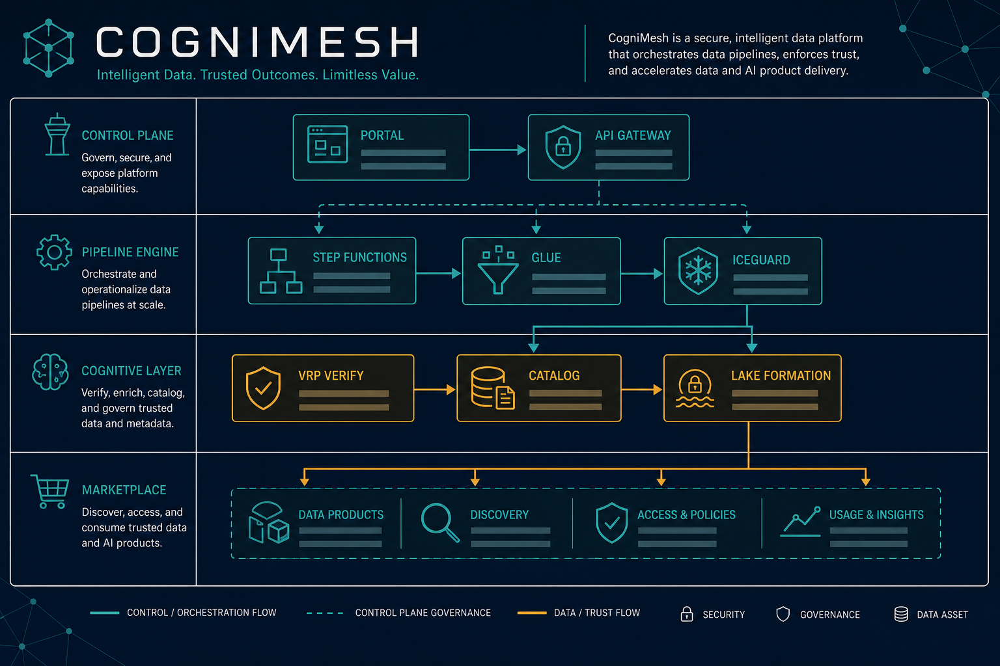
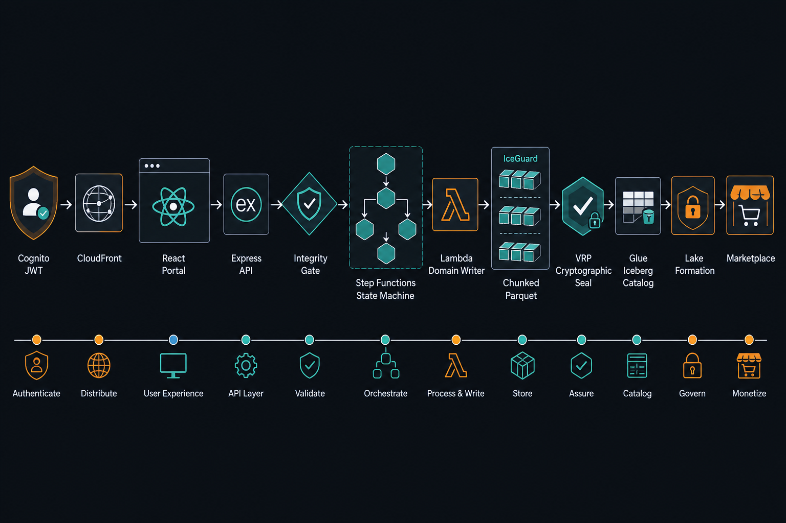
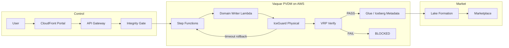

# CogniMesh End-to-End Architecture

**Branch focus:** `pvdm-architecture-review-2026-07-21`  
**Invariant:** `commit_metadata => VRP = PASS`

This page is the living E2E map of CogniMesh + the Vaquar Pattern (PVDM): control plane → durable AWS execution → proof-gated catalog → marketplace.

---

## Platform overview

| Plane | Components | Responsibility |
|-------|------------|----------------|
| Orchestration Control | Portal (React), API Gateway (Express), Cognito | Design, deploy, Bedrock agents |
| Metadata Pipeline Engine | Contract compiler, Step Functions, Glue/EMR/Lambda | Compile DataContract → durable ASL |
| Cognitive Layer | Agent jobs, MCP, transactional runtime | Agentic transforms + attestation |
| Marketplace & Governance | Catalog, Lake Formation, integrity gate | Proof-gated publish + RBAC |

---

## AWS execution path (PVDM)

### PVDM phases (code map)

| Phase | Name | Implementation |
|-------|------|----------------|
| 0 | Rules | `lib/integrity-gate/`, `rules/default-policies.yaml` |
| 1 | Physical | `IceGuardWriter` in `services/pvdm-runtime` - chunked Parquet, timeout abort, staging cleanup |
| 2 | Verify | `lib/vrp/` - sink read-back, JCS, KMS/Ed25519, fail-closed |
| 3 | Durable | `lib/vaquar/pvdm-sfn.js` - resume loop with **advanced `resume_offset`** |
| 4 | Metadata | `commitMetadata` + `lib/aws/glue-iceberg.js` - only after VRP PASS |

---

## Deploy to AWS (operator checklist)

See the full operator guide: **[examples/aws-pvdm-runbook.md](examples/aws-pvdm-runbook.md)** (`npm run test:pvdm-mock` for a local mock).

1. `terraform apply` in `infra/terraform/environments/prod` (or dev) with platform-ops enabled.
2. Map outputs into API env:
   - `AWS_DEPLOY_ENABLED=true`
   - `AWS_STEP_FUNCTIONS_ROLE_ARN`
   - `AWS_BEDROCK_AGENT_ROLE_ARN` / `AWS_AGENT_DEPLOY_ENABLED`
   - `PROOF_BUCKET`, `CHECKPOINT_BUCKET_NAME`
3. Package Lambdas: `npm run package:domain-writer` and `npm run package:integrity-gate`.
4. Portal: load a pattern → Preview → Deploy → watch **DeployProgress** for SFN execution.
5. On IceGuard rollback: SFN waits, then re-invokes Domain Writer with the **next `resume_offset`**.

### Local vs AWS

| Mode | Behavior |
|------|----------|
| Local (`AUTH_DISABLED`, no SFN role) | Compile + PVDM sim; catalog may be in-memory |
| AWS enabled | Integrity Gate → Domain Writer → VRP → Glue snapshot / Lake Formation |

---

## Related diagrams

- Editable draw.io: [PIPELINE_E2E_DIAGRAM.md](PIPELINE_E2E_DIAGRAM.md) · [`diagrams/cognimesh-pipeline-e2e.drawio`](diagrams/cognimesh-pipeline-e2e.drawio)
- Pattern deep dive: [vaquar-pattern.md](vaquar-pattern.md)
- System planes: [architecture.md](architecture.md)
