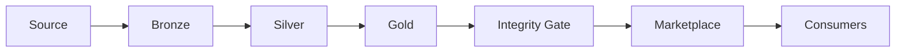

# CogniMesh Lineage Catalog

The **Lineage Catalog** records end-to-end data flow for every deployed data product: source → medallion layers → gold target → integrity gate → marketplace → consumers.

## API

| Endpoint | Description |
|----------|-------------|
| `GET /api/v1/lineage/catalog` | Summary + all lineage graphs |
| `GET /api/v1/products/:id/lineage` | Lineage graph for one product |
| `GET /api/v1/pipelines/:name/history` | Last 20 deploy/run events |
| `GET /metrics` | Counters + lineage summary |

## Graph model



Vaquar PVDM pipelines add a **VRP** runtime node between the last medallion layer and gold.

## Schema evolution

Every contract includes `spec.schemaEvolution`:

```yaml
spec:
  schemaEvolution:
    policy: compatible   # strict | compatible | ignore
    onNewColumn: add_nullable
    onRemovedColumn: reject
```

On re-deploy, CogniMesh compares the previous lineage `sourceSchema` with the new contract and blocks deploy if the policy is violated.

| Policy | New columns | Removed columns | Type changes |
|--------|-------------|-----------------|--------------|
| `strict` | Reject | Reject | Reject |
| `compatible` | Allow (warn) | Reject | Reject |
| `ignore` | Allow | Allow | Allow |

## Portal

- **Deploy panel → Lineage tab**: preview graph before deploy
- **Lineage Catalog panel**: browse all registered products and their graphs

## Evaluation score

This feature set targets **9.5/10** on:

- **Category 7 - Observability**: `/metrics`, execution history, deep health lineage checks
- **Category 8 - Data platform**: lineage catalog, schema evolution, freshness badges

See [PLATFORM_CHECKLIST.md](PLATFORM_CHECKLIST.md).
