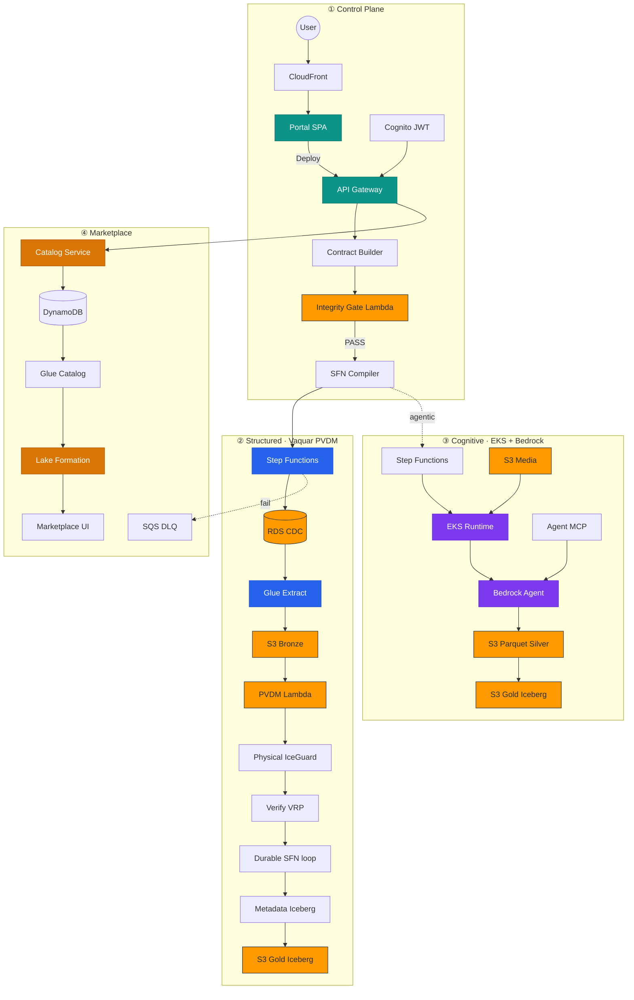
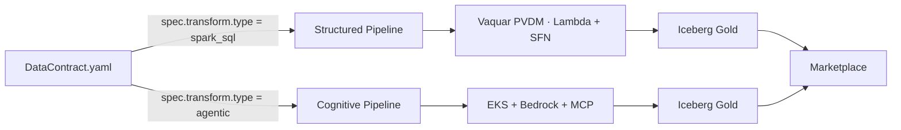

# CogniMesh End-to-End Pipeline Diagram

AWS architecture diagram showing **all pipeline types**, services, and the full path from portal design to marketplace publication.

## Interactive diagram (draw.io)

Open in [diagrams.net](https://app.diagrams.net) or VS Code with the **Draw.io Integration** extension:

| File | Description |
|------|-------------|
| [`diagrams/cognimesh-pipeline-e2e.drawio`](diagrams/cognimesh-pipeline-e2e.drawio) | Full E2E AWS diagram — editable |

```bash
# VS Code / Cursor
code docs/diagrams/cognimesh-pipeline-e2e.drawio

# Or open in browser
# https://app.diagrams.net → Open Existing → select cognimesh-pipeline-e2e.drawio
```

> **Tip:** In draw.io, enable **More Shapes → AWS19** (or AWS4) if icons do not render on first open.

---

## Diagram overview

Four swimlanes map to CogniMesh planes:

| Lane | Contents |
|------|----------|
| **① Control Plane** | User → CloudFront → Portal (S3) → Cognito → API → Contract Builder → Integrity Gate → Compiler → CI |
| **② Structured Pipeline** | Step Functions → RDS CDC → Glue → S3 Bronze → **Vaquar PVDM** (Physical → Verify → Durable → Metadata) → Iceberg Gold |
| **③ Cognitive Pipeline** | Step Functions → S3 media → **EKS runtime** → Bedrock + MCP → Parquet → Iceberg Gold |
| **④ Marketplace** | Catalog → DynamoDB → Glue Catalog → Lake Formation → Marketplace UI · SQS DLQ · VPC |

---

## Mermaid preview (GitHub-renderable)

### Full platform flow



### Structured vs cognitive decision



---

## Example contracts

| Pipeline | Contract | AWS path |
|----------|----------|----------|
| Structured CDC | [`structured-cdc-pipeline.yaml`](../contracts/examples/structured-cdc-pipeline.yaml) | RDS → Glue → S3 → PVDM → Iceberg |
| Cognitive media | [`cognitive-media-pipeline.yaml`](../contracts/examples/cognitive-media-pipeline.yaml) | S3 → EKS → Bedrock → Parquet → Iceberg |

---

## Terraform modules (production)

| Module | AWS resources in diagram |
|--------|--------------------------|
| `networking` | VPC |
| `storage` | S3 bronze / silver / gold / proof / checkpoint |
| `cognito` | Cognito user pool |
| `portal-cdn` | CloudFront + S3 portal |
| `lambda` | Integrity gate + domain writer |
| `orchestration` | Step Functions ASL |
| `glue` | Glue Data Catalog |
| `dynamodb` | Product registry |
| `governance` | Lake Formation |
| `messaging` | SQS DLQ |
| `eks` | Cognitive runtime cluster |

→ [infra/terraform/README.md](../infra/terraform/README.md)

---

## Related docs

| Document | Focus |
|----------|-------|
| [architecture.md](architecture.md) | System planes |
| [drag-drop-pipeline-flow.md](drag-drop-pipeline-flow.md) | Portal → deploy sequence |
| [vaquar-pattern.md](vaquar-pattern.md) | PVDM phases in detail |
| [LINEAGE_CATALOG.md](LINEAGE_CATALOG.md) | Post-deploy lineage |
