# CogniMesh Pipeline Patterns Guide

This document explains every architecture pattern available in the CogniMesh portal. Each pattern is a pre-built, deployable canvas graph that follows AWS best practices. Select a pattern from the **Architectures** tab in the sidebar and click **Use pattern** to load it on your canvas.

---

## Table of Contents

1. [Core Patterns (Simple)](#core-patterns)
2. [Data Mesh Patterns](#data-mesh)
3. [Data Lake Patterns](#data-lake)
4. [Lakehouse Patterns](#lakehouse)
5. [Kappa Architecture](#kappa)
6. [Lambda Architecture](#lambda-architecture)
7. [Streaming Patterns](#streaming)
8. [ETL / ELT Factory](#etl-elt-factory)
9. [Extended Patterns](#extended-patterns)
10. [Cognitive / AI Patterns](#cognitive-ai)

---

## Core Patterns

### Multi-Source → Parallel → Choice
**ID:** `multi-source-mesh`  
**Difficulty:** Advanced  
**AWS Services:** RDS, S3, Glue, Lambda, Iceberg, Step Functions

**What the UI builds:**
- A **Start** block initiating a Step Functions workflow
- A **Parallel** block that fans out to two independent branches:
  - Branch 1: RDS CDC source → Spark SQL transform (ETL with CDC merge)
  - Branch 2: S3 file source → Spark SQL transform (batch ELT)
- A **Merge** block that converges both branches
- An **Integrity Gate** (Lambda) that validates data quality via PVDM/VRP
- A **Choice** block that routes output based on quality score:
  - High quality → Gold Iceberg sink
  - Low quality → Archive S3 sink

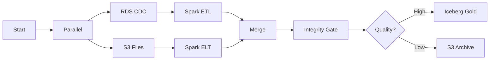

**Why this architecture:**
Step Functions orchestrates parallel ETL branches like a DAG. The Choice block implements conditional routing - good rows go to gold, quarantine rows go to archive. This is the recommended starting pattern for multi-source pipelines.

**What gets deployed to AWS:**
- Step Functions state machine with Parallel + Choice states
- Lambda integrity gate function
- Glue ETL jobs for each transform
- S3 buckets (gold + archive) via Terraform
- RDS instance + Secrets Manager (if Create new selected)

---

### RDS CDC → Iceberg (Vaquar PVDM)
**ID:** `vaquar-cdc-orders`  
**Difficulty:** Intermediate  
**AWS Services:** RDS, Glue, Iceberg, Lambda, Step Functions

**What the UI builds:**
- A single RDS source with CDC (Change Data Capture) enabled
- A Spark SQL transform that reads CDC events and applies business logic
- An Iceberg sink with Glue Data Catalog registration
- Behind the scenes: PVDM proof-gated writes (Physical → Verify → Durable → Metadata)

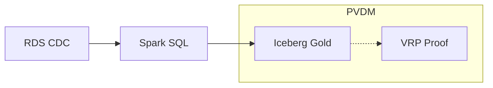

**Why this architecture:**
The Vaquar Pattern ensures every write to the gold Iceberg table is cryptographically verified before the metadata commit. If VRP (Verify-Read-back Protocol) fails, the Iceberg snapshot is rolled back. This guarantees data integrity at the storage layer.

**What gets deployed to AWS:**
- Step Functions with retry loop (IntegrityGate → DomainWriter → RouteOutcome)
- Lambda domain-writer that executes PVDM phases
- VRP proof stored in S3 proof bucket
- Iceberg table with snapshot pinning

---

### Media → AI Enrichment (Cognitive)
**ID:** `cognitive-media`  
**Difficulty:** Advanced  
**AWS Services:** S3, Bedrock, EKS, Iceberg, Lambda

**What the UI builds:**
- A media URL source (S3 prefix with PDFs, images, or videos)
- An **agentic** transform that invokes Amazon Bedrock to extract entities, summarize content, or classify media
- An Iceberg sink for the structured extraction output

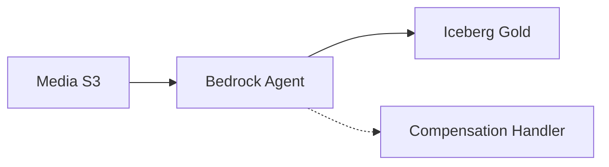

**Why this architecture:**
Cognitive pipelines use AI models (Claude, Titan, Nova) to transform unstructured media into structured Parquet. The compensation handler ensures idempotency - if the agent fails mid-batch, it resumes without reprocessing.

**What gets deployed to AWS:**
- EKS task for agentic runtime (or Lambda for small workloads)
- Bedrock model invocation (configured model ID)
- Compensation handler for rollback
- Idempotency tracking via workload ID

---

### S3 Files → Iceberg (Batch)
**ID:** `s3-batch-lake`  
**Difficulty:** Beginner  
**AWS Services:** S3, Glue, Iceberg

**What the UI builds:**
- An S3 source pointing to a landing zone bucket
- A Spark SQL transform for cleansing and typing
- An Iceberg sink with catalog registration

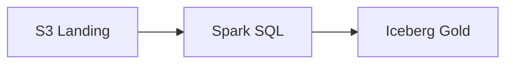

**Why this architecture:**
The simplest production-ready pipeline. Files land in S3, Glue ETL processes them on a cron schedule, and writes ACID-committed Iceberg tables. No streaming, no CDC, no agent - just clean batch ETL.

---

### Kafka → Iceberg Stream
**ID:** `kafka-stream`  
**Difficulty:** Intermediate  
**AWS Services:** MSK/Kafka, Glue, Iceberg

**What the UI builds:**
- A Kafka source (MSK topic)
- A Glue streaming transform with windowed aggregation
- An Iceberg sink for the streaming output

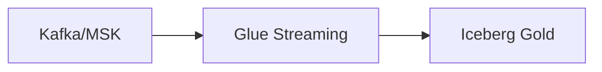

**Why this architecture:**
Event-driven architectures on Kafka need a streaming ETL to lakehouse bridge. Glue streaming (Spark Structured Streaming) consumes from MSK with checkpointing and writes micro-batches to Iceberg with exactly-once semantics via idempotent MERGE.

---

### MySQL → Redshift
**ID:** `mysql-redshift`  
**Difficulty:** Beginner  
**AWS Services:** MySQL/RDS, Glue, Redshift

**What the UI builds:**
- A MySQL source with CDC
- A Spark SQL transform
- A Redshift sink (COPY command)

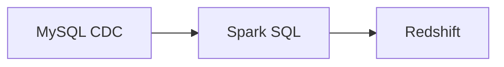

**Why this architecture:**
Classic OLTP-to-warehouse sync. MySQL CDC captures changes, Glue transforms and deduplicates, Redshift receives the final analytical layer. Good for teams already on Redshift who want managed ETL.

---

## Data Mesh

### Domain Data Product
**ID:** `arch-datamesh-domain-product`  
**Difficulty:** Advanced  
**AWS Services:** RDS, Glue, Iceberg, Lambda, Lake Formation

**What the UI builds:**
- Full medallion pipeline (Bronze → Silver → Gold) within a single domain's AWS account
- Three distinct roles mapped to mesh accounts:
  - **Producer** - ingests and transforms data
  - **Steward** - runs the PVDM integrity gate
  - **Publisher** - registers the Iceberg product in the catalog with Lake Formation grants
- Each block is tagged with its mesh role for governance tracing

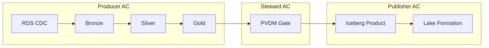

**Why this architecture:**
In a data mesh, each domain owns its data-as-a-product. This pattern implements the complete product lifecycle: CDC ingest, quality transformation, integrity verification, and self-serve publishing via Lake Formation tags.

---

### Multi-Domain Parallel
**ID:** `arch-datamesh-multi-domain`  
**Difficulty:** Expert  
**AWS Services:** RDS, MSK, S3, Glue, Iceberg, Lambda, Step Functions, Lake Formation

**What the UI builds:**
- Start → Parallel with 3 branches:
  - Commerce domain (RDS orders)
  - Inventory domain (Kafka stock updates)
  - CRM domain (S3 contacts)
- Each branch runs in its own producer AWS account and region
- Merge → Enrichment (Customer 360 join) → Steward Gate → Publisher Gold

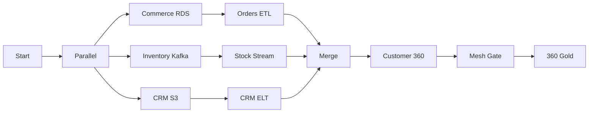

**Why this architecture:**
Cross-domain analytics without a central ETL team. Three domain pipelines run independently, the publisher account merges them into a federated product. Matches the Vaquar SDM framework's producer/steward/publisher account model.

---

## Data Lake

### Raw / Curated / Consumption Zones
**ID:** `arch-datalake-zones`  
**Difficulty:** Intermediate  
**AWS Services:** S3, Glue, Athena, Lake Formation

**What the UI builds:**
- S3 raw landing zone → Glue Crawler (schema-on-read) → Curated ETL → Quality Gate → Curated Parquet → Athena consumption view

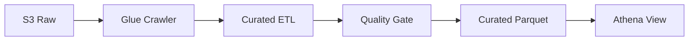

**Why this architecture:**
Classic data lake with immutable raw zone, typed curated zone, and Athena-queryable consumption layer. Good starting point before migrating to Iceberg lakehouse.

---

## Lakehouse

### Iceberg Medallion + ACID
**ID:** `arch-lakehouse-iceberg`  
**Difficulty:** Intermediate  
**AWS Services:** DMS, Glue, Iceberg, S3, Athena

**What the UI builds:**
- DMS CDC → Iceberg bronze (raw CDC events)
- MERGE into silver (deduplication + SCD)
- Aggregate gold (business KPIs)
- VRP proof on every gold commit

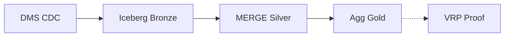

**Why this architecture:**
Modern lakehouse replaces Hive/Parquet with Iceberg ACID tables. MERGE handles CDC upserts, time travel enables rollback, and PVDM proof-gates every gold commit for auditability.

---

## Kappa

### Stream-Only Architecture
**ID:** `arch-kappa-stream-only`  
**Difficulty:** Advanced  
**AWS Services:** Kinesis, Glue Streaming, Iceberg, Lambda

**What the UI builds:**
- Kinesis source (event log) → Glue Streaming (window aggregation) → Dedupe → Enrichment join → VRP Gate → Iceberg Gold

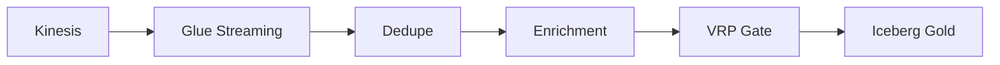

**Why this architecture:**
Kappa treats everything as a stream - no separate batch layer. Historical reprocessing = replay the Kinesis stream with a new versioned job. Simpler operations than Lambda architecture at the cost of replay complexity.

---

## Lambda Architecture

### Batch + Speed Layers (λ)
**ID:** `arch-lambda-batch-speed`  
**Difficulty:** Expert  
**AWS Services:** S3, Kinesis, Glue, Iceberg, Athena, Step Functions

**What the UI builds:**
- Start → Parallel with 2 branches:
  - **Batch layer:** S3 history → Glue daily ETL → Iceberg batch table
  - **Speed layer:** Kinesis real-time → Glue streaming → Iceberg speed table
- Merge → Athena serving view (UNION of batch + speed)

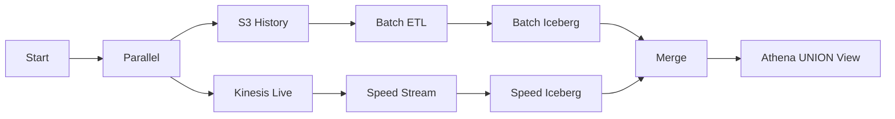

**Why this architecture:**
When you need both accurate batch history AND low-latency recent data. The batch layer provides complete, correct aggregates; the speed layer provides last-N-minutes approximations. Athena UNION merges both views at query time.

---

## Streaming

### Kinesis → Firehose → Analytics
**ID:** `arch-kinesis-firehose-analytics`  
**Difficulty:** Intermediate  
**AWS Services:** Kinesis, Firehose, Glue, Iceberg, Athena, Lambda

**What the UI builds:**
- Kinesis Data Streams (producer ingest) → Firehose delivery (buffered S3 write) → Bronze S3
- Glue streaming enrichment → Stream Gate (integrity) → Gold Iceberg

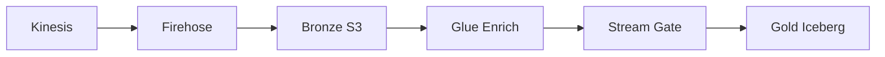

**Why this architecture:**
Production streaming stack for clickstream, IoT, or application logs. Firehose handles delivery/buffering to S3 (no code needed), then Glue streaming enriches and writes to Iceberg gold for SQL analytics.

---

### MSK → Glue Streaming → Lakehouse
**ID:** `arch-msk-glue-streaming`  
**Difficulty:** Advanced  
**AWS Services:** MSK, Glue, Iceberg, Schema Registry, Lambda

**What the UI builds:**
- MSK topic → Window aggregation → CDC MERGE into silver → Aggregate gold KPIs → PVDM Gate → Iceberg Gold

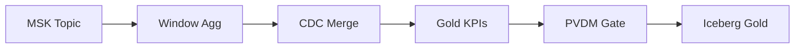

**Why this architecture:**
For teams already on Kafka/MSK who want managed streaming to lakehouse. Glue streaming handles window aggregations, idempotent MERGE handles exactly-once at the sink level (at-least-once delivery + dedup).

---

## ETL / ELT Factory

### Glue ETL Factory - Multi-Stage
**ID:** `arch-glue-etl-factory`  
**Difficulty:** Intermediate  
**AWS Services:** DMS, Glue, Iceberg, Lambda, Step Functions

**What the UI builds:**
- DMS CDC extract → Enrichment → Dedupe → Aggregate → Quality Gate → Iceberg Gold
- Each transform is a separate Glue job in a chained Step Functions workflow

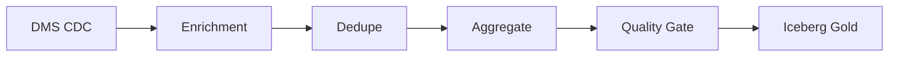

**Why this architecture:**
When you need multiple ETL stages (extract, enrich, dedupe, aggregate) as separate testable jobs. Each stage has its own Spark SQL, can be retried independently, and the chain is visible in the Step Functions console.

---

### ELT - Load First → Redshift Transform
**ID:** `arch-elt-redshift`  
**Difficulty:** Intermediate  
**AWS Services:** S3, Glue, Redshift, Lambda

**What the UI builds:**
- S3 landing → Glue COPY to Redshift staging → Redshift SQL transforms → Redshift marts

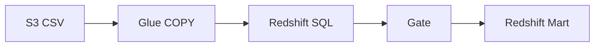

**Why this architecture:**
ELT pattern - load raw data into Redshift first (fast COPY from S3), then transform using Redshift's compute engine (SQL stored procedures or dbt). Good for teams with existing Redshift investment.

---

## Extended Patterns

### Full Medallion (Bronze → Silver → Gold)
**ID:** `medallion-full-stack`  
**Difficulty:** Intermediate  
**AWS Services:** RDS, Glue, S3, Iceberg, Step Functions, Lambda

Classic three-layer lakehouse with explicit bronze (raw), silver (conformed), and gold (aggregated) Iceberg tables.

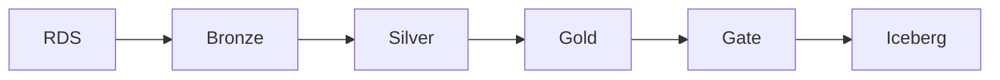

### Payment Ledger (Double-Entry)
**ID:** `finance-payment-ledger`  
Finance domain with strict data quality, audit trail, and double-entry ledger pattern.

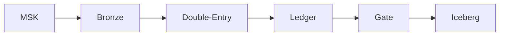

### FHIR Resources → HIPAA Gold
**ID:** `healthcare-fhir`  
Healthcare domain with PII masks (restricted classification), HIPAA-compliant pipeline.

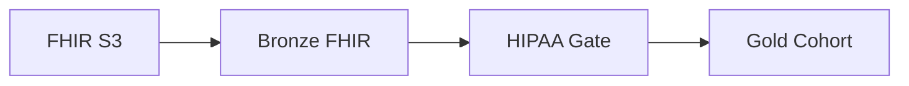

### Clickstream → Real-Time Dashboards
**ID:** `retail-clickstream`  
Retail domain with Kinesis streaming, sub-minute latency for real-time analytics.

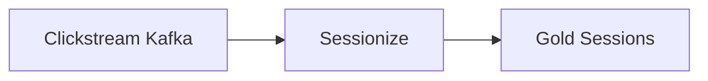

### IoT Sensor Fleet → Timestream Gold
**ID:** `iot-sensor-fleet`  
IoT domain with parallel fleet ingestion and high-volume sensor data processing.

```mermaid
flowchart LR
  Start --> Par[Parallel]
  Par --> A[Fleet A Kafka]
  Par --> B[Fleet B Kafka]
  A --> Merge
  B --> Merge
  Merge --> Enrich --> Gate --> Gold[IoT Gold]
```

### SCD Type 2 Customer Dimension
**ID:** `scd2-customers`  
Slowly Changing Dimension Type 2 pattern for customer master data.

```mermaid
flowchart LR
  RDS[RDS] --> Bronze --> SCD2[SCD Type 2] --> Gold --> Gate --> Iceberg
```

### Fraud Scoring (Parallel Rules + ML)
**ID:** `fraud-detection-parallel`  
Finance domain with parallel branches for rules engine and ML scoring, choice-routed output.

```mermaid
flowchart LR
  Start --> Par[Parallel]
  Par --> Rules[Rules Engine]
  Par --> ML[ML Scoring]
  Rules --> Merge
  ML --> Merge
  Merge --> Choice{Score?}
  Choice -->|High| Block[Block Sink]
  Choice -->|Low| Pass[Pass Sink]
```

### Documents → RAG Knowledge Base
**ID:** `genai-rag-documents`  
Cognitive pattern using Bedrock to chunk/embed documents for RAG retrieval.

```mermaid
flowchart LR
  S3[S3 PDFs] --> Chunk[Bedrock Chunk] --> Gold[RAG Iceberg]
```

### Data Quality Quarantine Lane
**ID:** `dq-quarantine`  
Compliance pattern that routes bad rows to a quarantine sink instead of failing the pipeline.

```mermaid
flowchart LR
  Source --> ETL --> Choice{DQ Pass?}
  Choice -->|Yes| Gold[Gold Sink]
  Choice -->|No| Quarantine[Quarantine Sink]
```

### Feature Store Pipeline
**ID:** `feature-store-ml`  
ML platform pattern that computes and publishes features to SageMaker Feature Store.

```mermaid
flowchart LR
  RDS[RDS] --> Bronze --> Features[Feature Compute] --> Gold --> Store[Feature Store]
```

---

## How Patterns Work

When you click **Use pattern**, the UI:

1. **Instantiates** the pattern - creates fresh node IDs and normalizes provisioning modes
2. **Loads** the nodes and edges onto the React Flow canvas
3. **Sets** pipeline metadata (name, domain, version, schedule)
4. **Defaults** all resources to "Create new" - so you can deploy immediately without providing ARNs
5. **Runs** AWS Design Review automatically - advisory findings shown but never block deploy

You can customize any block after loading:
- Click a block → edit in the Properties panel
- Drag AWS blocks from the palette to add more steps
- Use Parallel/Choice/Merge for complex workflows
- Preview YAML to see the generated DataContract
- Deploy to compile Step Functions + register in the marketplace

---

## Compute Engines

Each transform block can use different compute engines:

| Engine | Description | Managed |
|--------|-------------|---------|
| **AWS Glue** | Default - Spark ETL/ELT jobs | ✅ |
| **AWS Lambda** | Domain-writer for PVDM workloads | ✅ |
| **EMR Serverless** | Large-scale Spark (bring your app) | ✅ |
| **Databricks** | External - trigger via Lambda proxy | ❌ |

Set `computeEngine` on a transform block in Properties to override the default (Glue).

---

## Pattern Selection Guide

| I need... | Use this pattern |
|-----------|-----------------|
| Simple batch ETL | `s3-batch-lake` |
| CDC from database | `vaquar-cdc-orders` |
| Real-time streaming | `arch-kinesis-firehose-analytics` |
| Kafka to lakehouse | `arch-msk-glue-streaming` |
| AI/ML enrichment | `cognitive-media` or `genai-rag-documents` |
| Multi-source workflow | `multi-source-mesh` |
| Data mesh product | `arch-datamesh-domain-product` |
| Cross-domain federation | `arch-datamesh-multi-domain` |
| Batch + speed layers | `arch-lambda-batch-speed` |
| Stream-only (no batch) | `arch-kappa-stream-only` |
| Feature engineering | `feature-store-ml` |
| Fraud detection | `fraud-detection-parallel` |


---

## Agent Builder Templates

The **Agent Builder** panel (switch to it via the header toggle) provides 11 pre-built agent templates. Each template creates a visual graph of AgentCore components that deploys to Amazon Bedrock Agents.

### How Agent Templates Work

When you click **Use template**, the Agent Builder:
1. Places runtime, model, tools, guardrails, and memory blocks on the canvas
2. Wires them with edges (runtime → model, runtime → tools, etc.)
3. Sets agent metadata (name, domain, version, description)
4. Click **Deploy to AWS** → creates a real Bedrock Agent with alias "live"
5. Chat URL links to the deployed agent (Streamlit or Bedrock Console)

---

### Customer Support Agent
**ID:** `customer-support`  
**Category:** Customer Experience  
**Difficulty:** Starter  
**AWS Services:** AgentCore Runtime, Bedrock, Knowledge Base, Lambda, Guardrails

**What the UI builds:**
- **Runtime** block (Strands framework, session isolation enabled)
- **Foundation Model** (Claude Sonnet, temperature 0.2 for deterministic responses)
- **Knowledge Base** (FAQ retrieval with hybrid search)
- **Gateway** (dual auth - API key + Cognito)
- **Tool: Lambda** (Order Lookup function)
- **PII Guardrail** (anonymizes EMAIL, PHONE, SSN)
- **Content Guardrail** (denies legal advice, medical diagnosis topics)
- **Session Memory** (30-minute TTL)

```mermaid
flowchart TD
  RT[Runtime] --> Model[Claude Sonnet]
  RT --> KB[FAQ Knowledge Base]
  RT --> GW[Gateway]
  RT --> PII[PII Guardrail]
  RT --> Content[Content Guardrail]
  RT --> Mem[Session Memory]
  GW --> Lambda[Order Lookup λ]
```

**Use case:** Customer-facing chatbot that answers FAQs, looks up orders, and respects PII boundaries.

---

### RAG Document Q&A
**ID:** `rag-doc-qa`  
**Category:** Enterprise  
**Difficulty:** Starter  
**AWS Services:** AgentCore Runtime, Bedrock, Knowledge Base, Guardrails

**What the UI builds:**
- **Runtime** (LangChain framework)
- **Foundation Model** (Claude, temperature 0.1 for factual answers)
- **Knowledge Base** (enterprise docs with hybrid retrieval)
- **Content Guardrail** (blocks hate/violence, denies confidential leaks)
- **Observability** (traces enabled for debugging retrieval quality)

```mermaid
flowchart TD
  RT[Runtime] --> Model[Claude]
  RT --> KB[Docs KB]
  RT --> GR[Content Guardrail]
  RT --> Obs[Observability]
```

**Use case:** Internal knowledge assistant that answers questions from company documents with citations.

---

### Data Analyst Agent
**ID:** `data-analyst`  
**Category:** Data & Analytics  
**Difficulty:** Intermediate  
**AWS Services:** AgentCore Runtime, Bedrock, MCP, Lambda, Guardrails

**What the UI builds:**
- **Runtime** (Strands framework)
- **Foundation Model** (Claude, temperature 0 for exact SQL generation)
- **Gateway** (Lambda + MCP protocols)
- **Tool: MCP** (CogniMesh marketplace - list_products, query_lineage)
- **Tool: Lambda** (Athena query execution)
- **SQL Guardrail** (denies DROP TABLE, DELETE FROM, TRUNCATE)
- **Identity** (Lake Formation tag-based access scope)

```mermaid
flowchart TD
  RT[Runtime] --> Model[Claude]
  RT --> GW[Gateway]
  RT --> GR[SQL Guardrail]
  RT --> ID[Identity/LF Tags]
  GW --> MCP[CogniMesh MCP]
  GW --> Lambda[Athena Query λ]
```

**Use case:** Natural language to SQL analyst that queries the data mesh catalog and runs Athena queries with governance constraints.

---

### Fraud Investigation Agent
**ID:** `fraud-detection`  
**Category:** Security  
**Difficulty:** Advanced  
**AWS Services:** AgentCore Runtime, Bedrock, Lambda, Knowledge Base, Guardrails

**What the UI builds:**
- **Runtime** with long-term memory enabled
- **Foundation Model** (Claude, low temperature)
- **Knowledge Base** (fraud patterns + investigation playbooks)
- **Tool: Lambda** (transaction lookup, risk scoring API)
- **Strict Guardrail** (no PII exposure, no investigation leaks)
- **Human-in-the-Loop** (escalation to fraud analyst for high-risk cases)
- **Long Memory** (cross-session case tracking)

```mermaid
flowchart TD
  RT[Runtime] --> Model[Claude]
  RT --> KB[Fraud Patterns KB]
  RT --> GR[Strict Guardrail]
  RT --> HITL[Human-in-Loop]
  RT --> Mem[Long Memory]
  RT --> Lambda[Transaction Lookup λ]
```

**Use case:** Fraud analyst assistant that investigates suspicious transactions, references historical patterns, and escalates to humans for final decisions.

---

### Code Review Agent
**ID:** `code-review`  
**Category:** Developer  
**Difficulty:** Intermediate  
**AWS Services:** AgentCore Runtime, Bedrock, Code Interpreter, Guardrails

**What the UI builds:**
- **Runtime** (Strands framework)
- **Foundation Model** (Claude for code understanding)
- **Code Interpreter** (Python/JS sandbox for testing)
- **Security Guardrail** (blocks secrets in output, denies system access topics)
- **Observability** (traces for review accuracy tracking)

```mermaid
flowchart TD
  RT[Runtime] --> Model[Claude]
  RT --> Code[Code Interpreter]
  RT --> GR[Security Guardrail]
  RT --> Obs[Observability]
```

**Use case:** Automated code reviewer that analyzes PRs, runs test snippets in sandbox, and flags security issues.

---

### HR Policy Assistant
**ID:** `hr-policy`  
**Category:** Enterprise  
**Difficulty:** Starter  
**AWS Services:** AgentCore Runtime, Bedrock, Knowledge Base, Guardrails

**What the UI builds:**
- **Runtime** (Strands framework)
- **Foundation Model** (Claude, temperature 0.1)
- **Knowledge Base** (HR policy documents)
- **Content Guardrail** (denies salary negotiation advice, legal counsel, medical diagnosis)
- **Identity** (employee role-based access)

```mermaid
flowchart TD
  RT[Runtime] --> Model[Claude]
  RT --> KB[HR Policy KB]
  RT --> GR[Content Guardrail]
  RT --> ID[Identity/Role]
```

**Use case:** Employee self-service assistant that answers HR policy questions (PTO, benefits, procedures) without giving legal/medical advice.

---

### Multi-Agent Supervisor
**ID:** `multi-agent-supervisor`  
**Category:** Enterprise  
**Difficulty:** Advanced  
**AWS Services:** AgentCore Runtime, Bedrock, Multiple Sub-Agents, Gateway

**What the UI builds:**
- **Supervisor Runtime** (orchestrates sub-agents)
- **Foundation Model** (Claude for routing decisions)
- **Gateway** (routes requests to appropriate specialist)
- **Tool: Lambda** (sub-agent invocation - support, billing, technical)
- **Memory** (session context passed between agents)

```mermaid
flowchart TD
  Supervisor[Supervisor Runtime] --> Model[Claude]
  Supervisor --> GW[Gateway Router]
  Supervisor --> Mem[Session Memory]
  GW --> Support[Support Agent λ]
  GW --> Billing[Billing Agent λ]
  GW --> Tech[Technical Agent λ]
```

**Use case:** Complex multi-turn workflows where a supervisor agent routes questions to specialized sub-agents (support, billing, technical) and synthesizes their responses.

---

### CogniMesh Data Steward
**ID:** `cognimesh-steward`  
**Category:** CogniMesh  
**Difficulty:** Intermediate  
**AWS Services:** AgentCore Runtime, Bedrock, MCP, Lambda, Guardrails

**What the UI builds:**
- **Runtime** (Strands framework)
- **Foundation Model** (Claude for governance decisions)
- **Tool: MCP** (CogniMesh marketplace - list products, approve requests, grant access)
- **Tool: Lambda** (Lake Formation grant operations)
- **Guardrail** (cannot auto-approve without human review)
- **Identity** (steward role scope)

```mermaid
flowchart TD
  RT[Runtime] --> Model[Claude]
  RT --> MCP[CogniMesh MCP]
  RT --> Lambda[LF Grant λ]
  RT --> GR[Governance Guardrail]
  RT --> ID[Steward Identity]
```

**Use case:** Data steward assistant that reviews access requests, explains data products, and executes Lake Formation grants with governance guardrails.

---

### DevOps / SRE Agent
**ID:** `devops-sre`  
**Category:** DevOps  
**Difficulty:** Intermediate  
**AWS Services:** AgentCore Runtime, Bedrock, Knowledge Base, Lambda, CloudWatch, Guardrails, Step Functions

**What the UI builds:**
- **Runtime** (Strands framework)
- **Foundation Model** (Claude for incident analysis)
- **Knowledge Base** (runbooks, architecture docs, past incidents)
- **Tool: Lambda** (CloudWatch query, ECS service restart, Step Functions trigger)
- **Content Guardrail** (blocks destructive commands in prod without HITL)
- **Human-in-the-Loop** (production changes require human approval)
- **Observability** (all actions logged for incident review)

```mermaid
flowchart TD
  RT[Runtime] --> Model[Claude]
  RT --> KB[Runbooks KB]
  RT --> GR[Prod Guardrail]
  RT --> HITL[Human Approval]
  RT --> Obs[Observability]
  RT --> Lambda[CloudWatch/ECS λ]
```

**Use case:** SRE assistant that diagnoses incidents from CloudWatch metrics, suggests runbook actions, and executes non-destructive commands with human approval for production changes.

---

### Custom Agent Starter
**ID:** `custom-agent-starter`  
**Category:** Developer  
**Difficulty:** Starter  
**AWS Services:** AgentCore Runtime, Bedrock, Gateway, Guardrails, CloudWatch

**What the UI builds:**
- **Runtime** (Strands framework, minimal config)
- **Foundation Model** (Claude - you pick the variant)
- **Gateway** (API endpoint - you wire tools)
- **Content Guardrail** (basic safety - you customize)
- **Observability** (traces - you add tools and KB)

```mermaid
flowchart TD
  RT[Runtime] --> Model[Claude]
  RT --> GW[Gateway]
  RT --> GR[Basic Guardrail]
  RT --> Obs[Observability]
```

**Use case:** Starting point for building a custom agent. Provides the skeleton (runtime + model + gateway) - you add tools, knowledge bases, and domain-specific guardrails.

---

### Blank Agent
**ID:** `blank-agent`  
**Category:** Developer  
**Difficulty:** Starter

**What the UI builds:**
- Empty canvas - drag blocks from the Agent palette

```mermaid
flowchart TD
  Empty[Empty Canvas - Drag blocks from palette]
```

**Use case:** Full manual control. Build your agent graph from scratch using the AgentCore block palette.

---

## Agent Block Types Reference

| Block | Icon | Purpose |
|-------|------|---------|
| **Runtime** | ⚡ | Agent execution environment (Strands, LangChain, AutoGen) |
| **Supervisor** | 👔 | Multi-agent orchestrator that routes to specialists |
| **Foundation Model** | 🤖 | LLM connection (Claude, Nova, Titan, Llama) |
| **Knowledge Base** | 📚 | RAG retrieval (Bedrock KB with OpenSearch/Aurora) |
| **Guardrail** | 🔒 | Content filters, PII detection, denied topics |
| **Tool: Lambda** | λ | AWS Lambda function invocation |
| **Tool: MCP** | 🔌 | Model Context Protocol server connection |
| **Tool: API** | 🌐 | OpenAPI spec-based external API tool |
| **Code Interpreter** | 💻 | Sandboxed code execution (Python/JS) |
| **Browser** | 🌍 | Headless browser for web interaction |
| **Gateway** | 🌐 | API entry point (auth, rate limits, protocols) |
| **Memory: Session** | 🧠 | Short-term conversation memory (TTL-based) |
| **Memory: Long** | 📝 | Persistent memory across sessions |
| **Identity** | 🪪 | Access scope (Lake Formation tags, IAM roles) |
| **Human-in-Loop** | 👤 | Escalation point requiring human approval |
| **Observability** | 📊 | Traces, metrics, and audit logging |

---

## Agent Selection Guide

| I need... | Use this template |
|-----------|------------------|
| Customer chatbot with FAQ | `customer-support` |
| Document Q&A (RAG) | `rag-doc-qa` |
| Natural language SQL | `data-analyst` |
| Fraud investigation | `fraud-detection` |
| Code review automation | `code-review` |
| HR policy questions | `hr-policy` |
| Multi-agent routing | `multi-agent-supervisor` |
| Data mesh governance | `cognimesh-steward` |
| Incident response (SRE) | `devops-sre` |
| Build my own agent | `custom-agent-starter` |
| Start completely blank | `blank-agent` |


---

## New Features (ui-enhancement-2026-06-20)

### AgentCore Runtime (Strands) Deploy Target

In the Agent Builder, a new deploy target dropdown lets you choose:
- **Bedrock Agents** (default) — creates a Bedrock Agent with alias
- **AgentCore Runtime (Strands)** — generates a downloadable Python project

The AgentCore Runtime target generates a complete standalone project:
- `agent.py` — Strands Agent + BedrockModel with your tools as @tool stubs
- `requirements.txt` — Python deps (strands-agents, boto3, bedrock-agentcore)
- `Dockerfile` — linux/arm64 container
- `deploy.sh` — ECR build+push + create-agent-runtime CLI command
- `.env.example` — configuration reference
- `README.md` — usage instructions

Click **⬇ Download project (.zip)** to get the full project as a ZIP file.

### Native Dashboard Tab

The **📊 Dashboard** tab in the header shows a live view of ALL deployed infrastructure:
- KPI cards: Pipelines, Succeeded, Failed, Agents
- SVG donut chart of pipeline run-status distribution
- Bar chart of agents by status
- Full tables of all pipelines and agents with status badges
- Auto-refreshes every 15 seconds from `/api/v1/public/status`

### AgentCore Studio Tab

The **AgentCore Studio** tab embeds the AWS-sample AgentCore self-service platform
(deployed separately as its own CDK stack) in an iframe. This provides:
- Full agent template creation workflow
- Tool/guardrail configuration
- Runtime deployment via the AWS sample's own infrastructure

If the iframe is blocked by browser cookie policy, a fallback panel with
"Open in new tab ↗" is shown.
