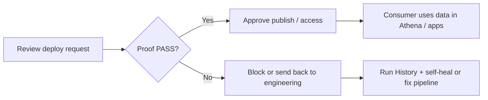

  

  
  
  
  

<h1 align="center">CogniMesh for Business &amp; Data Stewards</h1>

  <strong>Trust, access, and publication - in plain language</strong>

  <a href="#for-c-suite--executive-leadership">C-suite summary (2 min)</a>
  &nbsp;·&nbsp;
  <a href="#faq">FAQ</a>
  &nbsp;·&nbsp;
  <a href="#your-day-as-a-data-steward">Steward workflows</a>
  &nbsp;·&nbsp;
  <a href="../README.md">Technical README</a>

---

## Who this guide is for

| Reader | Start here |
|--------|------------|
| **CEO / GM** | [C-suite summary](#for-c-suite--executive-leadership) - strategy, risk, KPIs |
| **CFO** | [C-suite summary](#for-c-suite--executive-leadership) - audit readiness, cost control, prove-before-publish |
| **CDO / Chief Data Officer** | C-suite summary + [steward workflows](#your-day-as-a-data-steward) |
| **CISO / Compliance** | C-suite summary + [Trust & proof](#trust--proof-what-verified-means) |
| **Data steward / governance lead** | [Your day as a steward](#your-day-as-a-data-steward) |
| **Product owner (non-technical)** | [What CogniMesh is](#what-cognimesh-is-30-seconds) + platform demos |

Engineers and architects should use the [main README](../README.md).

---

## For C-suite & executive leadership

**One-line pitch:** CogniMesh turns data pipelines into **governed, provable data products** on AWS - so the organization can **ship faster with less reputational and regulatory risk**.

### Strategic outcomes (what leadership buys)

| Outcome | Business meaning |
|---------|------------------|
| **Faster time to market** | Domain teams publish datasets through a **visual portal** and ready-made patterns - less dependency on central engineering queues for every new product. |
| **Federated data mesh** | Each business unit **owns** its pipelines and products; central teams set **policy**, not every pipeline by hand. |
| **Trust at publish time** | Gold data does not reach the marketplace until **integrity verification passes** - fewer “the numbers were wrong” incidents after go-live. |
| **Consumer self-service** | Internal customers **discover, preview, and request access** in one place instead of opaque ticket chains. |
| **AI with guardrails** | Agent workflows can be tied to **verified inputs** and signed decision records - a concrete answer to “what did the AI actually use?” |
| **Audit-ready operations** | Run history, approvals, versions, lineage, and exportable audit reports support **SOX, HIPAA, and internal control** conversations. |

### Risks you reduce (board-level)

| Risk | Without a control plane | With CogniMesh |
|------|-------------------------|----------------|
| **Silent data loss** | Pipelines drop rows; dashboards still refresh | Verification **blocks** catalog commit on mismatch |
| **Unauthorized access** | Ad-hoc shares, stale entitlements | Marketplace **request → steward approve → grant** |
| **Unowned data products** | “Who owns this table?” | Every product has **domain, owner, contract** |
| **Unprovable AI decisions** | Black-box agent outputs | Optional **attestations** over verified inputs |
| **Regulatory scrutiny** | Manual evidence gathering | **Proof artifacts**, snapshots, and audit exports |

### KPIs executives can ask for

These map directly to portal screens - no custom BI required to start:

| KPI | Where to see it | Healthy signal |
|-----|-----------------|----------------|
| **Verification pass rate** | Run History · observability dashboard | High PASS % on production pipelines |
| **Rows dropped (quality)** | Run History per run | Drops within policy; spikes investigated |
| **Time to publish** | Deploy → marketplace listing | Trending down as domains reuse patterns |
| **Access backlog** | Approvals queue | Pending requests cleared within SLA |
| **Products with proof** | Marketplace · proof-gated badge | Critical domains publish only verified products |
| **Pipeline health score** | Operations · health panel | Scores stable or improving by domain |

### AI governance (what the board will ask)

| Question | CogniMesh answer |
|----------|------------------|
| “Can we prove what data the model saw?” | Proof-gated gateway + **decision attestations** on the agent path |
| “Can a bad pipeline corrupt gold data?” | **Fail closed** - no PASS on error or empty runs |
| “Who approved consumer access?” | **Approvals** log with steward identity |
| “Can we roll back a bad deploy?” | **Version diff and rollback** on the pipeline canvas |

*Honest limits:* CogniMesh proves **data integrity and decision context**, not that an LLM's business judgment is correct. For **aggregations**, enable `pvdm.vrp.mode: aggregate` so per-group invariants and lineage apply - see [FAQ - swap attacks](FAQ.md#does-verification-catch-swap-attacks-same-total-wrong-groups).*

### Investment framing (build vs assemble)

| Approach | Tradeoff |
|----------|----------|
| **DIY on raw AWS** | Maximum flexibility; you own glue between Glue, SFN, LF, catalog, and proof |
| **CogniMesh** | Pre-wired **portal + contracts + proof + marketplace + ops** on AWS serverless patterns |
| **Traditional ETL vendor** | Strong scheduling; often weak on **federated mesh + cryptographic proof** |

CogniMesh targets organizations already on **AWS** that want **domain-owned data products** with **evidence before publish**, not another batch-only ETL scheduler.

### What leadership decides vs delegates

| Leadership decides | Delegate to stewards & domain teams |
|--------------------|-------------------------------------|
| Which domains own which data products | Day-to-day access approvals |
| Proof required before publish (policy) | Run History review when PASS/FAIL |
| Deploy approval required or not | Design-review remediation |
| Lake Formation / IAM guardrails (with security) | Marketplace product metadata |
| AI attestation required on agent paths | Consumer onboarding |

### 60-second demo for an executive meeting

1. Open **Architectures** → load a pattern (e.g. finance or healthcare).  
2. Run **AWS Design Review** → show security score.  
3. **Deploy** → **Run History** → point to **VRP PASS** and proof link.  
4. Open **Marketplace** → consumer view → **Request access** → **Approvals** → approve.  

*Optional:* show **Operations** dashboard for health and audit export.

  <a href="assets/cognimesh-features-demo.mp4">▶ Watch platform tour (GIF)</a>

---

## What CogniMesh is (30 seconds)

**CogniMesh is a control plane for trustworthy data products on AWS.**

| Step | What happens |
|------|----------------|
| **1. Design** | Teams draw pipelines on a visual canvas (sources → transforms → outputs). |
| **2. Check** | The platform reviews the design for security and quality rules. |
| **3. Run** | Data moves through AWS (batch or streaming). |
| **4. Prove** | Before gold data is published, CogniMesh checks that **nothing was silently lost or changed**. |
| **5. Publish** | Approved data products appear in the **marketplace** for consumers. |
| **6. Govern** | Stewards approve access, track lineage, and audit who did what. |

**Your role as a steward:** Make sure only **verified** data products reach consumers, and that **access requests** are handled with policy - not ad-hoc email threads.

---

## The problem we solve

| Today (without CogniMesh) | With CogniMesh |
|---------------------------|----------------|
| “The dashboard looks right” but nobody can prove the numbers | Each publish can carry a **proof** that source and output match |
| Access granted in chat or ticket systems | **Request → approve → grant** in the portal with an audit trail |
| No one knows which pipeline version is live | **Version history**, diff, and rollback on the canvas |
| AI agents read data with no record of what they used | **Decision attestations** bind agent outputs to verified inputs |

---

## Your day as a data steward

### 1. Before data goes live - design review

When a domain team wants to deploy a pipeline:

- They run **AWS Design Review** in the portal (security and architecture score).
- You check that **governance** settings match policy (owner, domain, Lake Formation, quality rules).
- If your org enables it (`DEPLOY_APPROVAL_REQUIRED`), the deploy waits in **Approvals** until you approve.

**You are not expected to edit YAML.** You review outcomes, scores, and policy fit.

### 2. When data runs - proof and run history

After a pipeline runs:

- Open **Run History** in the portal.
- Look for the **VRP badge**: **PASS** (verified), **FAIL** (do not trust this run), or **UNVERIFIED** (nothing to prove - empty run or error).
- Expand a run to see rows processed, rows dropped, and links to proof artifacts.

**Rule of thumb:** Treat **FAIL** or **UNVERIFIED** like a failed audit - do not promote that output to consumers until engineering resolves it.

### 3. Marketplace - consumers discover your data products

Producers publish to the **Marketplace**. Consumers can:

- See **schema** and sample rows
- Open **Athena** with a safe preview query
- Click **Request access**

Products built with proof-gated pipelines show a **proof-gated** indicator - consumers know the dataset passed integrity checks before publication.

### 4. Access requests - your approvals queue

| Consumer action | Steward action |
|-----------------|----------------|
| **Request access** on a product | Item appears in header → **Approvals** |
| Waits for decision | **Approve** or **Reject** (optional reason) |
| Approved | Consumer sees access granted; Lake Formation grant can be applied in AWS |

**Try it locally:** Deploy any pipeline → Marketplace → open product → Request Access → Approvals → Approve.

### 5. Operations - lineage, versions, audit

From the **Operations** panel you can:

| Task | Where |
|------|--------|
| See health and pass rates | Operations dashboard |
| Compare pipeline versions | Versions → **Diff** |
| Roll back a bad deploy | Versions → **Rollback** |
| Export audit report | Audit → Download |
| Preview source data before deploy | Source block → **Preview source data** |
| Review column lineage | Column lineage tools |

---

## Trust & proof (what “verified” means)

CogniMesh uses the **[Vaquar Pattern](vaquar-pattern.md)** - proof before publish.

**In plain language:**

- The platform compares **what went in** vs **what was written** to the gold table.
- It stores **evidence** (a proof) that a third party can check later.
- **Catalog metadata** (marketplace listing, snapshot) only commits when verification **passes**.

**What proof does prove**

- Source and published data match for the fields the pipeline declares.
- The proof was signed under your organization’s key policy (AWS KMS in production).
- The run is tied to a specific table snapshot and time window.

**What proof does not prove**

- That business rules or ML models are “correct” - only that data was not silently corrupted in the pipe.
- That an **aggregation** allocated amounts to the wrong groups **when aggregate mode is not configured** - use `pvdm.vrp.mode: aggregate` for sum-by-group pipelines ([FAQ](FAQ.md#row-preserving-vs-aggregation---which-verification-applies)).
- That an AI agent’s **judgment** is right - only that it used **verified inputs** when attestations are enforced.

For AI-heavy flows, CogniMesh also supports **decision attestations**: a signed record that an agent’s output was produced from gateway-verified data, not self-declared inputs.

---

## Glossary (no jargon required)

| Term | What it means for you |
|------|------------------------|
| **Data product** | A dataset your domain owns and others can subscribe to |
| **Domain** | Business area (e.g. Finance, Healthcare) that owns its data products |
| **Marketplace** | Internal catalog - consumers browse and request access |
| **Data contract** | Rules for the pipeline (auto-generated from the canvas) |
| **Integrity gate** | Design-time checklist - blocks bad configs before AWS |
| **VRP / proof** | Evidence that source and sink data match |
| **PVDM** | The four-step write process: physical save → verify → durable run → catalog commit |
| **Lake Formation** | AWS layer for table-level access grants |
| **Lineage** | Where data came from and which pipelines touched it |
| **Agent** | AI assistant (e.g. Bedrock) with guardrails and optional attestation |

---

## Platform tour (watch first)

  
   
  <em>Operations · Run History · Lineage · Marketplace · Approvals</em>

  
   
  <em>Pattern library → design review → deploy → marketplace</em>

---

## FAQ

Full list (business, proof, engineering, agents, ops): **[docs/FAQ.md](FAQ.md)**

### Quick answers for stewards

**Do I need to write code?**  
No. Stewards work in the portal: Approvals, Run History, Marketplace, Operations.

**PASS vs FAIL vs UNVERIFIED?**  
**PASS** = verified, safe to promote per policy. **FAIL** = mismatch or blocked publish - do not trust. **UNVERIFIED** = empty run, error, or nothing to prove - **not** a pass.

**What should I block?**  
Deploys with critical design-review findings, VRP **FAIL** or **UNVERIFIED** (when proof is required), or missing owner/domain metadata - per your org policy.

**Can consumers see data before I approve?**  
Not when access control is enabled. They see schema and samples; full access follows your approval.

**How is this different from a normal data lake?**  
A lake stores files. CogniMesh adds contracts, proof before publish, marketplace, and steward workflows on top.

**Is everything on the hardening roadmap shipped?**  
Yes - VRP v3 covers transform verification, contract binding, compaction-safe logical digests, conformance vectors, and fail-closed publish. Details: [FAQ](FAQ.md#is-the-hardening-roadmap-done).

**Where do I go for step-by-step lessons?**  
[docs/tutorials/README.md](tutorials/README.md) - pipeline and agent walkthroughs by industry.

---

## Where to go next

| Goal | Link |
|------|------|
| **FAQ (start here for repeat questions)** | [FAQ.md](FAQ.md) |
| **C-suite / board briefing** | [Executive summary (2 min)](README-business-stewards.md#for-c-suite--executive-leadership) |
| Full product overview (mixed audience) | [Main README](../README.md) |
| Top 3 workflows (prove → deploy → consume) | [TOP3_FEATURES.md](TOP3_FEATURES.md) |
| Steward agent template (optional automation) | [CogniMesh Data Steward tutorial](tutorials/agents/cognimesh-steward.md) |
| Technical proof specification | [Vaquar Pattern](vaquar-pattern.md) |
| Hardening roadmap (honest limits + what's next) | [Vaquar Pattern - roadmap](vaquar-pattern.md#hardening-roadmap) |
| Portal button map | [PORTAL_UI.md](PORTAL_UI.md) |
| Local demo setup | [GETTING_STARTED.md](GETTING_STARTED.md) |

---

  Questions about governance policy? Define your rules in the integrity gate and steward approval settings - engineering wires the platform to match.

  <a href="../README.md"><strong>→ Continue to technical README</strong></a>

