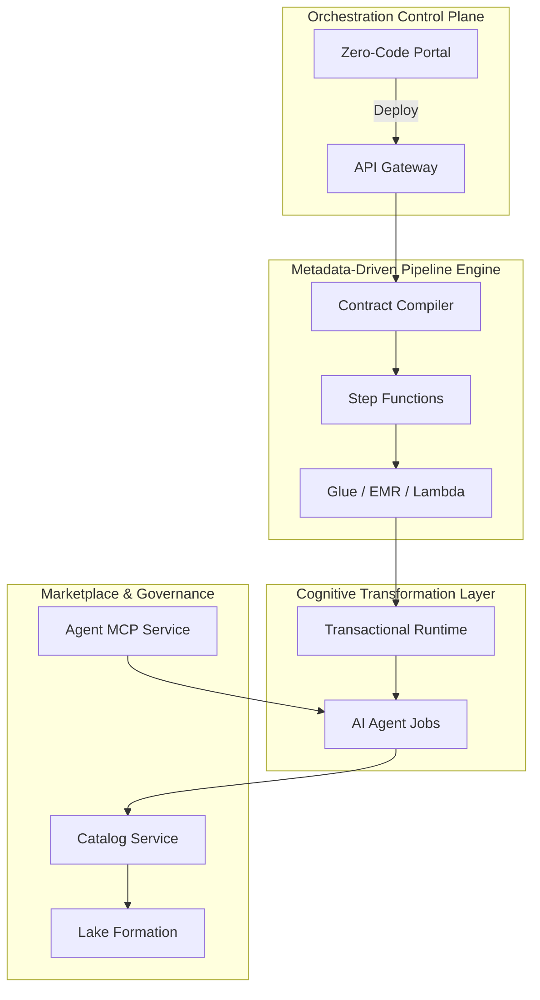

# CogniMesh Architecture

**Product:** CogniMesh  
**Version:** 1.0  
**Status:** Active development

## System Planes

> **Full AWS E2E diagram (draw.io):** [PIPELINE_E2E_DIAGRAM.md](PIPELINE_E2E_DIAGRAM.md) · [`diagrams/cognimesh-pipeline-e2e.drawio`](diagrams/cognimesh-pipeline-e2e.drawio)

## Pipeline Types

### Structured Pipeline (Vaquar PVDM)

`RDS/MySQL (CDC)` → `S3 Bronze` → `Glue Silver` → `Iceberg Gold`

Proof-gated writes follow **[The Vaquar Pattern](vaquar-pattern.md)** (Physical → Verify → Durable → Metadata).

### Cognitive Pipeline

`Media URL` → `Agentic Runtime (EKS)` → `Parquet Silver` → `Iceberg Gold`

## Transactional Runtime

The cognitive runtime (inspired by Atomix) provides:

- **Epoch tracking**: ordered sequence numbers per pipeline partition
- **Frontier tracking**: transaction isolation boundaries
- **Compensation handlers**: rollback for failed agent invocations

Implementation: `services/cognitive-runtime/`

## Marketplace Registration

1. Submit `manifest.yaml` (Data Contract)
2. CI runs `aiv-integrity-gate` (quality, security, compliance)
3. On approval → Glue Data Catalog + Lake Formation policies

## VPC Provisioning Mode

The portal supports two VPC modes when generating infrastructure:

- **Create new (Terraform)**: Generates a complete VPC with public/private subnets, NAT gateway, internet gateway, route tables, and security groups. Default for new pipelines.
- **Existing VPC**: References an existing VPC by ID. Users supply `vpcId`, `privateSubnetIds`, and `glueSecurityGroupId` in the pipeline properties panel.

The VPC mode is set in `pipelineMeta.vpcMode` (`"create_new"` or `"existing"`) and affects both Terraform export and the draw.io architecture diagram.

## Streamlit Agent Chat

After deploying a Bedrock Agent from the Agent Builder panel, CogniMesh launches a **Streamlit chat UI** automatically. The launcher (`lib/platform/streamlit-launcher.js`) manages per-agent Streamlit processes with:

- Automatic port allocation (starts at 8501, scans for free ports)
- Session-based conversation with the deployed agent via `bedrock-agent-runtime`
- Sidebar showing agent ID, alias, region, and session controls
- Process lifecycle management (reuse existing, graceful stop)

The chat app (`services/streamlit-agent-chat/app.py`) connects directly to Bedrock Agent Runtime using the deployed agent's ID and alias.

## Amazon Q Fix Integration

When the AWS Design Review panel finds issues (e.g., missing encryption, public RDS), CogniMesh can invoke **Amazon Q Business** to generate fix guidance. This is controlled by:

- `AMAZON_Q_FIX_ENABLED=true` - enables the integration
- `AMAZON_Q_APPLICATION_ID` - the Q Business application ID

The fix assistant (`lib/platform/amazon-q-fix.js`) sends a structured prompt with the finding details, severity, suggested fix steps, and block data. Amazon Q returns a concise remediation guide (max 120 words) with numbered steps and the specific Properties panel fields to change.

## Dynamic Draw.io Export

The draw.io architecture export (`portal/src/lib/infrastructure-export.js`) reads the **actual canvas nodes** to build the diagram dynamically:

- Only shows services that exist on the canvas (RDS, Kinesis, MSK, Glue, Firehose, etc.)
- Adapts IAM roles, security groups, and subnets to the actual pipeline composition
- Shows the correct count of sources, transforms, and sinks
- Handles edge cases: empty canvas produces a minimal diagram; partial pipelines don't crash
- VPC/subnet structure adjusts based on `vpcMode` (existing vs. Terraform-provisioned)
- Connections between services are wired based on the actual data flow

## AgentCore Runtime (Strands) Deploy Target

The Agent Builder supports two deploy targets via a dropdown:

- **Bedrock Agents** (default): Creates a managed Bedrock Agent with alias, knowledge bases, and guardrails.
- **AgentCore Runtime (Strands)**: Generates a standalone Python project using Strands + BedrockAgentCoreApp, downloadable as a ZIP.

The AgentCore Runtime project (`lib/platform/agentcore-runtime-deploy.js`) generates:
- `agent.py` — Strands Agent with BedrockModel and @tool stubs from the manifest
- `Dockerfile` — linux/arm64 container for ECR
- `deploy.sh` — ECR push + `aws bedrock-agentcore-control create-agent-runtime`
- `requirements.txt`, `.env.example`, `README.md`

When `AGENTCORE_RUNTIME_ENABLED=true` + `AGENTCORE_RUNTIME_ROLE_ARN` + `AGENTCORE_ECR_IMAGE_URI` are set, the API can also call `CreateAgentRuntime` directly.

## Native Dashboard

The portal includes a built-in **Dashboard tab** (`portal/src/components/DashboardView.jsx`) that provides a live view of all deployed infrastructure:

- 4 KPI cards: Pipelines deployed, Runs succeeded, Runs failed, Agents deployed
- SVG donut chart of pipeline run-status distribution
- Bar chart of agents by status (PREPARED, PREPARING, etc.)
- Full tables of all pipelines and agents with status badges
- Auto-refreshes every 15 seconds from `/api/v1/public/status` (no auth required)

## AgentCore Studio (Embedded)

The **AgentCore Studio tab** (`portal/src/components/AgentCoreStudioView.jsx`) embeds the AWS-sample AgentCore self-service platform via an iframe. This is a separately deployed CDK stack (`aws-samples/sample-ai-agent-factory`) that provides:

- Agent template creation workflow
- Tool/guardrail visual configuration
- Bedrock AgentCore runtime deployment

The studio URL is configured via `VITE_AGENTCORE_STUDIO_URL` (baked at build time). If the iframe is blocked by browser third-party cookie policy, a fallback panel with "Open in new tab" is shown.

## Documentation

| Document | Description |
|----------|-------------|
| [PIPELINE_E2E_DIAGRAM.md](PIPELINE_E2E_DIAGRAM.md) | **AWS E2E diagram** - structured + cognitive pipelines |
| [vaquar-pattern.md](vaquar-pattern.md) | The Vaquar Pattern (PVDM) |
| [drag-drop-pipeline-flow.md](drag-drop-pipeline-flow.md) | Portal E2E |
| [data-contract-spec.md](data-contract-spec.md) | DataContract spec |
| [TUTORIAL_AGENT_DEPLOY.md](TUTORIAL_AGENT_DEPLOY.md) | Tutorial: Deploy agent with Streamlit chat |
| [TUTORIAL_DRAWIO_EXPORT.md](TUTORIAL_DRAWIO_EXPORT.md) | Tutorial: Export architecture diagrams |

See [README](../README.md) for service and infrastructure paths.
