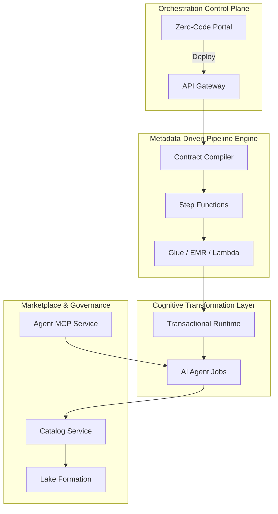

# CogniMesh Architecture

**Product:** CogniMesh  
**Version:** 1.0  
**Status:** Active development

## System Planes

## Pipeline Types

### Structured Pipeline

`RDS/MySQL (CDC)` → `S3 Bronze` → `Glue Silver` → `Iceberg Gold`

### Cognitive Pipeline

`Media URL` → `Agentic Runtime (EKS)` → `Parquet Silver` → `Iceberg Gold`

## Transactional Runtime

The cognitive runtime (inspired by Atomix) provides:

- **Epoch tracking**: ordered sequence numbers per pipeline partition
- **Frontier tracking**: transaction isolation boundaries
- **Compensation handlers**: rollback for failed agent invocations

Implementation: `services/cognitive-runtime/`

## Marketplace Registration

1. Submit `manifest.yaml` (Data Contract)
2. CI runs `aiv-integrity-gate` (quality, security, compliance)
3. On approval → Glue Data Catalog + Lake Formation policies

## Repository Layout

See [README](../README.md) for service and infrastructure paths.
