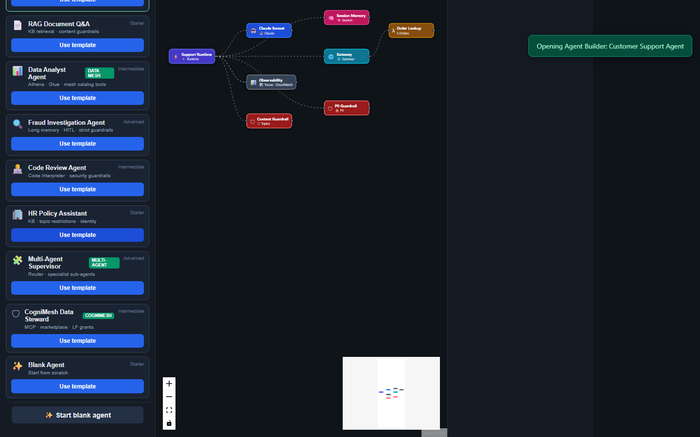
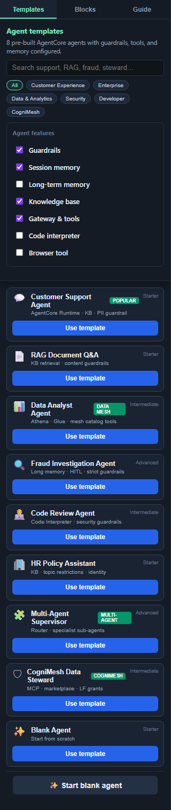
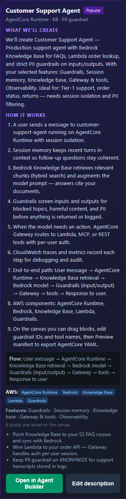
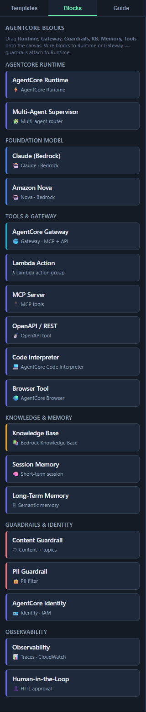
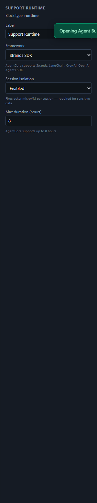
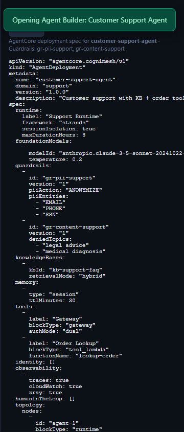

# Customize AI agents (developer guide)

Step-by-step guide to customizing Bedrock **AgentCore** agents - feature checkboxes, canvas editing, manifest export.

[← Developer hub](README.md) · [Extend agent templates in code](EXTEND_CATALOG.md#add-an-agent-template)

---

## 1. Open Agent Builder

  

Header → **Agent Builder** (toggle from Data Pipeline mode).

---

## 2. Pick features before you create

**New templates:** **DevOps / SRE** (runbooks, CloudWatch, prod HITL) and **Custom Agent Starter** (model + guardrails + gateway - you add tools).

  
  &nbsp;
  

Check only what you need:

| Feature | What it adds |
|---------|----------------|
| Guardrails | Content + PII filters |
| Session / long-term memory | Conversation context |
| Knowledge base | Bedrock KB (RAG) |
| Gateway & tools | Lambda, MCP, REST |
| Code interpreter / Browser | Sandboxed tools |
| Identity | Cognito / IAM scoping |
| Observability | CloudWatch traces |
| Human-in-the-loop | Approval queue |

Unchecked features are **removed** from the template; missing enabled features are **added** automatically.

---

## 3. Preview the agent plan

  

**AI Builder → AI agent** → describe agent → **Preview agent plan** → **Open in Agent Builder**

Or: **Templates** tab → expand card → **Use template**

→ [Per-agent tutorials](../tutorials/README.md#agent-tutorials)

---

## 4. Customize the canvas

  

| Block | Customize |
|-------|-----------|
| **Runtime** | Framework (Strands, LangChain, CrewAI), session isolation |
| **Foundation model** | `modelId`, temperature, max tokens |
| **Guardrail** | `guardrailId`, PII entities, denied topics |
| **Knowledge base** | `kbId`, retrieval mode (hybrid) |
| **Gateway** | Auth mode, protocols |
| **Lambda / MCP tool** | Function name, MCP URL, tool list |
| **Memory** | TTL, max turns, retention days |
| **HITL** | Approval threshold |

Drag new blocks from the palette:

  

---

## 5. Edit properties panel

  

Click a block → right panel shows type-specific fields. Click canvas background for **agent settings** (`name`, `domain`, `version`).

---

## 6. Preview manifest

  

Toolbar → **Preview manifest** - review YAML with:

- `spec.runtime` - framework, isolation
- `spec.guardrails[]` - `BEDROCK_GUARDRAIL_ID` env vars
- `spec.tools` - Gateway-connected actions
- `spec.memory` - session / long-term config

Export logic: `portal/src/lib/agent-export.js`

---

## 7. Export manifest (AWS deploy - next integration)

Toolbar → **Export manifest** - validates the graph and downloads `{agent-name}-agentcore.yaml`.

**Feature boundary:** Agent Builder does **not** call AWS Bedrock Agent APIs. It produces a deployable manifest. **Pipeline Deploy** in Data Pipeline mode *is* wired (integrity gate → catalog → Step Functions when `AWS_DEPLOY_ENABLED=true`).

To provision a real agent today, use the exported YAML with:

- `aws bedrock-agent create-agent` / `create-agent-action-group` / associate KB & guardrails
- A Terraform module (IAM role, AOSS collection, KB sync, guardrails, Lambda tools)
- Future CogniMesh `agent-deploy` API (planned - manifest schema is ready)

Prerequisites for real Bedrock deploy: agent IAM role, Knowledge Base (if RAG), Lambda action groups, Bedrock guardrails, runtime alias.

---

## Developer checklist

| Task | File |
|------|------|
| Add agent template | `portal/src/lib/agent-templates.js` |
| Add drag block | `portal/src/lib/agent-blocks.js` |
| Feature checkbox logic | `portal/src/lib/agent-feature-options.js` |
| NL → template matching | `portal/src/lib/ai-agent-designer.js` |
| Manifest export | `portal/src/lib/agent-export.js` |
| Graph validation | `portal/src/lib/validate-agent-blocks.js` |
| MCP tools server | `services/agent-mcp/server.js` |
| Regenerate agent tutorials | `npm run docs:tutorials` |

→ **[EXTEND_CATALOG.md](EXTEND_CATALOG.md)**

---

## DevOps / SRE agent

Load template **DevOps / SRE Agent** (category: **DevOps**) or AI prompt:

> _DevOps SRE agent with runbooks KB, CloudWatch tools, and prod deploy approval_

| Component | Purpose |
|-----------|---------|
| Runbooks KB | On-call docs, incident playbooks |
| CloudWatch Lambda | Query alarms & metrics |
| Deploy Lambda | Trigger CI/CD (behind HITL) |
| Terraform MCP | Plan summaries, EKS cluster list |
| Ops guardrail | Blocks destructive commands |
| Prod HITL | Human approval before production changes |

Customize `functionName` values to your Lambda ARNs and sync runbooks to Bedrock KB.

---

## Build a custom agent

### Option A - Custom Agent Starter (recommended)

1. **Agent Builder → Templates** → **Custom Agent Starter** → **Use template**
2. Or AI Builder: _"Custom agent starter - build my own agent with guardrails and gateway tools"_
3. Rename agent in properties (`name`, `domain`, `description`)
4. Replace **Your Lambda Tool** with your function; drag MCP, KB, browser from **Blocks**
5. Use **feature checkboxes** to strip memory/KB if not needed
6. **Preview manifest** → **Deploy Agent**

### Option B - Blank canvas

**Templates → Start blank agent** - only Runtime; add everything manually.

### Option C - Code (new template in repo)

Copy `custom-agent-starter` in `portal/src/lib/agent-templates.js`, change `id` and `nodes`, add keywords in `ai-agent-designer.js`, run `npm run docs:tutorials`.

---

## See also

- [AGENT_BUILDER.md](../AGENT_BUILDER.md)
- [Agent tutorials](../tutorials/README.md#agent-tutorials)
