# Customize data pipelines (developer guide)

Step-by-step guide to customizing pipelines in the CogniMesh portal - with screenshots for every major screen.

[← Developer hub](README.md) · [Extend patterns in code](EXTEND_CATALOG.md#add-a-pipeline-pattern)

---

## 1. Choose how to start

  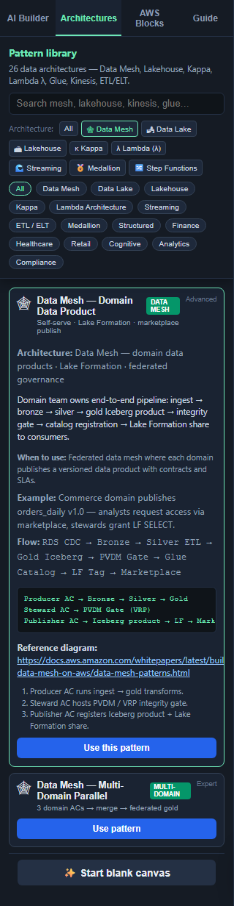
  &nbsp;
  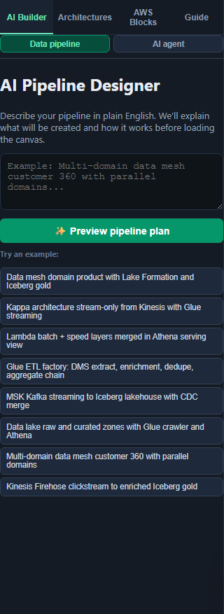

| Method | When to use |
|--------|-------------|
| **Architectures** tab | You know the pattern (Data Mesh, Kappa, Lambda λ, …) |
| **AI Builder → Data pipeline** | Describe in English; get a plan first |
| **AWS Blocks** tab | Blank canvas - drag blocks manually |

### AI Builder with plan preview (recommended)

  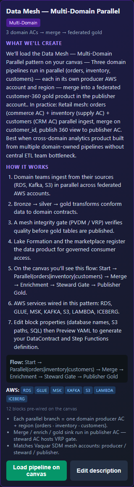

1. Paste a description (e.g. _"Multi-domain data mesh customer 360"_)
2. Click **Preview pipeline plan** - read _what we'll create_ and _how it works_
3. Click **Load pipeline on canvas**

→ [Tutorial for your pattern](../tutorials/README.md)

---

## 2. Understand the canvas

  

- **Blocks** = sources, transforms, sinks, workflow (Parallel, Choice, Merge)
- **Edges** = data flow (animated when valid)
- **Swimlanes** (Data Mesh) = producer / steward / publisher AWS accounts
- **Red badges** = validation errors on a block

  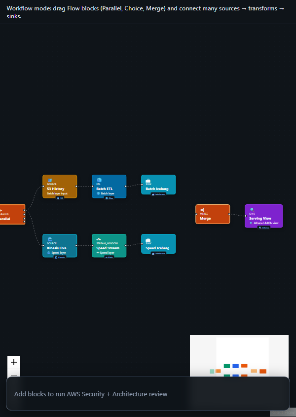
   <em>Lambda λ - parallel batch + speed layers</em>

---

## 3. Customize block properties

Click any block on the canvas. The **right panel** shows fields for that block type.

  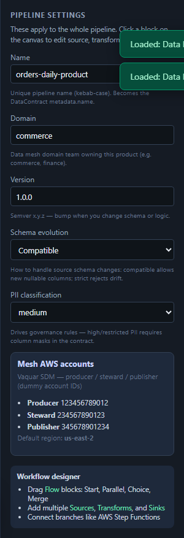
  &nbsp;
  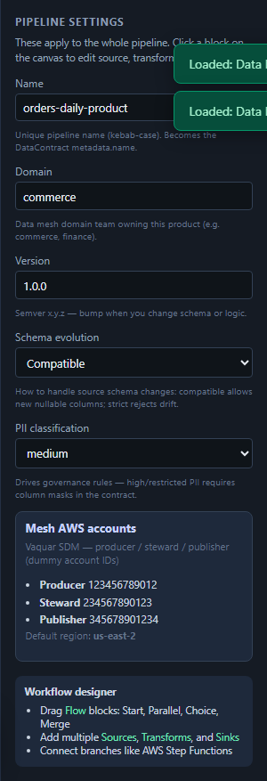

### Common fields to change

| Block type | Customize |
|------------|-----------|
| **RDS source** | `database`, `table`, `primaryKey`, CDC on/off |
| **Glue / Spark transform** | `sparkSql`, `schedule`, processing mode (ETL/ELT) |
| **Iceberg sink** | S3 `location`, Glue `catalogDatabase`, `catalogTable` |
| **Integrity gate** | Vaquar PVDM / mesh gate settings |
| **Pipeline settings** | `name`, `domain`, `version`, schema evolution policy |

Click empty canvas background for **pipeline-level** settings (left column in panel).

---

## 4. Add blocks from the palette

  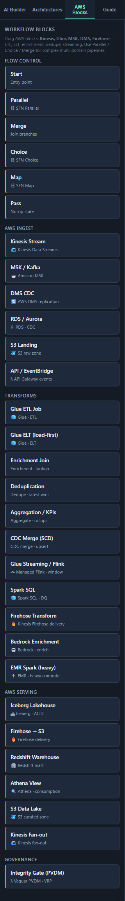

1. Sidebar → **AWS Blocks**
2. Drag **Glue ETL**, **Kinesis**, **MSK**, **enrichment**, **dedupe**, etc.
3. Connect with edges to existing graph
4. Undo/redo: header buttons or **Ctrl+Z** / **Ctrl+Y**

---

## 5. Follow the in-app guide

  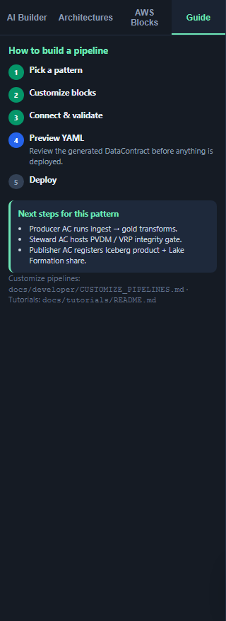

Sidebar → **Guide** shows current step: pick → connect → customize → preview → deploy.

---

## 6. AWS Design Review

  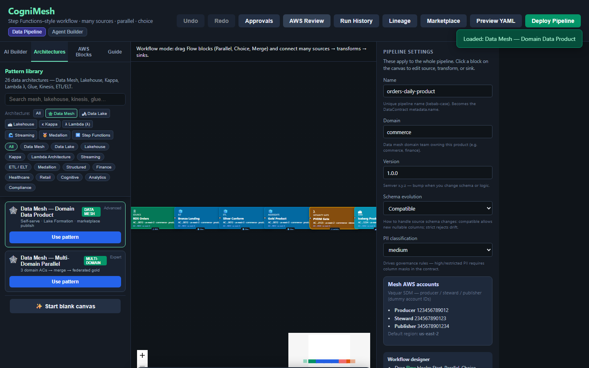

Requires API on port **4000**. Header → **AWS Review** - security & architecture scores, findings per block.

Customize behavior: `lib/aws-design-review/` · API `POST /api/v1/pipelines/design-review`

---

## 7. Preview YAML (DataContract)

  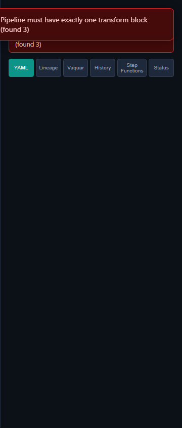

1. Header → **Preview YAML** (or **Ctrl+S**)
2. Review tabs: **Contract**, **Lineage**, **Vaquar**, **Step Functions**
3. Fix validation errors before deploy

The graph compiles to `DataContract.yaml` via `lib/contract-builder/graph-to-contract.js`.

---

## 8. Deploy & marketplace

**Deploy:** Header → **Deploy Pipeline** → confirm → API compiles Step Functions + integrity gate.

  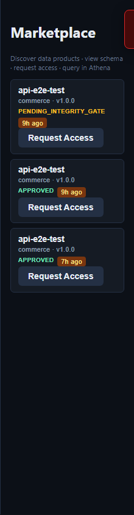

**Marketplace:** Header → **Marketplace** - browse products, schema, sample rows, request access.

---

## Developer checklist

| Task | Where |
|------|--------|
| Change default pattern graph | `portal/src/lib/patterns/architecture-patterns.js` |
| Add domain pattern | `portal/src/lib/patterns/extra-patterns.js` |
| Change graph → contract rules | `lib/contract-builder/graph-to-contract.js` |
| Change integrity / PVDM rules | `lib/integrity-gate/rules-engine.js` |
| Change Step Functions output | `services/pipeline-engine/compile.js` |
| Add API endpoint | `services/api-gateway/server.js` |
| Regenerate tutorials | `npm run docs:tutorials` |
| Regenerate screenshots | `npm run docs:screenshots` |

→ Full code guide: **[EXTEND_CATALOG.md](EXTEND_CATALOG.md)**

---

## See also

- [Tutorial hub](../tutorials/README.md)
- [Vaquar Pattern](../vaquar-pattern.md)
- [Data contract spec](../data-contract-spec.md)
