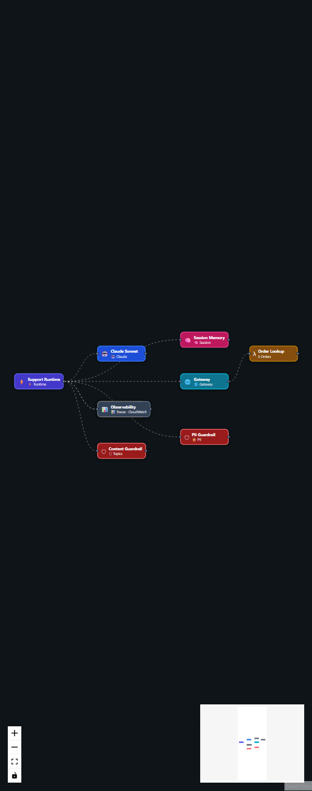

# Extend the catalog (code customization)

How developers add patterns, agents, blocks, and API behavior in the CogniMesh repo.

[← Developer hub](README.md) · [Customize pipelines UI](CUSTOMIZE_PIPELINES.md) · [Customize agents UI](CUSTOMIZE_AGENTS.md)

---

## Repository map

```
atomix/
├── portal/src/
│   ├── lib/patterns/          # Pipeline pattern graphs
│   ├── lib/agent-templates.js # AgentCore templates
│   ├── lib/agent-blocks.js    # Agent palette blocks
│   ├── lib/pipeline-patterns.js # Merges all patterns
│   └── components/            # React UI
├── lib/
│   ├── contract-builder/      # Graph → DataContract.yaml
│   ├── integrity-gate/        # PVDM / rules engine
│   └── ai-pipeline-designer.js
├── services/
│   ├── api-gateway/           # REST API for portal
│   ├── pipeline-engine/       # Contract → Step Functions
│   ├── catalog/               # Marketplace (Java)
│   └── agent-mcp/             # MCP for agents
├── infra/terraform/           # AWS modules
└── docs/tutorials/            # Auto-generated tutorials
```

<p align="center">
  
  &nbsp;
  
</p>

---

## Add a pipeline pattern

### 1. Define the graph

Edit or create an entry in:

- **Architectures:** `portal/src/lib/patterns/architecture-patterns.js`
- **Domain / industry:** `portal/src/lib/patterns/extra-patterns.js`
- **Core starters:** `portal/src/lib/pipeline-patterns.js` (`CORE_PATTERNS`)

Minimal pattern shape:

```javascript
{
  id: "my-custom-pattern",
  name: "My Custom Pipeline",
  subtitle: "Short tagline",
  category: "Structured",
  architecture: "lakehouse",
  difficulty: "Intermediate",
  description: "What this pipeline does.",
  whenToUse: "When teams should pick this.",
  exampleScenario: "Real-world story.",
  exampleFlow: "Source → Transform → Sink",
  awsServices: ["Glue", "Iceberg", "RDS"],
  nodes: [ /* React Flow nodes */ ],
  edges: [ /* React Flow edges */ ],
  pipelineMeta: { name: "my-pipeline", domain: "commerce", version: "1.0.0" },
  customizeTips: ["Tip 1", "Tip 2"],
}
```

Patterns are merged in `pipeline-patterns.js`:

```javascript
export const PIPELINE_PATTERNS = [...ARCHITECTURE_PATTERNS, ...CORE_PATTERNS, ...EXTRA_PATTERNS];
```

### 2. Wire AI Builder matching

Add keywords in `portal/src/lib/ai-pipeline-designer.js`:

```javascript
{ id: "my-custom-pattern", keywords: ["my keyword", "custom etl"] },
```

Keep in sync with root `lib/ai-pipeline-designer.js` if used by API.

### 3. Regenerate docs & test

```bash
npm run docs:tutorials      # New tutorial markdown
npm run test:portal-unit    # Portal unit tests
npm run build --prefix portal
```

---

## Add an agent template

Edit `portal/src/lib/agent-templates.js`:

```javascript
{
  id: "my-agent",
  name: "My Agent",
  subtitle: "Runtime · KB · guardrails",
  category: "Enterprise",
  framework: "strands",
  description: "...",
  whenToUse: "...",
  awsServices: ["AgentCore Runtime", "Bedrock", "Guardrails"],
  agentMeta: { name: "my-agent", domain: "ops", version: "1.0.0" },
  nodes: [ /* agent blocks */ ],
  edges: [ /* connections */ ],
  customizeTips: ["..."],
}
```

Add AI matching in `portal/src/lib/ai-agent-designer.js`:

```javascript
{ id: "my-agent", keywords: ["ops", "runbook", "on-call"] },
```

Feature checkboxes apply via `portal/src/lib/agent-feature-options.js` - map `blockTypes` to feature IDs.

---

## Add palette blocks

| Type | File |
|------|------|
| Pipeline blocks (Glue, Kinesis, …) | `portal/src/lib/workflow-blocks.js` |
| Agent blocks (Runtime, guardrail, …) | `portal/src/lib/agent-blocks.js` |

Each block needs `category`, `type`, `label`, and `defaults` (including `blockType`).

---

## API & contract layer

<p align="center">
  
</p>

| Endpoint | Purpose |
|----------|---------|
| `POST /api/v1/pipelines/preview` | Graph → validate → contract YAML |
| `POST /api/v1/pipelines/deploy` | Preview + compile + catalog |
| `POST /api/v1/pipelines/design-review` | AWS Well-Architected scan |
| `POST /api/v1/pipelines/ai-design` | Server-side NL matching (optional) |

**Customize contract output:** `lib/contract-builder/graph-to-contract.js`  
**Customize validation:** `lib/integrity-gate/` + `schemas/data-contract-v1.schema.json`  
**Customize ASL:** `services/pipeline-engine/compile.js`

Add routes in `services/api-gateway/server.js`.

---

## Data Mesh account constants

Swimlane overlays use dummy account IDs in `portal/src/lib/patterns/mesh-constants.js`:

```javascript
export const VAQUAR_MESH_ACCOUNTS = {
  producer: "111122223333",
  steward: "222233334444",
  publisher: "333344445555",
};
```

Customize per-domain branches in `MESH_DOMAIN_BRANCHES`.

---

## Terraform & AWS

Infrastructure modules: `infra/terraform/modules/`  
Environment wiring: `infra/terraform/environments/dev/`

See [infra/terraform/README.md](../../infra/terraform/README.md).

---

## Documentation automation

| Command | Output |
|---------|--------|
| `npm run docs:tutorials` | `docs/tutorials/pipelines/*.md` + `agents/*.md` + index |
| `npm run docs:screenshots` | `docs/images/`, `docs/images/dev/`, `docs/assets/` |

After UI or catalog changes, run both so developer guides stay in sync.

---

## Testing

```bash
npm run test:portal-unit     # Vitest - patterns, agents, designers
npm run test:api             # API gateway E2E
npm run test:e2e             # Contract compile E2E
npm run test:integrity-gate  # Rules engine
```

---

## See also

- [data-contract-spec.md](../data-contract-spec.md)
- [PORTAL_DEV.md](../PORTAL_DEV.md)
- [TROUBLESHOOTING.md](../TROUBLESHOOTING.md)
