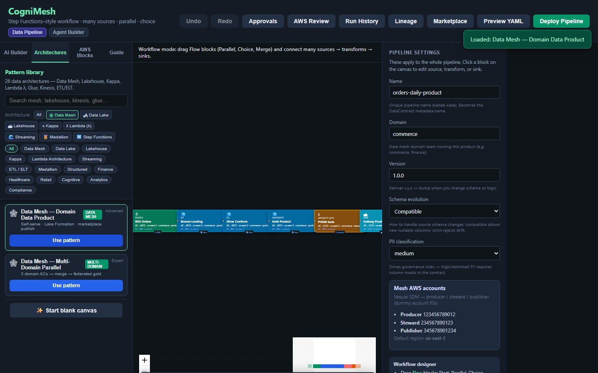

# Developer customization hub

<p align="center">
  
</p>

Visual guides for **customizing pipelines and agents** in the portal and **extending the codebase** (patterns, templates, API, Terraform).

---

## Who this is for

| Role | Start here |
|------|------------|
| **Portal user / data engineer** | [Customize pipelines](CUSTOMIZE_PIPELINES.md) · [Customize agents](CUSTOMIZE_AGENTS.md) |
| **Frontend contributor** | [Extend catalog](EXTEND_CATALOG.md) · [Portal dev](../PORTAL_DEV.md) |
| **Backend contributor** | [Extend catalog](EXTEND_CATALOG.md#api--contract-layer) · [Data contract](../data-contract-spec.md) |
| **Tutorial walkthroughs** | [Tutorials hub](../tutorials/README.md) - one guide per pattern & agent |

---

## Screenshot index (21 developer images)

All images live in [`docs/images/dev/`](../images/dev/). Regenerate: `npm run build --prefix portal && npm run docs:screenshots`

### Data pipelines

| # | Image | Shows |
|---|-------|--------|
| 01 | [01-pipeline-overview.png](../images/dev/01-pipeline-overview.png) | Full app - Data Mesh on canvas |
| 02 | [02-pattern-library-expanded.png](../images/dev/02-pattern-library-expanded.png) | Architectures tab - expanded pattern card |
| 03 | [03-ai-pipeline-designer.png](../images/dev/03-ai-pipeline-designer.png) | AI Builder - Data pipeline tab |
| 04 | [04-pipeline-plan-preview.png](../images/dev/04-pipeline-plan-preview.png) | Natural-language plan before load |
| 05 | [05-canvas-datamesh-swimlanes.png](../images/dev/05-canvas-datamesh-swimlanes.png) | Multi-domain mesh + account swimlanes |
| 06 | [06-block-properties-panel.png](../images/dev/06-block-properties-panel.png) | Per-block properties (source, SQL, etc.) |
| 07 | [07-pipeline-settings-panel.png](../images/dev/07-pipeline-settings-panel.png) | Pipeline name, domain, version |
| 08 | [08-aws-blocks-palette.png](../images/dev/08-aws-blocks-palette.png) | Drag Glue, Kinesis, MSK blocks |
| 09 | [09-workflow-guide.png](../images/dev/09-workflow-guide.png) | In-app workflow steps |
| 10 | [10-aws-design-review.png](../images/dev/10-aws-design-review.png) | AWS Well-Architected HUD |
| 11 | [11-preview-yaml-panel.png](../images/dev/11-preview-yaml-panel.png) | DataContract YAML preview |
| 12 | [12-marketplace-panel.png](../images/dev/12-marketplace-panel.png) | Consumer marketplace |
| 13 | [13-lambda-architecture-canvas.png](../images/dev/13-lambda-architecture-canvas.png) | Lambda λ batch + speed layers |
| 21 | [21-kappa-design-review.png](../images/dev/21-kappa-design-review.png) | Kappa stream + design review |

### AI agents

| # | Image | Shows |
|---|-------|--------|
| 14 | [14-agent-templates-features.png](../images/dev/14-agent-templates-features.png) | Templates + feature checkboxes |
| 15 | [15-ai-agent-generator.png](../images/dev/15-ai-agent-generator.png) | AI agent tab + features |
| 16 | [16-agent-plan-preview.png](../images/dev/16-agent-plan-preview.png) | Agent creation plan |
| 17 | [17-agent-canvas.png](../images/dev/17-agent-canvas.png) | AgentCore graph on canvas |
| 18 | [18-agent-blocks-palette.png](../images/dev/18-agent-blocks-palette.png) | Runtime, guardrails, tools palette |
| 19 | [19-agent-properties-panel.png](../images/dev/19-agent-properties-panel.png) | Guardrail ID, model, Lambda name |
| 20 | [20-agent-manifest-preview.png](../images/dev/20-agent-manifest-preview.png) | AgentCore YAML manifest |

---

## Customization guides

| Guide | What you learn |
|-------|----------------|
| **[CUSTOMIZE_PIPELINES.md](CUSTOMIZE_PIPELINES.md)** | Load patterns, edit blocks, preview YAML, deploy, marketplace |
| **[CUSTOMIZE_AGENTS.md](CUSTOMIZE_AGENTS.md)** | Feature checkboxes, templates, guardrails, manifest export |
| **[EXTEND_CATALOG.md](EXTEND_CATALOG.md)** | Add patterns/templates in code, API hooks, regenerate tutorials |

---

## Quick local setup

```bash
npm install
cp .env.example .env
npm run start:dev
```

| URL | Service |
|-----|---------|
| http://localhost:3000 | Portal (Vite) |
| http://localhost:4000 | API gateway |

---

## Related documentation

- [PORTAL_DEV.md](../PORTAL_DEV.md) - dev environment & file map
- [AGENT_BUILDER.md](../AGENT_BUILDER.md) - AgentCore tutorial
- [tutorials/README.md](../tutorials/README.md) - per-pattern & per-agent tutorials
- [drag-drop-pipeline-flow.md](../drag-drop-pipeline-flow.md) - E2E deploy flow
- [data-contract-spec.md](../data-contract-spec.md) - YAML schema
