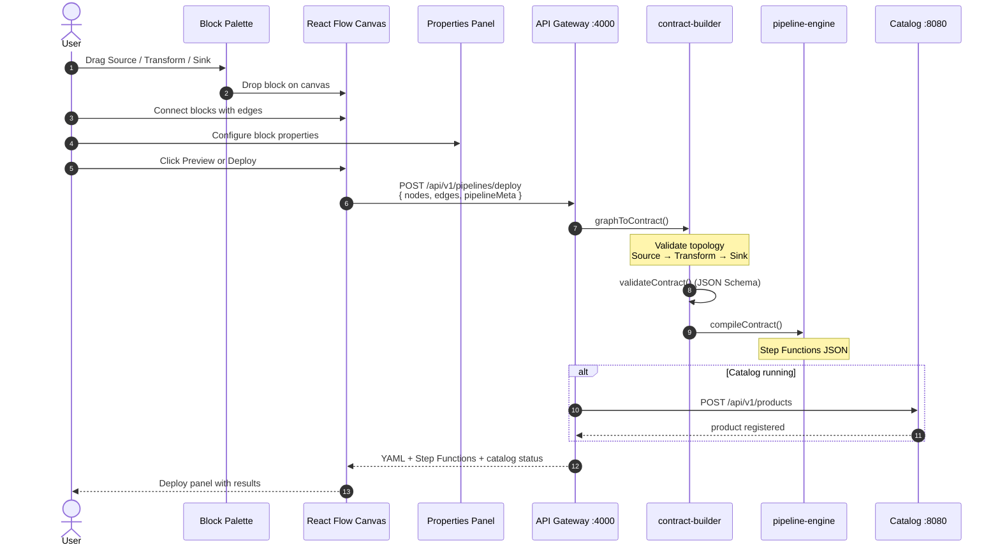
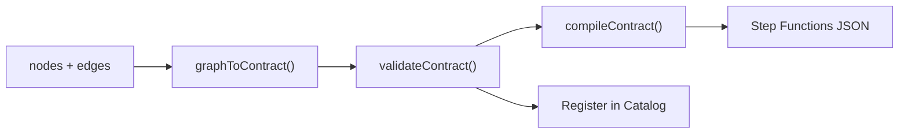

# Drag-and-Drop to Pipeline: End-to-End Flow

> **AWS architecture diagram:** [PIPELINE_E2E_DIAGRAM.md](PIPELINE_E2E_DIAGRAM.md) · open [`diagrams/cognimesh-pipeline-e2e.drawio`](diagrams/cognimesh-pipeline-e2e.drawio) in draw.io

This document explains how the CogniMesh zero-code portal converts visual blocks into a deployed, governed data pipeline.

## Flow Overview



## Step 1: Drag blocks from the palette

| Block | Maps to contract field |
|-------|------------------------|
| **Source** | `spec.source` |
| **Transform** / **AI Transform** | `spec.transform` |
| **Sink** | `spec.target` |

Blocks are dragged from `portal/src/components/BlockPalette.jsx` onto the React Flow canvas. Each drop creates a node with default configuration.

## Step 2: Connect blocks

Edges must form a valid path:

```
Source → Transform → Sink
```

The `validateGraph()` function in `lib/contract-builder/graph-to-contract.js` enforces exactly one of each block type and valid connectivity.

## Step 3: Configure properties

Click any block to edit in the Properties panel:

- **Source:** type (`rds`, `media_url`, …), database, table, CDC
- **Transform:** `spark_sql` or `agentic` (model, prompt, compensation handler)
- **Sink:** target type, S3 location, Glue catalog

Pipeline-level metadata (name, domain, version) is edited when no block is selected.

## Step 4: Preview or Deploy

| Action | Endpoint | Result |
|--------|----------|--------|
| **Preview YAML** | `POST /api/v1/pipelines/preview` | Contract YAML + Step Functions (no catalog write) |
| **Deploy Pipeline** | `POST /api/v1/pipelines/deploy` | Full flow + marketplace registration |

## Step 5: Backend processing



## Run locally (full stack)

```bash
npm install
cp .env.example .env
npm start
```

Open http://localhost:3000 -> design pipeline -> **Deploy Pipeline**.

## Test without UI

```bash
npm test
npm run test:api
```

## Key files

| File | Role |
|------|------|
| `portal/src/App.jsx` | Canvas, drag-drop, deploy actions |
| `portal/src/components/BlockPalette.jsx` | Draggable block definitions |
| `portal/src/components/PropertiesPanel.jsx` | Per-block configuration UI |
| `lib/contract-builder/graph-to-contract.js` | Graph → `DataContract.yaml` |
| `lib/contract-builder/index.js` | Preview + deploy orchestration |
| `services/api-gateway/server.js` | REST API for portal |
| `services/pipeline-engine/compile.js` | Contract → Step Functions |
