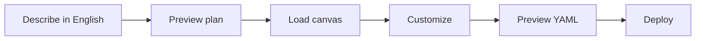

# CogniMesh Tutorials

  
  &nbsp;
  

<strong>Real-world guides</strong> - one tutorial per architecture pattern and per AgentCore template.

---

## Quick start

| Goal | Start here |
|------|------------|
| **Data pipeline** | [Pipeline tutorials](#data-pipeline-tutorials) |
| **AI agent** | [Agent tutorials](#agent-tutorials) |
| Local dev | `npm run start:dev` → http://localhost:3000 |
| Regenerate pages | `npm run docs:tutorials` |

---

## Data pipeline tutorials

### Analytics

| Tutorial | Level | Summary |
|----------|-------|--------|
| [Feature Store Pipeline](pipelines/feature-store-ml.md) | Advanced | Build ML feature tables from multiple sources, publish versioned feature groups to go… |
| [MySQL → Redshift](pipelines/mysql-redshift.md) | Intermediate | Extract from MySQL, transform in Spark SQL, load into Redshift for BI dashboards. |
| [S3 Files → Iceberg](pipelines/s3-batch-lake.md) | Beginner | Land CSV/JSON files from S3, apply Spark SQL cleansing, register as an Iceberg table. |

### Cognitive

| Tutorial | Level | Summary |
|----------|-------|--------|
| [Documents → RAG Knowledge Base](pipelines/genai-rag-documents.md) | Intermediate | Ingest PDF/document URLs from S3, use Bedrock agent to chunk, summarize, and extract … |
| [Media → AI Enrichment](pipelines/cognitive-media.md) | Intermediate | Ingest media URLs, run an agentic Bedrock transform, and write structured Parquet to … |

### Compliance

| Tutorial | Level | Summary |
|----------|-------|--------|
| [Data Quality Quarantine Lane](pipelines/dq-quarantine.md) | Intermediate | Run SparkRules quality checks after transform; route passing rows to gold Iceberg and… |

### Data Lake

| Tutorial | Level | Summary |
|----------|-------|--------|
| [Data Lake - Raw / Curated / Consumption Zones](pipelines/arch-datalake-zones.md) | Intermediate | Classic data lake: land everything raw (raw zone), curate with Glue ETL (curated zone… |

### Data Mesh

| Tutorial | Level | Summary |
|----------|-------|--------|
| [Data Mesh - Domain Data Product](pipelines/arch-datamesh-domain-product.md) | Advanced | Domain team owns end-to-end pipeline: ingest → bronze → silver → gold Iceberg product… |
| [Data Mesh - Multi-Domain Parallel](pipelines/arch-datamesh-multi-domain.md) | Expert | Three domain pipelines run in parallel (orders, inventory, customers) - each in its o… |

### ETL / ELT

| Tutorial | Level | Summary |
|----------|-------|--------|
| [ELT - Load First → Redshift Transform](pipelines/arch-elt-redshift.md) | Intermediate | Classic cloud ELT: land raw files on S3, COPY into Redshift staging, transform with S… |
| [Glue ETL Factory - Multi-Stage Pipeline](pipelines/arch-glue-etl-factory.md) | Advanced | Enterprise ETL chain entirely on AWS Glue: extract (DMS) → ELT bronze → ETL cleanse →… |

### Finance

| Tutorial | Level | Summary |
|----------|-------|--------|
| [Fraud Scoring (Parallel Rules + ML)](pipelines/fraud-detection-parallel.md) | Advanced | Score transactions in parallel: rules engine branch + ML feature branch, merge scores… |
| [Payment Ledger (Double-Entry)](pipelines/finance-payment-ledger.md) | Advanced | Ingest payment events from Kafka, validate debit/credit balance in silver, publish im… |

### Healthcare

| Tutorial | Level | Summary |
|----------|-------|--------|
| [FHIR Resources → HIPAA Gold](pipelines/healthcare-fhir.md) | Advanced | Ingest FHIR JSON bundles from S3, parse Patient/Observation resources in silver with … |

### Kappa

| Tutorial | Level | Summary |
|----------|-------|--------|
| [Kappa Architecture - Stream-Only](pipelines/arch-kappa-stream-only.md) | Advanced | Kappa: treat everything as a stream. Historical reprocessing = replay the log with a … |

### Lakehouse

| Tutorial | Level | Summary |
|----------|-------|--------|
| [Lakehouse - Iceberg Medallion + ACID](pipelines/arch-lakehouse-iceberg.md) | Intermediate | Modern lakehouse: Iceberg tables at each medallion layer with ACID commits, time trav… |

### Lambda Architecture

| Tutorial | Level | Summary |
|----------|-------|--------|
| [Lambda Architecture (λ) - Batch + Speed Layers](pipelines/arch-lambda-batch-speed.md) | Expert | Lambda architecture: batch layer (Glue daily ETL to Iceberg serving layer) + speed la… |

### Medallion

| Tutorial | Level | Summary |
|----------|-------|--------|
| [Full Medallion (Bronze → Silver → Gold)](pipelines/medallion-full-stack.md) | Beginner | The canonical data lakehouse pattern: raw landing (bronze), cleansed conformed data (… |
| [SCD Type 2 Customer Dimension](pipelines/scd2-customers.md) | Intermediate | Track customer attribute changes over time using SCD2 merge logic - valid_from, valid… |

### Retail

| Tutorial | Level | Summary |
|----------|-------|--------|
| [Clickstream → Real-Time Dashboards](pipelines/retail-clickstream.md) | Advanced | Capture website click events from Kafka, sessionize in stream mode, aggregate to gold… |

### Streaming

| Tutorial | Level | Summary |
|----------|-------|--------|
| [IoT Sensor Fleet → Timestream Gold](pipelines/iot-sensor-fleet.md) | Advanced | Ingest telemetry from multiple device fleets in parallel, merge, apply anomaly detect… |
| [Kafka → Iceberg Stream](pipelines/kafka-stream.md) | Advanced | Stream events from Kafka through a passthrough or Spark transform into Iceberg. |
| [Kinesis → Firehose → Analytics](pipelines/arch-kinesis-firehose-analytics.md) | Intermediate | Production streaming stack: producers → Kinesis Data Streams → optional Firehose deli… |
| [MSK → Glue Streaming → Lakehouse](pipelines/arch-msk-glue-streaming.md) | Advanced | Amazon MSK (Managed Kafka) as durable log, Glue streaming ETL with window aggregation… |

### Structured

| Tutorial | Level | Summary |
|----------|-------|--------|
| [Multi-Source → Parallel → Choice](pipelines/multi-source-mesh.md) | Intermediate | Ingest from RDS and S3 in parallel, merge, then route to Iceberg gold or S3 archive b… |
| [RDS CDC → Iceberg](pipelines/vaquar-cdc-orders.md) | Beginner | Capture changes from Amazon RDS (MySQL) into a Bronze → Silver → Gold medallion, with… |

---

## Agent tutorials

### CogniMesh

| Tutorial | Framework | Summary |
|----------|-----------|--------|
| [CogniMesh Data Steward](agents/cognimesh-steward.md) | strands | Mesh steward agent for schema review, access request triage, and Lake Formation grant… |

### Customer Experience

| Tutorial | Framework | Summary |
|----------|-----------|--------|
| [Customer Support Agent](agents/customer-support.md) | strands | Production support agent with Bedrock Knowledge Base for FAQs, Lambda order lookup, a… |

### Data & Analytics

| Tutorial | Framework | Summary |
|----------|-----------|--------|
| [Data Analyst Agent](agents/data-analyst.md) | strands | Natural-language data analyst with Gateway tools for Athena SQL, Glue catalog, and Co… |

### Developer

| Tutorial | Framework | Summary |
|----------|-----------|--------|
| [Code Review Agent](agents/code-review.md) | openai-agents | Reviews pull requests using Code Interpreter for static analysis snippets and guardra… |
| [Custom Agent Starter](agents/custom-agent-starter.md) | strands | Blueprint for a custom AgentCore agent: Runtime, Bedrock model, content guardrail, Ga… |

### DevOps

| Tutorial | Framework | Summary |
|----------|-----------|--------|
| [DevOps / SRE Agent](agents/devops-sre.md) | strands | Site reliability agent with runbook Knowledge Base, Gateway tools for CloudWatch alar… |

### Enterprise

| Tutorial | Framework | Summary |
|----------|-----------|--------|
| [HR Policy Assistant](agents/hr-policy.md) | langchain | HR policy Q&A with employee-scoped identity, handbook KB, and strict topic guardrails… |
| [Multi-Agent Supervisor](agents/multi-agent-supervisor.md) | crewai | Supervisor routes requests to specialist agents - research, writing, and tool executi… |
| [RAG Document Q&A](agents/rag-doc-qa.md) | langchain | Document Q&A agent using Bedrock Knowledge Base with hybrid retrieval and content/top… |

### Security

| Tutorial | Framework | Summary |
|----------|-----------|--------|
| [Fraud Investigation Agent](agents/fraud-detection.md) | strands | Fraud analyst agent with session isolation, long-term memory for case history, human-… |

---

## Screenshots

| Image | Topic |
|-------|-------|
| [cog1.jpeg](../images/cog1.jpeg) | Data Mesh Customer 360 |
| [cog2.jpeg](../images/cog2.jpeg) | Lambda λ architecture |
| [portal-ai-pipeline-designer.png](../images/portal-ai-pipeline-designer.png) | AI pipeline designer |
| [portal-agent-builder-full.png](../images/portal-agent-builder-full.png) | Agent Builder |

`npm run docs:screenshots` · `npm run docs:tutorials`

## See also

- [PORTAL_UI.md](../PORTAL_UI.md) · [AGENT_BUILDER.md](../AGENT_BUILDER.md) · [PORTAL_DEV.md](../PORTAL_DEV.md)
