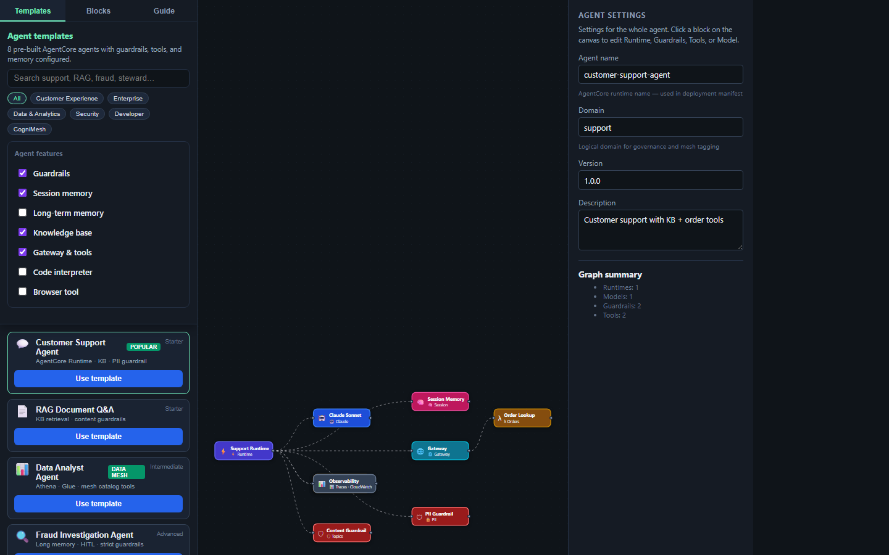

# Fraud Investigation Agent

<p align="center">
  
  <br /><em>Long memory · HITL · strict guardrails</em>
</p>

[← All tutorials](../README.md) · [Agent Builder guide](../../AGENT_BUILDER.md)

---

## What you'll create

Fraud analyst agent with session isolation, long-term memory for case history, human-in-the-loop for high-risk actions.

| | |
|---|---|
| **Template ID** | `fraud-detection` |
| **Category** | Security |
| **Framework** | strands |
| **Agent name** | `fraud-investigation` |

## Why use this agent

Transaction review, case investigation - Firecracker isolation per customer session.

## How it works

1. User message → **AgentCore Runtime** (session-isolated)
2. **Bedrock model** reasons over context
3. **Knowledge Base** retrieval (if enabled) augments the prompt
4. **Guardrails** filter input/output
5. **Gateway** routes tool calls to Lambda / MCP / REST
6. Response returned with observability traces

**Features:** Guardrails, Long-term memory, Gateway & tools, Observability, Human-in-the-loop

**AWS services:** `AgentCore Runtime` · `Memory` · `Guardrails` · `Human-in-the-Loop`


---

## Step-by-step in CogniMesh

### 1. Start the portal

```bash
npm run start:dev
```

### 2. Generate this agent

1. **AI Builder → AI agent** (or **Agent Builder → Templates**)
2. Enable: Guardrails, Long-term memory, Gateway & tools, Observability, Human-in-the-loop
3. Paste: _"Fraud investigation agent with human-in-the-loop and strict PII block"_
4. **Preview agent plan** → **Open in Agent Builder**

### 3. Customize · 4. Preview manifest · 5. Export

Edit guardrail IDs, tool names, KB IDs on canvas → **Preview manifest** → **Export manifest** (downloads YAML). AWS Bedrock provisioning is not wired in CogniMesh yet - use the manifest with `aws bedrock-agent create-agent` or Terraform.

---

## Developer workflow

| Layer | Path |
|-------|------|
| Manifest export | `portal/src/lib/agent-export.js` |
| Validation | `portal/src/lib/validate-agent-blocks.js` |
| MCP server | `services/agent-mcp/` |
| Cognitive runtime | `services/cognitive-runtime/` |

---

## Tips

- Set BEDROCK_GUARDRAIL_ID env on runtime deploy.
- Route block/escalate actions through human_loop.
- Long-term memory stores case summaries - not raw PAN data.


## Related

- [Tutorial hub](../README.md)
- [Agent Builder guide](../../AGENT_BUILDER.md)
