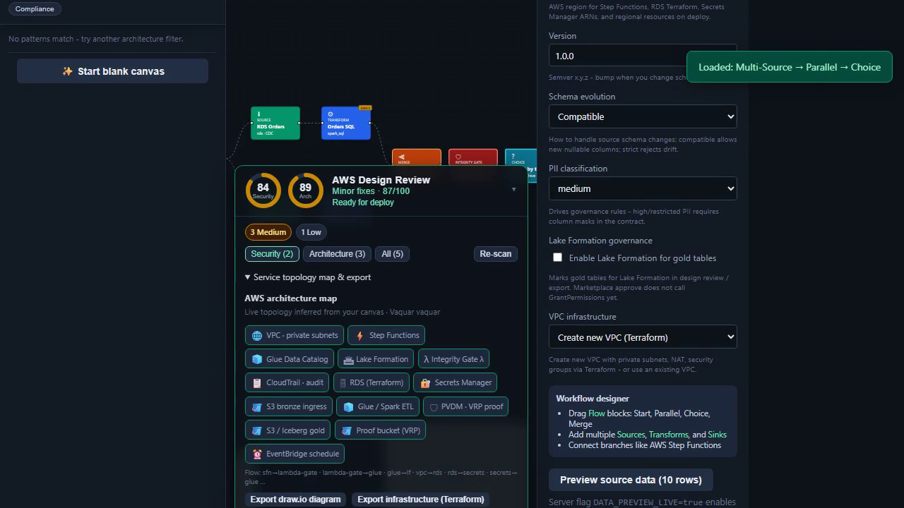

# Getting started (UI walkthrough)

Short portal tutorial for first-time designers: **Panels**, **resource setup**, and **AWS Design Review Fix this**.

## Watch

  

Regenerate: `DEMO_ONLY=tutorial npm run docs:demo` (or full `npm run docs:demo`).

## How it works

The portal turns a spoken or library pattern into a proof-gated data product:

1. **Describe or load a pattern** — AI Builder or Architectures library.
2. **Review the graph** — sources, transforms, integrity gate, sinks.
3. **Fix AWS Design Review** — setup, encryption, and Lake Formation before deploy.
4. **Preview YAML** — DataContract + Step Functions ASL.
5. **Deploy** — integrity gate and PVDM/VRP proof must pass before catalog commit and marketplace listing.

  
   <em>Platform tour — click to play how the designer, review, ops, and marketplace fit together</em>

Full pipeline and agent recordings: [pipeline demo](../assets/cognimesh-pipeline-demo.mp4) · [agent demo](../assets/cognimesh-agent-demo.mp4)

## What you will see

1. **Panels** (header) - Operations, Approvals, Run History, Lineage, Marketplace, Deploy results.
2. **Load Multi-Source workflow** - canvas + AWS Design Review.
3. **Properties → Setup ready** - Create new (Terraform) path needs no Secrets Manager ARN when the checklist is complete.
4. **Use existing database** - surfaces setup findings; **Fix this** opens the review guide.
5. **Preview YAML** - Step Functions / contract preview before deploy.

## Related

- [Tutorials hub](README.md)
- [Portal UI](../PORTAL_UI.md)
- [AWS PVDM runbook](../examples/aws-pvdm-runbook.md)
- [E2E architecture](../E2E_ARCHITECTURE.md)
