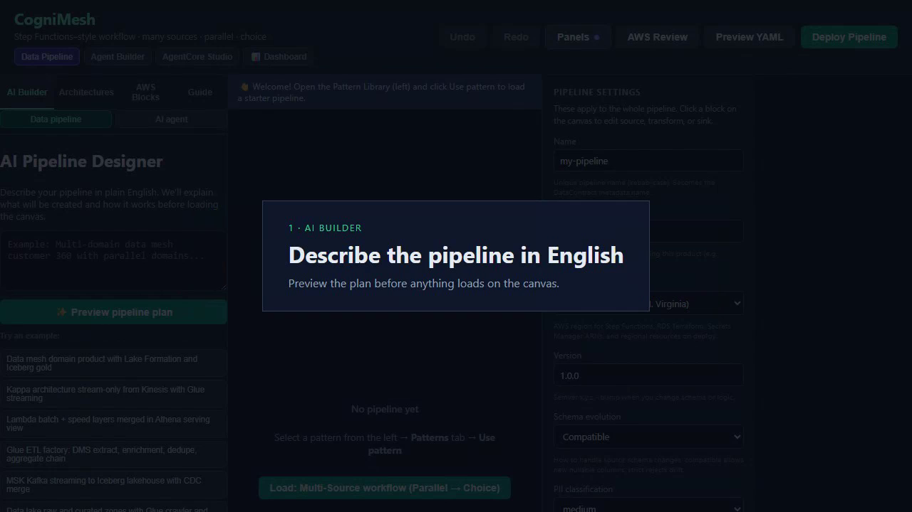

# Getting started (UI walkthrough)

Short portal tutorial: **caption, then live demo**, feature by feature: AI Builder, canvas + PVDM gate, AWS review, preview, deploy, operations, Agent Builder.

## Watch

  
   <em>How it works: each chapter starts with a caption, then the UI demo</em>

Regenerate: `DEMO_ONLY=howto npm run docs:demo` (or full `npm run docs:demo`).

## How it works

The video walks each feature **end to end**: a title card, then the real portal.

1. **AI Builder**: describe the pipeline in English and preview the plan.
2. **Architectures**: load Multi-Source onto the canvas.
3. **Canvas + PVDM gate**: sources → transform → integrity gate → sinks; gold waits on VRP proof.
4. **AWS Design Review**: security/architecture scores and the inferred AWS map.
5. **Preview YAML**: DataContract + Step Functions ASL.
6. **Deploy**: integrity gate and PVDM proof, then catalog / marketplace.
7. **Operations**: runs, lineage, marketplace.
8. **Agent Builder**: template, guardrails, preview, deploy.

Shorter clips: [UI panels](../assets/cognimesh-tutorial-demo.mp4) · [pipeline](../assets/cognimesh-pipeline-demo.mp4) · [agent](../assets/cognimesh-agent-demo.mp4) · [platform tour](../assets/cognimesh-features-demo.mp4)

## What you will see

1. **Panels** (header) - Operations, Approvals, Run History, Lineage, Marketplace, Deploy results.
2. **Load Multi-Source workflow** - canvas + AWS Design Review.
3. **Properties → Setup ready** - Create new (Terraform) path needs no Secrets Manager ARN when the checklist is complete.
4. **Use existing database** - surfaces setup findings; **Fix this** opens the review guide.
5. **Preview YAML** - Step Functions / contract preview before deploy.
6. **Marketplace** - trust grade, proof SLA, **Verify proof** and **Diff proofs**. See [Proof-gated marketplace](proof-gated-marketplace.md).

## Related

- [Tutorial hub](README.md)
- [GETTING_STARTED.md](../GETTING_STARTED.md)
- [Vaquar Pattern](../vaquar-pattern.md)
