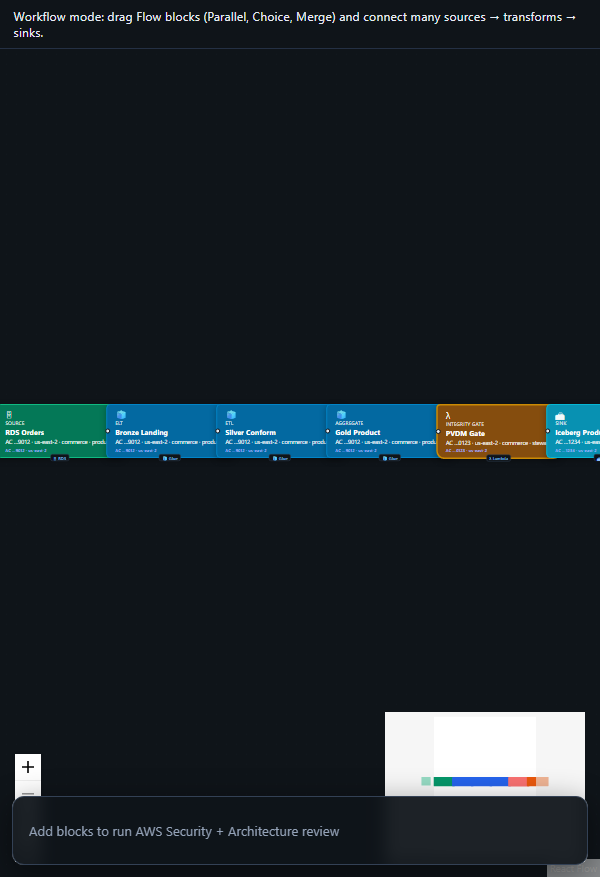

# Data Mesh - Domain Data Product

<p align="center">
  
  <br /><em>Self-serve · Lake Formation · marketplace publish</em>
</p>

[← All tutorials](../README.md) · [Portal UI](../../PORTAL_UI.md)

---

## What you'll create

Domain team owns end-to-end pipeline: ingest → bronze → silver → gold Iceberg product → integrity gate → catalog registration → Lake Formation share to consumers.

**Real-world example:** Commerce domain publishes orders_daily v1.0 - analysts request access via marketplace, stewards grant LF SELECT.

| | |
|---|---|
| **Pattern ID** | `arch-datamesh-domain-product` |
| **Category** | Data Mesh |
| **Difficulty** | Advanced |
| **Architecture** | datamesh |

## Why use this pattern

Federated data mesh where each domain publishes a versioned data product with contracts and SLAs.

## How it works

```
RDS CDC → Bronze → Silver ETL → Gold Iceberg → PVDM Gate → Glue Catalog → LF Tag → Marketplace
```

**Diagram:**

```
Producer AC → Bronze → Silver → Gold
Steward AC → PVDM Gate (VRP)
Publisher AC → Iceberg product → LF → Marketplace
```


**AWS services:** _See canvas blocks._


---

## Step-by-step in CogniMesh

### 1. Start the portal

```bash
npm run start:dev
```

Open [http://localhost:3000](http://localhost:3000).

### 2. Load this pattern

**Option A - AI Builder (recommended)**

1. Sidebar → **AI Builder** → **Data pipeline**
2. Paste: _"Multi-domain data mesh customer 360 with parallel domains"_
3. Click **Preview pipeline plan** - read _what we'll create_ and _how it works_
4. Click **Load pipeline on canvas**

**Option B - Architectures library**

1. Sidebar → **Architectures**
2. Filter: **Data Mesh**
3. Find **Data Mesh - Domain Data Product** → **Use pattern**

### 3. Customize blocks

Click each block on the canvas and set real values in the properties panel.

### 4. Preview & validate

Click **Preview YAML** (Ctrl+S) - review `DataContract.yaml` and Step Functions ASL.

### 5. Deploy

**Deploy** when API is on port 4000 - integrity gate → catalog registration.

---

## Developer workflow

| Layer | What you do |
|-------|-------------|
| **Portal / contract** | Tune block properties; export YAML from preview |
| **`lib/contract-builder/`** | Graph → DataContract mapping |
| **`services/pipeline-engine/`** | Contract → Step Functions ASL |
| **`lib/integrity-gate/`** | PVDM / VRP rules before gold publish |
| **`infra/terraform/`** | AWS infrastructure modules |

**API:** `POST /api/v1/pipelines/preview` · `POST /api/v1/pipelines/deploy`

---

## Tips

- Producer AC runs ingest → gold transforms.
- Steward AC hosts PVDM / VRP integrity gate.
- Publisher AC registers Iceberg product + Lake Formation share.


## Related

- [Tutorial hub](../README.md)
- [Drag-and-drop E2E](../../drag-drop-pipeline-flow.md)
- [Vaquar Pattern](../../vaquar-pattern.md)
- [External reference](https://docs.aws.amazon.com/whitepapers/latest/building-data-mesh-on-aws/data-mesh-patterns.html)
