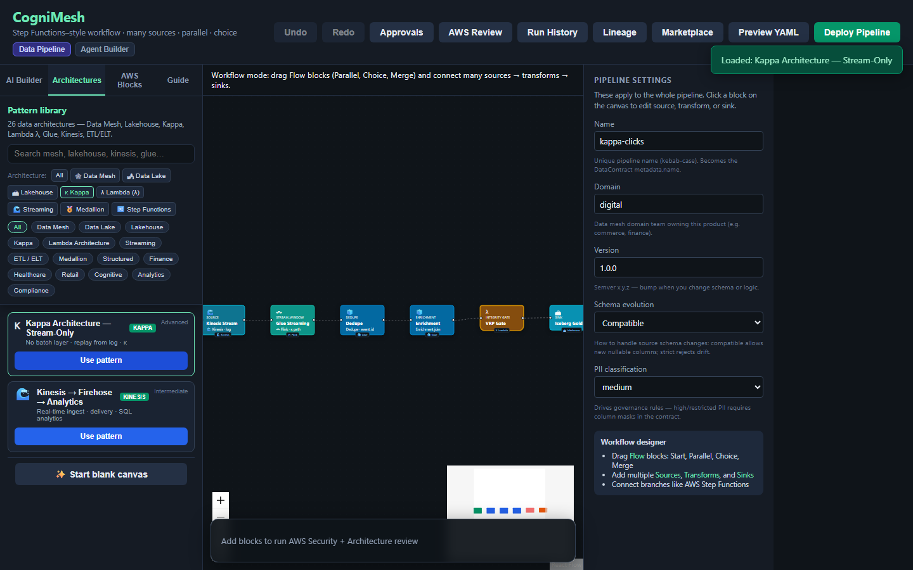

# Kappa Architecture - Stream-Only

<p align="center">
  
  <br /><em>No batch layer · replay from log · κ</em>
</p>

[← All tutorials](../README.md) · [Portal UI](../../PORTAL_UI.md)

---

## What you'll create

Kappa: treat everything as a stream. Historical reprocessing = replay the log with a new versioned job. No separate batch ETL layer.

**Real-world example:** Clickstream on Kinesis → Flink/Glue streaming → Iceberg gold; backfill = replay Kinesis epoch.

| | |
|---|---|
| **Pattern ID** | `arch-kappa-stream-only` |
| **Category** | Kappa |
| **Difficulty** | Advanced |
| **Architecture** | kappa |

## Why use this pattern

High-volume event streams where batch+stream dual pipelines (Lambda arch) are too costly to maintain.

## How it works

<p align="center">
  <a href="../../assets/cognimesh-pipeline-demo.mp4">
    
  </a>
  <br /><em>Load a pattern → AWS review → preview YAML → deploy → marketplace — click to play video</em>
</p>

```
Kinesis → Glue Streaming → Dedupe → Enrich → Iceberg (single path)
```

**Diagram:**

```
Kinesis (log) ──▶ Glue Streaming ──▶ Iceberg gold
     ↑ replay for reprocessing (new job version)
```


**AWS services:** `Kinesis` · `Glue` · `Flink` · `Iceberg` · `Lambda`


---

## Step-by-step in CogniMesh

### 1. Start the portal

```bash
npm run start:dev
```

Open [http://localhost:3000](http://localhost:3000).

### 2. Load this pattern

**Option A - AI Builder (recommended)**

1. Sidebar → **AI Builder** → **Data pipeline**
2. Paste: _"Kappa stream-only from Kinesis with Glue streaming"_
3. Click **Preview pipeline plan** - read _what we'll create_ and _how it works_
4. Click **Load pipeline on canvas**

**Option B - Architectures library**

1. Sidebar → **Architectures**
2. Filter: **Kappa**
3. Find **Kappa Architecture - Stream-Only** → **Use pattern**

### 3. Customize blocks

Click each block on the canvas and set real values in the properties panel.

### 4. Preview & validate

Click **Preview YAML** (Ctrl+S) - review `DataContract.yaml` and Step Functions ASL.

### 5. Deploy

**Deploy** when API is on port 4000 - integrity gate → catalog registration.

---

## Developer workflow

| Layer | What you do |
|-------|-------------|
| **Portal / contract** | Tune block properties; export YAML from preview |
| **`lib/contract-builder/`** | Graph → DataContract mapping |
| **`services/pipeline-engine/`** | Contract → Step Functions ASL |
| **`lib/integrity-gate/`** | PVDM / VRP rules before gold publish |
| **`infra/terraform/`** | AWS infrastructure modules |

**API:** `POST /api/v1/pipelines/preview` · `POST /api/v1/pipelines/deploy`

---

## Tips

- Reprocess = new job version + replay stream.
- No nightly batch layer needed.


## Related

- [Tutorial hub](../README.md)
- [Drag-and-drop E2E](../../drag-drop-pipeline-flow.md)
- [Vaquar Pattern](../../vaquar-pattern.md)

