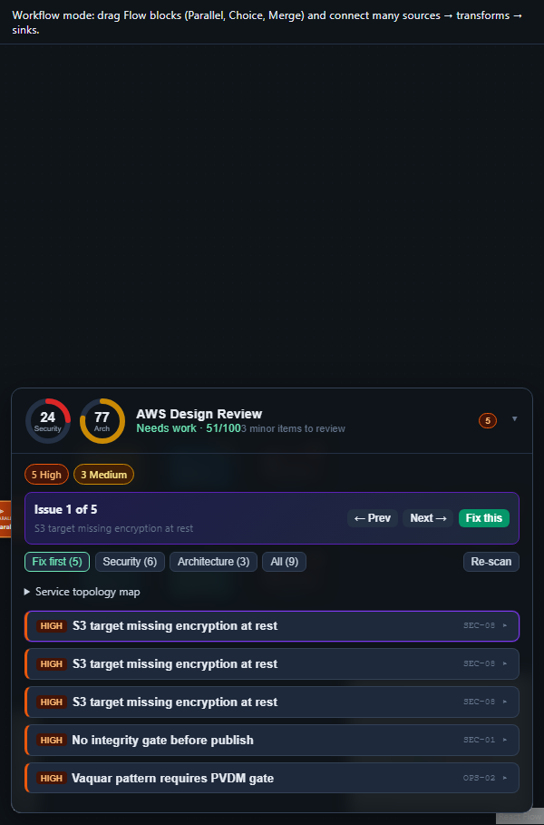

# Lambda Architecture (λ) - Batch + Speed Layers

<p align="center">
  
  <br /><em>Batch view + real-time speed layer · merge at query</em>
</p>

[← All tutorials](../README.md) · [Portal UI](../../PORTAL_UI.md)

---

## What you'll create

Lambda architecture: batch layer (Glue daily ETL to Iceberg serving layer) + speed layer (Kinesis/Flink real-time aggregates) merged at query time in Athena/Redshift.

**Real-world example:** E-commerce: nightly batch revenue + Kinesis speed layer last-hour sales → Athena UNION view.

| | |
|---|---|
| **Pattern ID** | `arch-lambda-batch-speed` |
| **Category** | Lambda Architecture |
| **Difficulty** | Expert |
| **Architecture** | lambda_arch |

## Why use this pattern

Need both accurate batch history and low-latency recent data - classic λ before full Kappa migration.

## How it works

```
Parallel[Batch: S3→Glue→Iceberg | Speed: Kinesis→Flink→Iceberg] → Merge → Athena serving
```

**Diagram:**

```
         ┌─ Batch (Glue daily) ──▶ Iceberg batch/
Source ──┤
         └─ Speed (Kinesis) ──▶ Iceberg speed/
                    ↓
              Athena VIEW = UNION
```


**AWS services:** `Glue` · `Kinesis` · `Flink` · `Iceberg` · `Athena` · `Step Functions`


---

## Step-by-step in CogniMesh

### 1. Start the portal

```bash
npm run start:dev
```

Open [http://localhost:3000](http://localhost:3000).

### 2. Load this pattern

**Option A - AI Builder (recommended)**

1. Sidebar → **AI Builder** → **Data pipeline**
2. Paste: _"Lambda batch and speed layers merged in Athena serving view"_
3. Click **Preview pipeline plan** - read _what we'll create_ and _how it works_
4. Click **Load pipeline on canvas**

**Option B - Architectures library**

1. Sidebar → **Architectures**
2. Filter: **Lambda Architecture**
3. Find **Lambda Architecture (λ) - Batch + Speed Layers** → **Use pattern**

### 3. Customize blocks

Click each block on the canvas and set real values in the properties panel.

### 4. Preview & validate

Click **Preview YAML** (Ctrl+S) - review `DataContract.yaml` and Step Functions ASL.

### 5. Deploy

**Deploy** when API is on port 4000 - integrity gate → catalog registration.

---

## Developer workflow

| Layer | What you do |
|-------|-------------|
| **Portal / contract** | Tune block properties; export YAML from preview |
| **`lib/contract-builder/`** | Graph → DataContract mapping |
| **`services/pipeline-engine/`** | Contract → Step Functions ASL |
| **`lib/integrity-gate/`** | PVDM / VRP rules before gold publish |
| **`infra/terraform/`** | AWS infrastructure modules |

**API:** `POST /api/v1/pipelines/preview` · `POST /api/v1/pipelines/deploy`

---

## Tips

- Batch = complete accurate history.
- Speed = last N minutes/hours.
- Athena view UNIONs both.


## Related

- [Tutorial hub](../README.md)
- [Drag-and-drop E2E](../../drag-drop-pipeline-flow.md)
- [Vaquar Pattern](../../vaquar-pattern.md)

