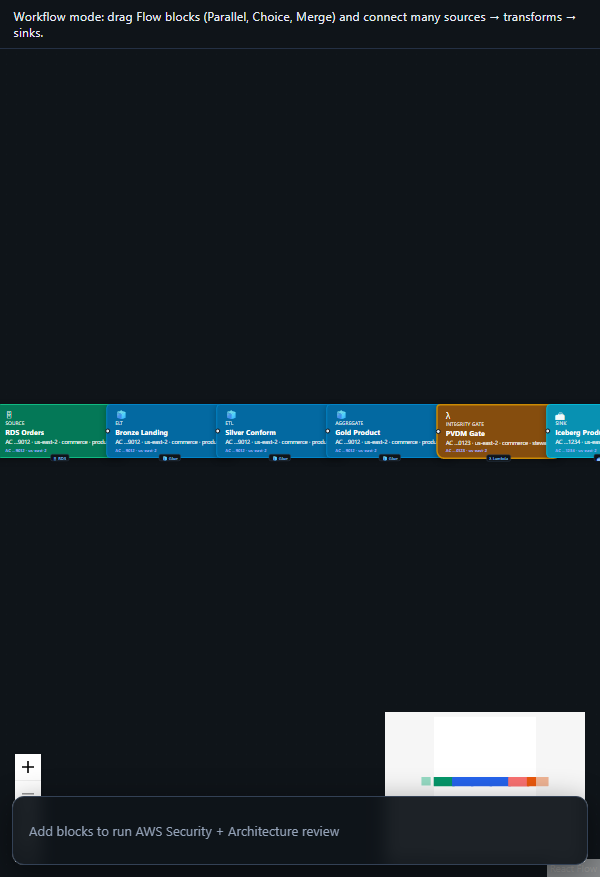

# Full Medallion (Bronze → Silver → Gold)

<p align="center">
  
  <br /><em>Classic lakehouse architecture</em>
</p>

[← All tutorials](../README.md) · [Portal UI](../../PORTAL_UI.md)

---

## What you'll create

The canonical data lakehouse pattern: raw landing (bronze), cleansed conformed data (silver), business-ready aggregates (gold). Each layer is a separate Spark transform with Vaquar PVDM proof before gold commit.

**Real-world example:** E-commerce company ingests order CDC → bronze raw JSON → silver typed columns → gold daily revenue by region.

| | |
|---|---|
| **Pattern ID** | `medallion-full-stack` |
| **Category** | Medallion |
| **Difficulty** | Beginner |
| **Architecture** | medallion |

## Why use this pattern

Any domain building a curated data product from operational sources. Start here if you're new to medallion.

## How it works

```
RDS CDC → Bronze (raw) → Silver (cleanse, dedupe) → Gold Iceberg (aggregates + VRP proof)
```

**Diagram:**

```
┌─────────┐   ┌─────────┐   ┌─────────┐   ┌─────────┐
│  Source │──▶│ Bronze  │──▶│ Silver  │──▶│  Gold   │
│  (CDC)  │   │  layer  │   │  layer  │   │ Iceberg │
└─────────┘   └─────────┘   └─────────┘   └─────────┘
```


**AWS services:** `RDS` · `Glue` · `S3` · `Iceberg` · `Step Functions` · `Lambda`


---

## Step-by-step in CogniMesh

### 1. Start the portal

```bash
npm run start:dev
```

Open [http://localhost:3000](http://localhost:3000).

### 2. Load this pattern

**Option A - AI Builder (recommended)**

1. Sidebar → **AI Builder** → **Data pipeline**
2. Paste: _"Full medallion bronze silver gold from RDS CDC"_
3. Click **Preview pipeline plan** - read _what we'll create_ and _how it works_
4. Click **Load pipeline on canvas**

**Option B - Architectures library**

1. Sidebar → **Architectures**
2. Filter: **Medallion**
3. Find **Full Medallion (Bronze → Silver → Gold)** → **Use pattern**

### 3. Customize blocks

Click each block on the canvas and set real values in the properties panel.

### 4. Preview & validate

Click **Preview YAML** (Ctrl+S) - review `DataContract.yaml` and Step Functions ASL.

### 5. Deploy

**Deploy** when API is on port 4000 - integrity gate → catalog registration.

---

## Developer workflow

| Layer | What you do |
|-------|-------------|
| **Portal / contract** | Tune block properties; export YAML from preview |
| **`lib/contract-builder/`** | Graph → DataContract mapping |
| **`services/pipeline-engine/`** | Contract → Step Functions ASL |
| **`lib/integrity-gate/`** | PVDM / VRP rules before gold publish |
| **`infra/terraform/`** | AWS infrastructure modules |

**API:** `POST /api/v1/pipelines/preview` · `POST /api/v1/pipelines/deploy`

---

## Tips

- Bronze = land raw with minimal transforms.
- Silver = typing, dedupe, business keys.
- Gold = aggregates or star-schema ready tables.
- Enable SparkRules on silver/gold for data quality.


## Related

- [Tutorial hub](../README.md)
- [Drag-and-drop E2E](../../drag-drop-pipeline-flow.md)
- [Vaquar Pattern](../../vaquar-pattern.md)

