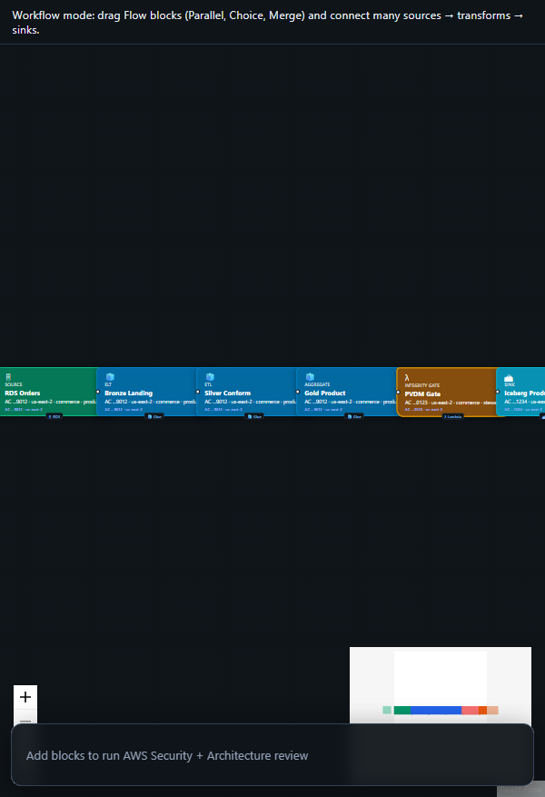

# Spark Declarative Pipelines (SDP) Medallion

<p align="center">
  
  <br /><em>Apache Spark 4.1+ · portable SQL pipelines</em>
</p>

[← All tutorials](../README.md) · [Portal UI](../../PORTAL_UI.md)

---

## What you'll create

Author bronze/silver/gold as Spark Declarative Pipelines (CREATE OR REFRESH MATERIALIZED VIEW / STREAMING TABLE). Export a spark-pipeline.yml project and run with spark-pipelines. CogniMesh still proof-gates the Iceberg catalog commit.

**Real-world example:** Orders land on S3 → SDP bronze MV → silver typed → gold MV → CogniMesh VRP → Iceberg publish.

| | |
|---|---|
| **Pattern ID** | `spark-declarative-medallion` |
| **Category** | Lakehouse |
| **Difficulty** | Intermediate |
| **Architecture** | lakehouse |

## Why use this pattern

You want portable Spark 4.1+ declarative pipelines (Databricks Lakeflow-compatible authoring) without giving up VRP verify-before-commit.

## How it works

<p align="center">
  <a href="../../assets/cognimesh-pipeline-demo.mp4">
    
  </a>
  <br /><em>Load a pattern, AWS review, preview YAML, deploy, marketplace (click to play video)</em>
</p>

```
S3 landing → SDP bronze → SDP silver → SDP gold → PVDM Verify → Iceberg Metadata
```


**AWS services:** `EMR Serverless / Spark 4.1+` · `S3` · `Iceberg` · `Glue Catalog` · `Step Functions`


---

## Step-by-step in CogniMesh

### 1. Start the portal

```bash
npm run start:dev
```

Open [http://localhost:3000](http://localhost:3000).

### 2. Load this pattern

**Option A - AI Builder (recommended)**

1. Sidebar → **AI Builder** → **Data pipeline**
2. Paste: _"Lakehouse Iceberg medallion with CDC merge"_
3. Click **Preview pipeline plan** - read _what we'll create_ and _how it works_
4. Click **Load pipeline on canvas**

**Option B - Architectures library**

1. Sidebar → **Architectures**
2. Filter: **Lakehouse**
3. Find **Spark Declarative Pipelines (SDP) Medallion** → **Use pattern**

### 3. Customize blocks

Click each block on the canvas and set real values in the properties panel.

### 4. Preview & validate

Click **Preview YAML** (Ctrl+S) - review `DataContract.yaml` and Step Functions ASL.

### 5. Deploy

**Deploy** when API is on port 4000 - integrity gate → catalog registration.

---

## Developer workflow

| Layer | What you do |
|-------|-------------|
| **Portal / contract** | Tune block properties; export YAML from preview |
| **`lib/contract-builder/`** | Graph → DataContract mapping |
| **`services/pipeline-engine/`** | Contract → Step Functions ASL |
| **`lib/integrity-gate/`** | PVDM / VRP rules before gold publish |
| **`infra/terraform/`** | AWS infrastructure modules |

**API:** `POST /api/v1/pipelines/preview` · `POST /api/v1/pipelines/deploy`

---

## Tips

- Export Spark Declarative Pipelines from AWS Design Review.
- Run: pip install 'pyspark[pipelines]' && spark-pipelines run
- Keep PVDM on - SDP success is not a catalog publish proof.


## Related

- [Tutorial hub](../README.md)
- [Drag-and-drop E2E](../../drag-drop-pipeline-flow.md)
- [Vaquar Pattern](../../vaquar-pattern.md)

