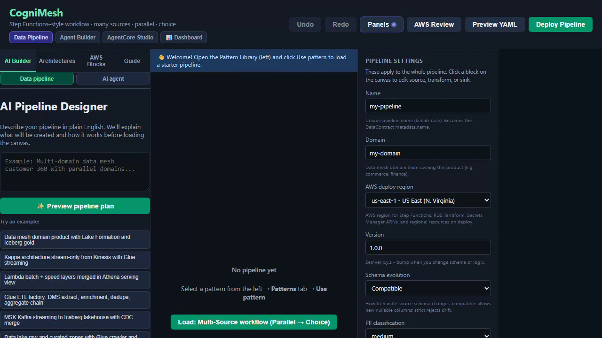

# Proof-gated marketplace (tutorial)

Consumers should not trust a green job log. This walkthrough shows how to publish a product, read the trust card, verify a proof offline, and diff two publications.

## Watch (captioned UI demo)

<p align="center">
  <a href="../assets/cognimesh-marketplace-proof-demo.mp4">
    
  </a>
  <br />
  <a href="../assets/cognimesh-marketplace-proof-demo.mp4"><strong>▶ Play marketplace proof demo</strong></a>
  <br />
  <em>Caption first, then trust card → verify → diff</em>
</p>

Regenerate: `DEMO_ONLY=marketplace-proof npm run docs:demo`

## What you will do

1. Deploy a Vaquar / CDC pattern so a product lands in Marketplace.
2. Open the product and read **trust grade**, **Profile A/T/O**, **source snapshot**, and **snapshot pin SQL**.
3. Paste a VRP proof JSON and click **Verify proof** (no AWS credentials).
4. Paste a second proof and click **Diff proofs** to see what changed (hashes, schema, source snapshot).

## Start the portal

```bash
npm run start:dev
```

Open http://localhost:3000

## Step 1: Publish a proof-gated product

1. Load **RDS CDC to Iceberg** (or any Vaquar pattern) from Architectures.
2. Click **Preview YAML**, then **Deploy Pipeline**.
3. Local deploy compiles the contract, runs a demo PVDM workload, and registers the catalog product.

You should see a Run History entry with VRP **PASS** (or FAIL if you tamper rows). Catalog commit only happens on PASS.

## Step 2: Marketplace trust card

1. Open **Panels → Marketplace**.
2. Click the product.
3. Confirm:
   - Trust grade and score
   - Profile (A = identity, O = ordered sequence field, T = independent transform oracle)
   - Freshness SLA (hours since last VRP PASS, default 24h via `PVDM_PROOF_SLA_HOURS`)
   - Snapshot pin SQL for Iceberg time travel
4. Sample rows stay hidden until VRP PASS (fail-closed consumer).

## Step 3: Verify a proof (example)

CLI (same checks as the portal button):

```bash
node scripts/verify-vrp-proof.js path/to/proof.json
```

HTTP:

```bash
curl -s -X POST http://localhost:4000/api/v1/proofs/verify \
  -H "Content-Type: application/json" \
  -H "Authorization: Bearer $TOKEN" \
  -d "{\"proof\": $(cat path/to/proof.json), \"requireSignature\": false}"
```

A valid unsigned demo proof returns `"valid": true` when `requireSignature` is false. Production proofs must carry a Steward signature.

Worked JSON: [docs/examples/proof-verify.md](../examples/proof-verify.md)

## Step 4: Diff two publications

Paste yesterday's proof in the first box and today's proof in the second, then **Diff proofs**.

Typical changes:

| Field | Meaning |
|-------|---------|
| `verdict` | PASS vs FAIL |
| `schema_fingerprint` | Schema drift (paper N15) |
| `source_snapshot_id` | Different source snapshot (paper N15) |
| `multiset.sink_hash` | Written content changed |
| `iceberg_snapshot_id` | New catalog snapshot |

Iceberg time travel shows *which snapshot*. This diff shows *whether content integrity fields changed*.

## Related

- [Vaquar Pattern](../vaquar-pattern.md)
- [Getting started UI](getting-started-ui.md)
- [RDS CDC tutorial](pipelines/vaquar-cdc-orders.md)
