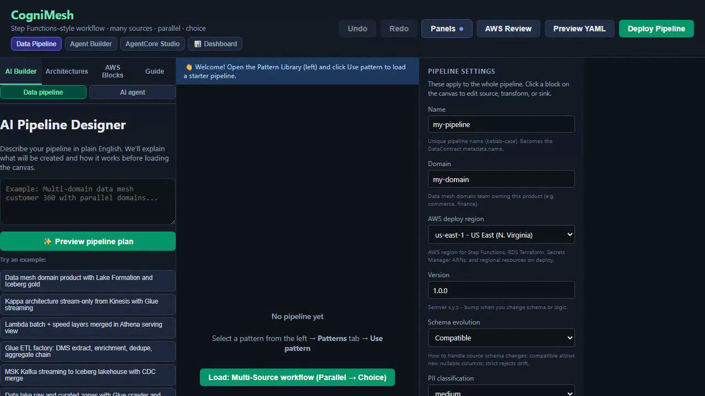
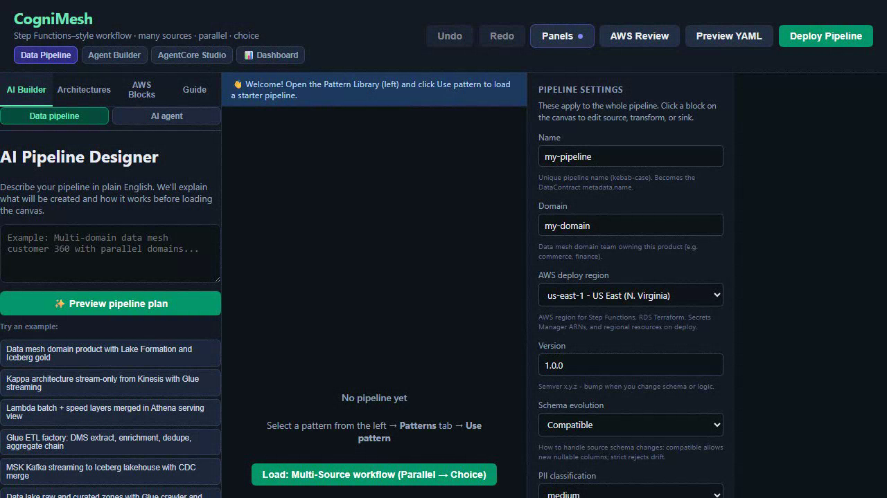

# Spark Declarative Pipelines + dbt with CogniMesh

CogniMesh stays the **control plane** (canvas, contracts, marketplace, VRP).
[Apache Spark Declarative Pipelines (SDP)](https://spark.apache.org/docs/latest/declarative-pipelines-programming-guide.html) and **dbt** are portable transform engines you export into.

## Watch (captioned UI demos)

<p align="center">
  <a href="../assets/cognimesh-sdp-export-demo.mp4">
    
  </a>
  &nbsp;
  <a href="../assets/cognimesh-dbt-export-demo.mp4">
    
  </a>
  <br />
  <a href="../assets/cognimesh-sdp-export-demo.mp4"><strong>▶ SDP export</strong></a>
  &nbsp;·&nbsp;
  <a href="../assets/cognimesh-dbt-export-demo.mp4"><strong>▶ dbt export</strong></a>
  <br />
  <em>Caption first, then the live portal walkthrough</em>
</p>

Regenerate: `DEMO_ONLY=sdp-export,dbt-export npm run docs:demo`

## When to use which

| Engine | Strength | Still needs CogniMesh for |
|--------|----------|---------------------------|
| **SDP** (`spark-pipelines`) | Spark 4.1+ declarative MVs / streaming tables, auto dependency order | Proof-gated Iceberg commit, marketplace trust |
| **dbt** | Analyst-friendly models + schema tests | Same - `dbt test` is observational, not VRP |
| **Glue spark_sql** | AWS-native jobs already on the canvas | Same PVDM path |

## Export from the portal

1. Load **Spark Declarative Pipelines (SDP) Medallion** or **dbt Silver → Gold (+ PVDM)**.
2. Open **AWS Design Review** → Service topology map and export.
3. Click **Export Spark Declarative Pipelines** or **Export dbt project**.
4. Unzip and run:

```bash
# SDP (Spark 4.1+)
pip install "pyspark[pipelines]"
spark-pipelines dry-run
spark-pipelines run

# dbt
dbt run --select orders_clean
dbt test --select orders_clean
```

5. Publish through CogniMesh Deploy so Run History shows **VRP PASS** before consumers see gold.

## API

```bash
POST /api/v1/pipelines/export/spark-declarative
POST /api/v1/pipelines/export/dbt
```

Body: `{ "nodes", "edges", "pipelineMeta" }` (same as preview). Response includes `files` and `zipBase64`.

## Honest boundary

- SDP / dbt success ≠ catalog publish.
- Invariant remains: `commit_metadata ⇒ VRP = PASS`.
- Marketplace samples stay fail-closed until PASS.

Related: [Proof-gated marketplace](proof-gated-marketplace.md) · [Vaquar Pattern](../vaquar-pattern.md)
