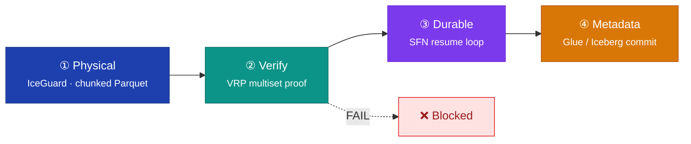
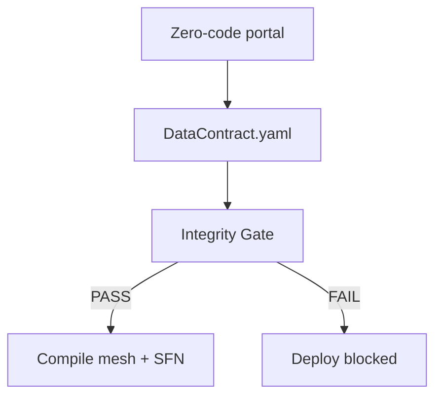
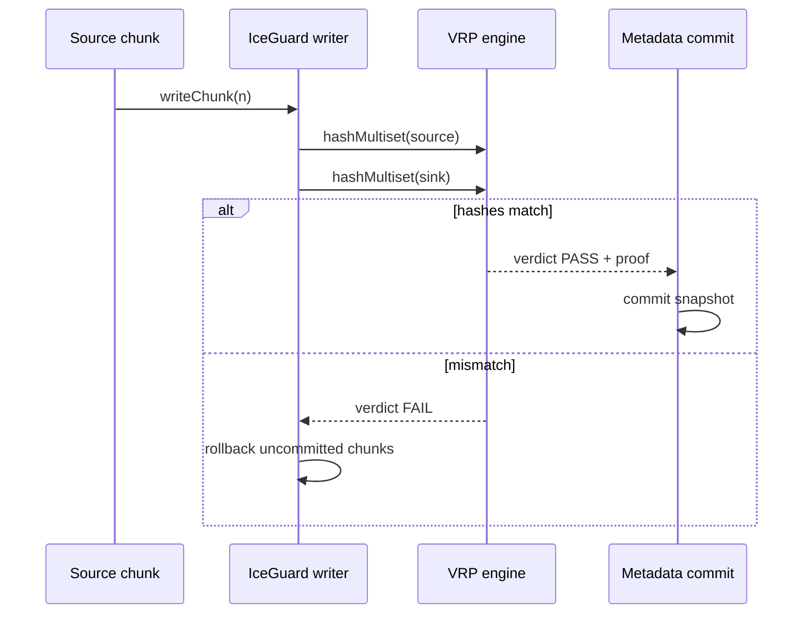
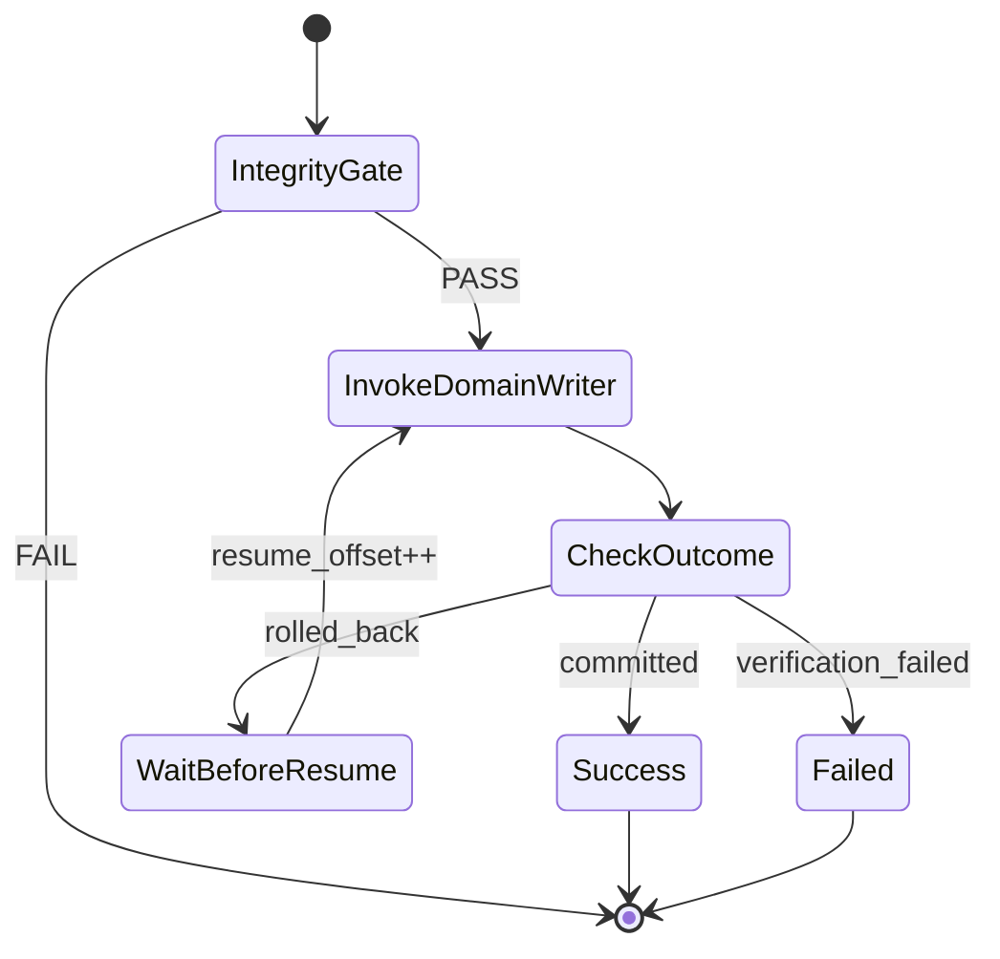
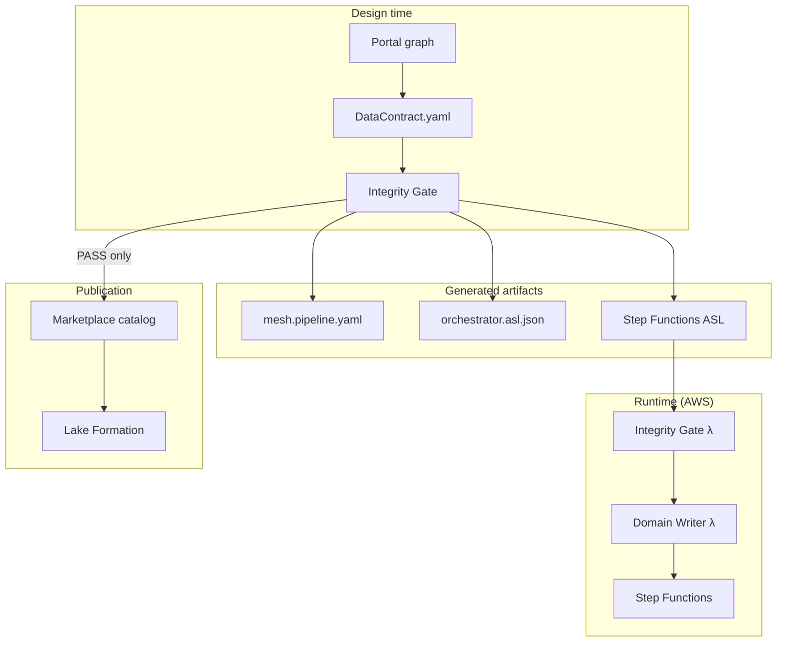

<p align="center">
  
  
  
</p>

<h1 align="center">The Vaquar Pattern</h1>

<p align="center">
  <strong>Proof-gated serverless data mesh writes for AWS</strong><br/>
  Design-time rules · Physical staging · Multiset verification · Durable execution · Metadata commit
</p>

<p align="center">
  <a href="../README.md">← CogniMesh</a> ·
  <a href="data-contract-spec.md">Data Contract</a> ·
  <a href="../lib/vaquar/contract-to-mesh.js">mesh compiler</a> ·
  <a href="../services/pvdm-runtime/">PVDM runtime</a>
</p>

---

## Overview

The **Vaquar Pattern** is a reference architecture for building **trustworthy data products** on AWS serverless infrastructure. It was created by **[Vaquarkhan](https://github.com/vaquarkhan)** to solve a recurring data-mesh failure mode: pipelines that write physical data and catalog metadata **without cryptographic proof** that source and sink agree.

CogniMesh implements the Vaquar Pattern end-to-end: from portal design through `DataContract.yaml`, integrity gate, PVDM runtime, and marketplace publication.

> **Core invariant**
>
> `commit_metadata ⟹ VRP = PASS`
>
> No Iceberg snapshot, Glue catalog update, or marketplace listing may proceed unless multiset verification passes for every committed chunk.

---

## Why the pattern exists

Traditional ETL assumes correctness. Modern data meshes need **evidence**.

| Problem | Vaquar response |
|---------|-----------------|
| Silent row loss during transform | Multiset VRP (veridata-recon) per chunk |
| Long-running Lambda timeouts | Durable execution with SFN resume loop |
| Partial writes corrupting gold tables | IceGuard chunked Parquet + rollback |
| Governance applied too late | Integrity gate at design time **and** runtime |
| Catalog drift from physical data | Metadata commit gated on VRP proof |

---

## PVDM: the four phases

**PVDM** stands for **Physical → Verify → Durable → Metadata**. Each phase has a single responsibility and a hard failure boundary.



### Phase 0 (design time): Rules before runtime

Before PVDM executes, CogniMesh runs an **integrity gate** against declarative policies (`rules/default-policies.yaml`). This mirrors SparkRules-style governance at design time so bad contracts never reach AWS.



---

## Building blocks

| Block | Phase | Responsibility | CogniMesh implementation |
|-------|-------|----------------|--------------------------|
| **Integrity Gate** | 0 · Rules | Schema, security, compliance checks | `lib/integrity-gate/`, `services/lambda/integrity-gate/` |
| **SparkRules** | 0 · Rules | Optional DRL filter before physical write | `services/pvdm-runtime/` `applySparkRules()` |
| **IceGuard** | 1 · Physical | Chunked Parquet, checkpoint, rollback | `services/pvdm-runtime/` `IceGuardWriter` |
| **veridata-recon** | 2 · Verify | Multiset hash comparison (VRP) | `services/pvdm-runtime/` `generateVRP()` |
| **Durable Execution** | 3 · Durable | 15-min Lambda segments, SFN resume | `lib/vaquar/pvdm-sfn.js` |
| **GlueCatalogConnector** | 4 · Metadata | Proof-gated catalog commit | `validateThenCommit()` + `commitMetadata()` |
| **Domain Writer** | Runtime | Orchestrates full PVDM workload | `services/lambda/domain-writer/` |

---

## VRP: verifiable reconciliation proof

VRP compares **source** and **sink** multisets over identity + content fields. A SHA-256 hash of row counts per composite key must match exactly.



**Outcomes** (aligned with serverless-data-mesh domain writer):

| Outcome | Meaning |
|---------|---------|
| `committed` | All chunks verified; metadata updated |
| `verification_failed` | VRP FAIL; no snapshot |
| `unverified` | Empty workload, filtered-to-zero, or PVDM not run — **not** PASS |
| `rolled_back` | Runtime error; IceGuard checkpoints reverted |

### Trust model (honest)

VRP proofs are **not** “no trust required.” They reduce risk when:

1. **Sink binding** — Proofs include per-chunk file digests and (when integrated) Iceberg manifest digests so an independent verifier can recompute the sink multiset from durable storage, not a self-reported hash alone.
2. **Signing custody** — Production signing uses **AWS KMS** (`VRP_KMS_KEY_ID`, `kms:Sign`); key material is non-exportable. Trust shifts to KMS key policy + CloudTrail, not env-var private keys.
3. **Canonical payloads** — Proof bodies use RFC 8785-style JCS (`lib/vrp/canonical.js`) over a strict schema (strings + integers; no floats).
4. **Freshness** — Proofs carry `pipeline_run_id`, `chunk_sequence`, `not_before` / `not_after`, and a catalog table identity to limit replay.
5. **Fail closed** — Exceptions and empty workloads yield `UNVERIFIED`, never `PASS`. KMS signing failures yield `signing_failed` and block deploy.
6. **Sink read-back** — Source multiset is hashed pre-write; sink multiset is hashed after reading persisted **Parquet** chunk bytes (`lib/vrp/parquet-chunk.js`, `lib/vrp/chunk-store.js`). Proofs bind `digest_type: parquet_footer` (last 4 KiB SHA-256). Shallow in-memory copies are rejected (`sink_materialization: "read_back"`).
7. **Proof persistence** — `proofS3Uri` is emitted only when a signed proof is written (`lib/vrp/proof-store.js`). Optional S3 upload with Object Lock (`VRP_OBJECT_LOCK_MODE`, `VRP_OBJECT_LOCK_RETAIN_DAYS`).
8. **Transparency log** — Issued proofs append to local JSONL **and** S3 per-proof objects when `PROOF_BUCKET` is set (`lib/vrp/transparency-log.js`). Async S3 lookup for gateway verification.
9. **Snapshot pinning** — Proofs bind `iceberg_snapshot_id` from Glue Iceberg metadata (`lib/aws/glue-iceberg.js`) or monotonic catalog state + `snapshot_pin` SQL; consumers must read `FOR SYSTEM_VERSION AS OF <id>`.
10. **Enforced inputs** — Agent/decision attestations require `gatewayToken` from the proof-aware data gateway (`lib/vrp/proof-gateway.js`). Declared `inputProofs` are rejected unless `VRP_ALLOW_DECLARED_INPUTS=true` (tests only).

| Attack surface | Mitigation in CogniMesh |
|----------------|-------------------------|
| Self-reported sink hash | Parquet footer digests + manifest digest; verifier recomputes from persisted bytes |
| Naive JSON canonicalization | JCS in `lib/vrp/canonical.js` |
| Key in env/repo | KMS asymmetric signing in `lib/vrp/sign.js` |
| Replay / stale proof | `not_before`/`not_after`, `pipeline_run_id`, Iceberg snapshot id |
| Cosmetic snapshot id | Real Glue `current-snapshot-id` or monotonic `data/iceberg-snapshots.json` |
| Default `["id"]` field | All columns by default; explicit `identityFields` required to narrow |
| Fail-open PASS on error | `lib/pvdm-run-summary.js` + empty workload → `UNVERIFIED` |
| Self-declared agent inputs | Proof gateway stamps served rows; attestations bind `gatewayToken` |

Environment:

| Variable | Purpose |
|----------|---------|
| `VRP_KMS_KEY_ID` | KMS asymmetric key for production signing |
| `VRP_SIGNING_MODE` | `kms` (default when key set) or `dev` (ephemeral Ed25519, local only) |
| `VRP_PROOF_TTL_SEC` | Proof validity window (default 86400) |
| `VRP_SIGN_ON_GENERATE` | Set `false` to skip signing in tests |
| `PROOF_BUCKET` / `PROOF_BUCKET_NAME` | S3 bucket for proofs + transparency log objects |
| `VRP_S3_PERSIST` | Enable S3 persistence (default on when bucket set) |
| `VRP_OBJECT_LOCK_MODE` / `VRP_OBJECT_LOCK_RETAIN_DAYS` | S3 Object Lock on proof/transparency objects |
| `VRP_UPLOAD_PARQUET` | Upload Parquet chunks to lakehouse S3 URI (`true`) |
| `GLUE_ICEBERG_ENABLED` | Set `false` to skip Glue; use `data/iceberg-snapshots.json` |
| `VRP_GATEWAY_SECRET` | HMAC secret for gateway tokens |
| `VRP_ALLOW_DECLARED_INPUTS` | Allow self-declared `inputProofs` in attestations (tests only) |
| `VRP_REQUIRE_TRANSPARENCY_LOG` | Gateway requires transparency log entry |

Implementation: [`lib/vrp/`](../lib/vrp/)

### Offline verification

Consumers can verify a proof **without AWS credentials** using the producer's published public key:

```bash
node scripts/verify-vrp-proof.js path/to/proof.json --public-key producer-public.pem
```

API: `verifyVrpProof(proof, { publicKeyPem })` in [`lib/vrp/verify.js`](../lib/vrp/verify.js) — checks multiset binding, validity window, and signature.

Agent MCP endpoints:

| Endpoint | Purpose |
|----------|---------|
| `POST /mcp/gateway/serve` | Verify proof, serve pinned snapshot rows, return `gatewayToken` |
| `POST /mcp/verify-proof` | Offline-style VRP proof verification |
| `POST /mcp/verify-attestation` | Verify decision attestation signature + output hash |

API gateway: `POST /api/v1/gateway/serve` (same semantics, auth required).

### Decision attestation (agent layer)

[`lib/vrp/decision-attestation.js`](../lib/vrp/decision-attestation.js) binds agent decisions to **gateway-served** VRP input proofs. Pass `gatewayToken` from `serveProofGatedDataset` to `POST /mcp/invoke` — attestations record `gateway_enforced: true` on each input binding.

---

## Durable execution model

AWS Lambda has a 15-minute ceiling. Vaquar workloads may run 90+ minutes. The pattern uses **Step Functions** with a resume loop:



Implementation: [`lib/vaquar/pvdm-sfn.js`](../lib/vaquar/pvdm-sfn.js)

---

## Contract → mesh bridge

CogniMesh compiles `cognimesh.io/v1` **DataContract** manifests into `sdm/v1` **DataProductPipeline** mesh YAML for Vaquar-compatible runtimes.

```
DataContract.yaml  →  contract-to-mesh.js  →  mesh.pipeline.yaml
                    →  pvdm-sfn.js         →  orchestrator.asl.json
```

| DataContract field | Mesh mapping |
|--------------------|--------------|
| `spec.execution.pattern: vaquar` | `spec.runtime.pattern` |
| `spec.transform.pvdm.*` | `spec.workload` + `spec.boundary` |
| `spec.transform.sparkRules` | `spec.runtime.spark_rules_enabled` |
| `spec.target.catalog` | `spec.runtime.metadata` |
| `spec.governance` | `spec.governance` + consumer SLAs |

Compiler: [`lib/vaquar/contract-to-mesh.js`](../lib/vaquar/contract-to-mesh.js)

Example structured pipeline: [`contracts/examples/structured-cdc-pipeline.yaml`](../contracts/examples/structured-cdc-pipeline.yaml)

---

## CogniMesh deploy flow



Generated output directory:

```
generated/{domain}/{pipeline-name}/
├── mesh.pipeline.yaml
├── orchestrator.asl.json
└── manifest.json
```

---

## When to use Vaquar vs cognitive pipelines

| Dimension | Vaquar PVDM (structured) | Cognitive (EKS + Bedrock) |
|-----------|--------------------------|---------------------------|
| Input | RDS CDC, S3, Kafka | Media URLs, unstructured |
| Transform | Spark SQL, Glue | Agentic (LLM extraction) |
| Correctness model | VRP multiset proof | Epoch / frontier / compensation |
| Runtime | Lambda + Step Functions | EKS controller + MCP |
| Contract flag | `execution.pattern: vaquar` | `transform.type: agentic` |

Both paths share the same **DataContract** schema and **integrity gate** at design time.

---

## Quick commands

```bash
# Validate + compile Vaquar bridge
npm run test:vaquar

# PVDM runtime unit tests (VRP, IceGuard, commit)
npm run test:pvdm

# VRP security hardening (fail-closed, JCS, KMS signing, field resolution)
npm run test:vrp-security

# Generate mesh.yaml from example contract
npm run vaquar:apply -- contracts/examples/structured-cdc-pipeline.yaml

# Package Lambdas for Terraform
npm run package:lambda
npm run package:domain-writer
```

---

## Reference implementation

The Vaquar Pattern is also embodied in the open-source **[AWS Serverless Data Mesh Framework](https://github.com/vaquarkhan/aws-serverless-datamesh-framework)** (`serverless-data-mesh` Python package). CogniMesh provides a **Node.js reference runtime** and **zero-code portal** on top of the same invariants.

| Layer | Repository path |
|-------|-----------------|
| Pattern specification | This document |
| Mesh compiler | `lib/vaquar/` |
| PVDM runtime | `services/pvdm-runtime/` |
| Python domain writer (optional) | `services/domain-writer/handler.py` |
| Terraform (prod) | `infra/terraform/` |

---

## Author & lineage

| | |
|---|---|
| **Pattern** | The Vaquar Pattern |
| **Author** | [Vaquarkhan](https://github.com/vaquarkhan) |
| **Platform** | [CogniMesh](https://github.com/vaquarkhan/CogniMesh) |
| **Invariant** | `commit_metadata ⟹ VRP = PASS` |
| **Phases** | Physical → Verify → Durable → Metadata |

<p align="center">
  <sub>Domain teams own the pipeline design. The mesh proves correctness before publication.</sub>
</p>
