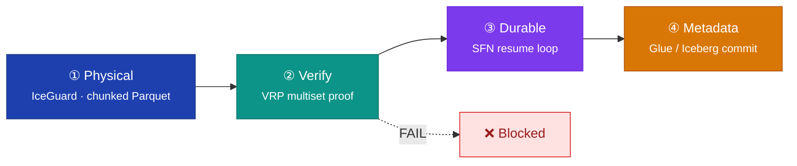
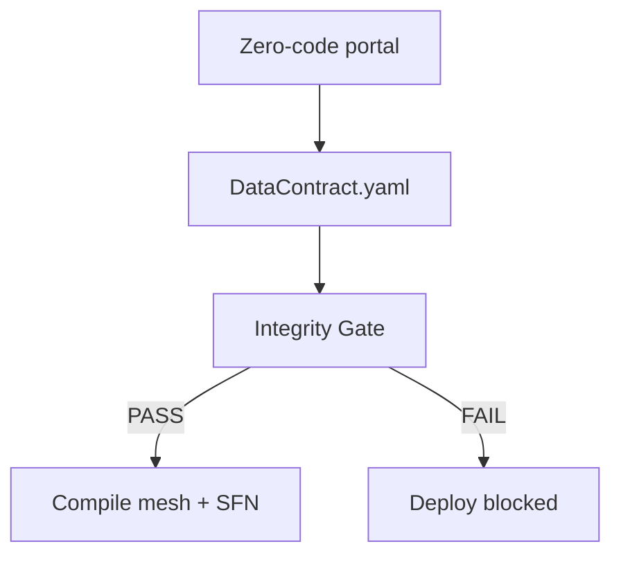
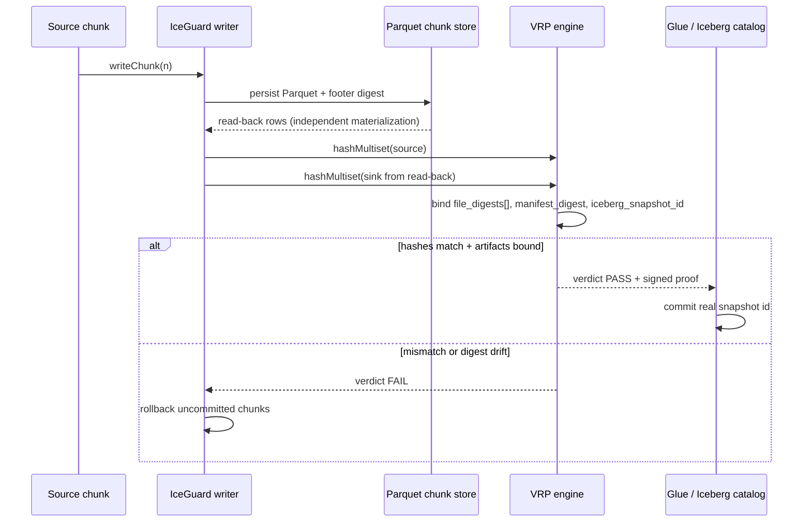
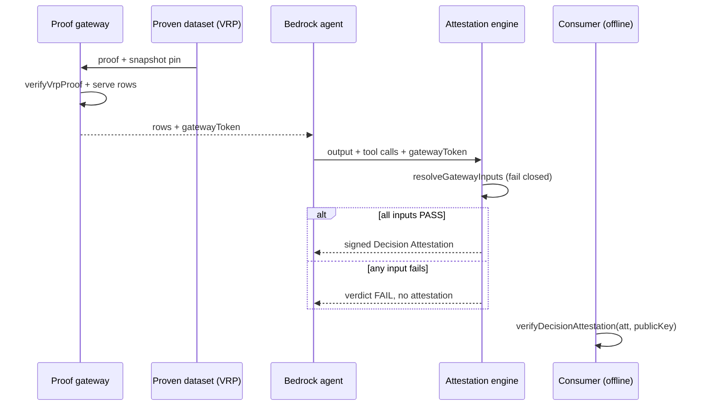
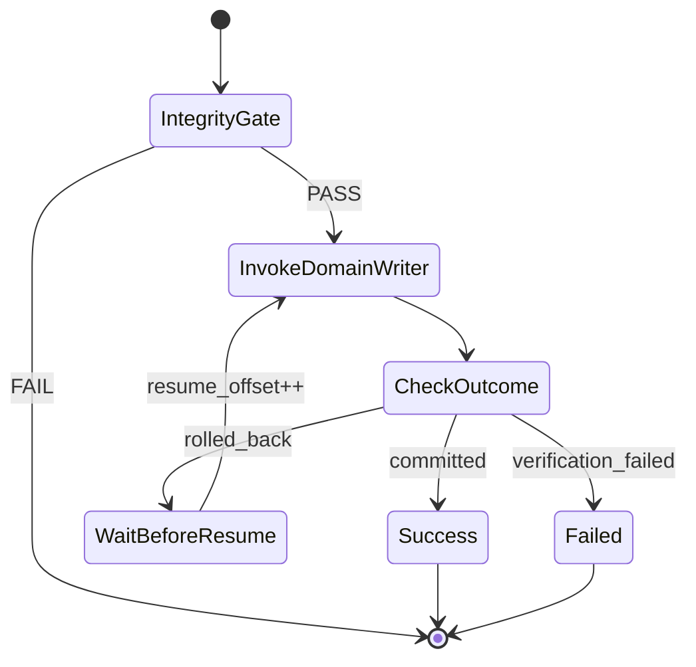
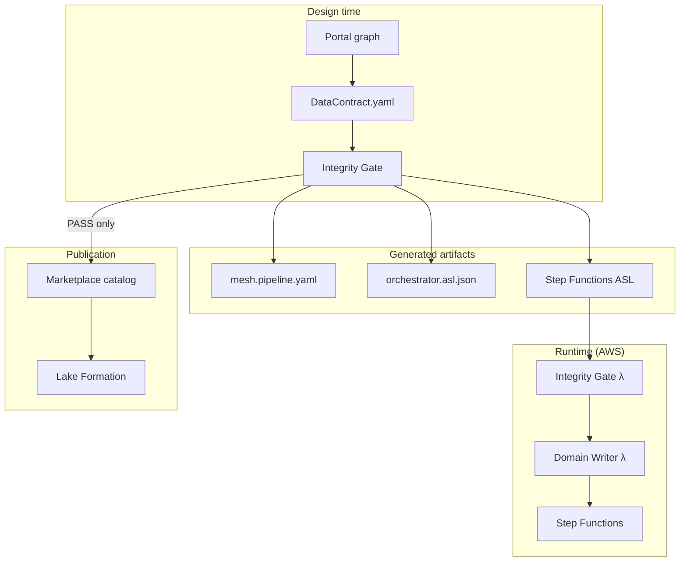

<p align="center">
  
  
  
  
</p>

<h1 align="center">The Vaquar Pattern</h1>

<p align="center">
  <strong>Proof-gated serverless data mesh writes for AWS</strong><br/>
  Design-time rules · Physical staging · Multiset verification · Durable execution · Metadata commit
</p>

<p align="center">
  <a href="../README.md">← CogniMesh</a> ·
  <a href="FAQ.md">FAQ</a> ·
  <a href="data-contract-spec.md">Data Contract</a> ·
  <a href="../lib/vaquar/contract-to-mesh.js">mesh compiler</a> ·
  <a href="../services/pvdm-runtime/">PVDM runtime</a>
</p>

---

## Overview

The **Vaquar Pattern** is a reference architecture for building **trustworthy data products** on AWS serverless infrastructure. It was created by **[Vaquarkhan](https://github.com/vaquarkhan)** to solve a recurring data-mesh failure mode: pipelines that write physical data and catalog metadata **without cryptographic proof** that source and sink agree.

CogniMesh implements the Vaquar Pattern end-to-end: from portal design through `DataContract.yaml`, integrity gate, PVDM runtime, and marketplace publication.

> **Core invariant**
>
> `commit_metadata ⟹ VRP = PASS`
>
> No Iceberg snapshot, Glue catalog update, or marketplace listing may proceed unless multiset verification passes for every committed chunk.

---

## Why the pattern exists

Traditional ETL assumes correctness. Modern data meshes need **evidence**.

| Problem | Vaquar response |
|---------|-----------------|
| Silent row loss during transform | Multiset VRP (veridata-recon) per chunk |
| Long-running Lambda timeouts | Durable execution with SFN resume loop |
| Partial writes corrupting gold tables | IceGuard chunked Parquet + rollback |
| Governance applied too late | Integrity gate at design time **and** runtime |
| Catalog drift from physical data | Metadata commit gated on VRP proof |

---

## PVDM: the four phases

**PVDM** stands for **Physical → Verify → Durable → Metadata**. Each phase has a single responsibility and a hard failure boundary.



### Phase 0 (design time): Rules before runtime

Before PVDM executes, CogniMesh runs an **integrity gate** against declarative policies (`rules/default-policies.yaml`). This mirrors SparkRules-style governance at design time so bad contracts never reach AWS.



---

## Building blocks

| Block | Phase | Responsibility | CogniMesh implementation |
|-------|-------|----------------|--------------------------|
| **Integrity Gate** | 0 · Rules | Schema, security, compliance checks | `lib/integrity-gate/`, `services/lambda/integrity-gate/` |
| **SparkRules** | 0 · Rules | Optional DRL filter before physical write | `services/pvdm-runtime/` `applySparkRules()` |
| **IceGuard** | 1 · Physical | Chunked Parquet, checkpoint, rollback | `services/pvdm-runtime/` `IceGuardWriter` |
| **veridata-recon** | 2 · Verify | Multiset hash comparison (VRP) | `services/pvdm-runtime/` `generateVRP()` |
| **Durable Execution** | 3 · Durable | 15-min Lambda segments, SFN resume | `lib/vaquar/pvdm-sfn.js` |
| **GlueCatalogConnector** | 4 · Metadata | Proof-gated catalog commit | `validateThenCommit()` + `commitMetadata()` |
| **Domain Writer** | Runtime | Orchestrates full PVDM workload | `services/lambda/domain-writer/` |

---

## VRP: verifiable reconciliation proof

VRP compares **source** and **sink** multisets over identity + content fields. A SHA-256 hash of row counts per composite key must match exactly - but the proof does **not** stop at a self-reported hash. The signed envelope binds **content-addressable sink artifacts** so an independent verifier can recompute the sink side from durable storage.



**Proof envelope** (`proof_version: "3"`, v2 still accepted by verifier) includes:

| Field | Purpose |
|-------|---------|
| `multiset.source_hash` / `multiset.sink_hash` | JCS SHA-256 over row-count map (identity + content fields) |
| `multiset.mode` | `identity` (row-preserving) or `aggregate` (transform changes grain) |
| `multiset.sink_materialization` | Must be `"read_back"` - sink hash from persisted bytes, not in-memory copy |
| `transform_verification` | Derived invariants, per-group lineage hash, `transform_content_hash` |
| `sink_artifacts.logical_content` | Compaction-safe `logical_content_hash` (primary trust after `OPTIMIZE`) |
| `sink_artifacts.file_digests[]` | Per-chunk Parquet URI + digest (`physical_binding: secondary`) |
| `sink_artifacts.manifest_digest` | Binds catalog commit to proof multiset |
| `contract_binding.contract_hash` | JCS hash of signed contract at mint time |
| `environment_binding` | `aws_account_id`, `environment`, `table_uuid`, `region` |
| `reproducible_computation` | Claim: output is deterministic result of transform T over signed inputs |
| `failure_localization` | Merkle roots + hashed offending keys on FAIL (no raw PII) |
| `iceberg_snapshot_id` | Real Glue `current-snapshot-id` or monotonic catalog state - not `snap-${Date.now()}` |
| `snapshot_pin.sql` | `FOR SYSTEM_VERSION AS OF <id>` for consumer queries |
| `schema_fingerprint` | Detects schema drift between source and sink |
| `pipeline_run_id`, `chunk_sequence` | Replay binding |
| `not_before` / `not_after` | Freshness window |
| `signing` | KMS `kms:Sign` (production) or dev-Ed25519 (local only) |

**Outcomes** (aligned with serverless-data-mesh domain writer):

| Outcome | Meaning |
|---------|---------|
| `committed` | All chunks verified; metadata updated |
| `verification_failed` | VRP FAIL; no snapshot |
| `unverified` | Empty workload, filtered-to-zero, or PVDM not run - **not** PASS |
| `rolled_back` | Runtime error; IceGuard checkpoints reverted |
| `signing_failed` | KMS signing error; deploy blocked |
| `publish_blocked` | Transparency log or proof persistence failed; deploy blocked |

### What VRP proves - and what it does not

- **Proves:** For **identity** transforms (row-preserving): source and sink multisets match over declared fields. For **aggregate** transforms: derived invariants (per-group sums, lineage hashes) hold; swap attacks fail even when global totals match. Sink multiset was derived from independently read persisted bytes; logical content hash survives Iceberg compaction; contract and environment are bound; the proof was signed under a named key within a validity window; the Iceberg snapshot id resolves to catalog state.
- **Does not prove:** Semantic correctness of ML/LLM judgments, or integrity of columns outside `identityFields` + `contentFields`. Reproducible computation attests determinism of a **declared** transform - correctness of the transform code remains a separate review artifact.

### Security review: eight attacks

Independent review identified eight ways a naive “signed multiset hash” could give false confidence. CogniMesh addresses each in code:

| # | Attack | Risk | Mitigation (shipped) | Implementation |
|---|--------|------|----------------------|----------------|
| 1 | **Forgeable hash** - signature over self-reported count hash, not real sink bytes | Signed self-attestation | Content-addressable sink: Parquet footer or NDJSON full-file digests + manifest digest; verifier recomputes from read-back | `lib/vrp/parquet-chunk.js`, `chunk-store.js`, `verify.js` |
| 2 | **Naive canonical JSON** - floats, key order, Unicode footguns | Valid sig fails or two payloads collide | RFC 8785-style JCS; numbers coerced to decimal strings; strict proof schema | `lib/vrp/canonical.js` |
| 3 | **Key in env/repo** - anyone with producer access mints proofs | Theater | KMS asymmetric `kms:Sign`; non-exportable key material; `keyId` in envelope | `lib/vrp/sign.js` |
| 4 | **Replay / proof reuse** - old proof attached to new path | Stale provenance | `pipeline_run_id`, `chunk_sequence`, `not_before`/`not_after`, table identity + snapshot id | `lib/vrp/generate.js` |
| 5 | **Cosmetic snapshot id** - `snap-${Date.now()}` not real Iceberg id | Pin doesn't resolve | Glue Iceberg metadata `current-snapshot-id` or monotonic `iceberg-snapshots.json` | `lib/aws/glue-iceberg.js` |
| 6 | **Self-reported agent inputs** - agent lists proofs it didn't read | Attestation theater | Proof-aware gateway: verify proof → serve rows → HMAC `gatewayToken`; attestations reject declared `inputProofs` by default | `lib/vrp/proof-gateway.js`, `decision-attestation.js` |
| 7 | **Multiset hides column corruption** - default `["id"]`, unlisted columns invisible | Silent pass | All columns hashed by default; explicit `identityFields` to narrow; `schema_fingerprint` in proof | `lib/vrp/fields.js` |
| 8 | **Fail-open PASS** - empty workload or catch → PASS | Manufactured confidence | Fail closed: empty → `UNVERIFIED`; exceptions → `UNVERIFIED`/`FAIL`; signing errors → `signing_failed` | `lib/pvdm-run-summary.js`, `services/pvdm-runtime/` |

**Honest hierarchy** (what actually carries the trust claim):

1. **Load-bearing:** Attack 1 (content-bound sink) + Attack 6 (gateway-enforced inputs) - without these, the chain is signed self-attestation.
2. **Custody:** Attack 3 - KMS or it's theater; trust = key policy + CloudTrail, not “no trust required.”
3. **Correctness:** Attacks 2, 4, 5, 7, 8 - hardening that prevents subtle false PASS.

### Trust model

VRP proofs are **not** “no trust required.” They reduce risk when all of the following hold:

1. **Sink binding** - Proofs include per-chunk Parquet footer digests and Iceberg manifest digests; `verifyVrpProof(proof, { localPath })` recomputes footer SHA-256 from persisted bytes.
2. **Signing custody** - Production signing uses **AWS KMS** (`VRP_KMS_KEY_ID`, `kms:Sign`); key material is non-exportable. Publish the public key out-of-band; trust KMS key policy + CloudTrail.
3. **Canonical payloads** - RFC 8785-style JCS (`lib/vrp/canonical.js`) over a strict schema (strings; numbers as decimal strings; no floats/undefined).
4. **Freshness** - Proofs carry `pipeline_run_id`, `chunk_sequence`, `not_before` / `not_after`, and catalog table + Iceberg snapshot identity.
5. **Fail closed** - Exceptions and empty workloads yield `UNVERIFIED`, never `PASS`. KMS signing failures yield `signing_failed` and block deploy.
6. **Sink read-back** - Source multiset hashed pre-write; sink multiset hashed after reading persisted bytes (`lib/vrp/parquet-chunk.js`, `lib/vrp/chunk-store.js`). Parquet footer digest via `@dsnp/parquetjs` when available; **NDJSON full-file digest fallback** on clean installs where legacy `parquetjs`/thrift breaks. `sink_materialization: "read_back"` required.
7. **Proof persistence** - `proofS3Uri` emitted only when a signed proof is written (`lib/vrp/proof-store.js`). Optional S3 Object Lock (`VRP_OBJECT_LOCK_MODE`, `VRP_OBJECT_LOCK_RETAIN_DAYS`).
8. **Transparency log** - Issued proofs append to local JSONL **and** S3 per-proof objects when `PROOF_BUCKET` is set (`lib/vrp/transparency-log.js`).
9. **Snapshot pinning** - Real `iceberg_snapshot_id` from Glue or catalog state + `snapshot_pin` SQL (`FOR SYSTEM_VERSION AS OF <id>`).
10. **Enforced inputs** - Decision attestations require `gatewayToken` from the proof-aware data gateway. Declared `inputProofs` rejected unless `VRP_ALLOW_DECLARED_INPUTS=true` (tests only).

Environment:

| Variable | Purpose |
|----------|---------|
| `VRP_KMS_KEY_ID` | KMS asymmetric key for production signing |
| `VRP_SIGNING_MODE` | `kms` (default when key set) or `dev` (ephemeral Ed25519, local only) |
| `VRP_PROOF_TTL_SEC` | Proof validity window (default 86400) |
| `VRP_SIGN_ON_GENERATE` | Set `false` to skip signing in tests |
| `PROOF_BUCKET` / `PROOF_BUCKET_NAME` | S3 bucket for proofs + transparency log objects |
| `VRP_S3_PERSIST` | Enable S3 persistence (default on when bucket set) |
| `VRP_OBJECT_LOCK_MODE` / `VRP_OBJECT_LOCK_RETAIN_DAYS` | S3 Object Lock on proof/transparency objects |
| `VRP_UPLOAD_PARQUET` | Upload Parquet chunks to lakehouse S3 URI (`true`) |
| `VRP_FORCE_NDJSON` / `VRP_SINK_FORMAT=ndjson` | Force durable NDJSON read-back (full-file digest) |
| `VRP_PARQUET_REQUIRED` | Set `true` to fail instead of NDJSON fallback when Parquet errors |
| `GLUE_ICEBERG_ENABLED` | Set `false` to skip Glue; use `data/iceberg-snapshots.json` |
| `VRP_GATEWAY_SECRET` | HMAC secret for gateway tokens |
| `VRP_ALLOW_DECLARED_INPUTS` | Allow self-declared `inputProofs` in attestations (tests only) |
| `VRP_FAIL_CLOSED` | When `true` with `PROOF_BUCKET`, failed proof persistence blocks publish |
| `VRP_ENVIRONMENT` | Environment label bound in `environment_binding` |

Conformance: `npm run verify:conformance` runs published known-good/tampered vectors (`fixtures/vrp-conformance/`).

Implementation: [`lib/vrp/`](../lib/vrp/)

### Offline verification

Consumers can verify a proof **without AWS credentials** using the producer's published public key:

```bash
node scripts/verify-vrp-proof.js path/to/proof.json --public-key producer-public.pem
```

`verifyVrpProof(proof, { publicKeyPem, localPath })` in [`lib/vrp/verify.js`](../lib/vrp/verify.js) checks:

- multiset binding (`source_hash === sink_hash`, `sink_materialization: read_back`)
- validity window (`not_before` / `not_after`)
- Parquet footer digest re-hash when `localPath` is supplied
- cryptographic signature (when present)
- optional transparency log membership

Agent MCP / API endpoints:

| Endpoint | Purpose |
|----------|---------|
| `POST /mcp/gateway/serve` | Verify proof, serve pinned snapshot rows, return `gatewayToken` |
| `POST /api/v1/gateway/serve` | Same semantics (auth required) |
| `POST /mcp/verify-proof` | Offline-style VRP proof verification |
| `POST /mcp/verify-attestation` | Verify decision attestation signature + output hash |

---

## PVDM-A: carrying proof into agent decisions

PVDM proves the **data** is intact. It says nothing about what an **agent** then does with that data. The recurring failure mode in agentic systems is *verified inputs feeding an unverifiable decision*: an LLM reads a clean dataset, produces an action, and there is no way for a downstream consumer to confirm the decision was computed only from proven inputs, or that the decision record was not altered afterward.

**PVDM-A** (Decision Attestation) extends the proof chain one hop past the data layer. It is a distinct extension - not a fifth PVDM phase - but it shares the same custody model and fail-closed semantics.

> **Decision invariant**
>
> `mint_attestation ⟹ every input proof verifies offline = PASS`
>
> An attestation is never minted over an input proof that fails verification. Fail closed.

### What it binds

When the agent runtime produces a decision, it signs an attestation body (`lib/vrp/decision-attestation.js`, `attestation_version: "1"`):

| Field | Meaning |
|-------|---------|
| `session_id` | Agent session the decision belongs to |
| `decision_id` | Stable id for this decision (idempotency key) |
| `nonce` | Per-attestation UUID to bind uniqueness |
| `pipeline_run_id` | Run that produced the consumed data |
| `iceberg_snapshot_id` | The exact table snapshot the agent read |
| `inputs[]` | Normalized binding of each verified VRP proof: `pipeline_run_id`, `chunk_sequence`, `table`, `schema_fingerprint`, `source_hash`, `sink_hash`, `manifest_digest`, `file_digest_count`, `gateway_enforced`, `gateway_served_at`, `gateway_row_count` |
| `output_hash` | JCS SHA-256 of the agent output (hash, not raw content) |
| `tool_calls_hash` | JCS SHA-256 of the tool-call list |
| `not_before` / `not_after` | Validity window |
| `signed_at` | Issue time |
| `signing` | KMS or dev-Ed25519 signature envelope (same custody model as VRP) |

### Flow



### Gateway: served, not declared

Attack 6 is addressed at the **data-access boundary**:

1. Consumer calls `serveProofGatedDataset({ proof, sessionId, localPath })` - verifies the VRP proof, reads pinned snapshot materialization, returns rows + HMAC `gatewayToken`.
2. Agent invocation passes `gatewayToken` (not raw `inputProofs`) to `POST /mcp/invoke`.
3. `buildDecisionAttestation` resolves the token → verified proof; each `inputs[]` entry records `gateway_enforced: true`.

Declared `inputProofs` are **rejected by default** (`VRP_ALLOW_DECLARED_INPUTS=true` only in tests). This closes the loophole where a compromised agent reads unproven data but lists only proven inputs in the attestation.

### Verification

`verifyDecisionAttestation(attestation, options)` returns `VERIFIED` only when **all** of these hold:

- `attestation_version` is supported,
- validity window is current (`not_before` / `not_after`),
- the signature verifies against the public key,
- at least one input binding is present,
- (optional) recomputed `output_hash` matches the supplied output,
- (optional) recomputed `tool_calls_hash` matches the supplied tool calls.

Live endpoints:

| Endpoint | Purpose |
|----------|---------|
| `POST /mcp/gateway/serve` | Verify proof, serve rows, mint `gatewayToken` |
| `POST /mcp/invoke` (with `sessionId` + `gatewayToken`) | Mints signed attestation alongside agent result |
| `POST /mcp/verify-attestation` | Verifies attestation signature + hashes |

### What it proves - and what it does not

- **Proves:** the decision was computed only from inputs whose VRP proofs verify (via gateway token when enforcement is on), against a named snapshot, under a recorded tool-call set, and that the decision record has not been altered since signing (output/tool-call hashes + signature).
- **Does not prove:** that the decision is *semantically correct*. An LLM's judgment cannot be cryptographically proven right. The attestation establishes **provenance and integrity of the decision context**, not correctness of the conclusion.

### Remaining honest limits

- **Mandatory enforcement on every agent path** - gateway + attestation are implemented; making them mandatory on all production agent invocations is an operational policy choice (disable `VRP_ALLOW_DECLARED_INPUTS` in prod).
- **Attestation transparency log** - VRP proofs append to the transparency log today; extending the same log to decision attestations is a future hardening step for replay detection across the agent layer.

Implementation: [`lib/vrp/decision-attestation.js`](../lib/vrp/decision-attestation.js) · [`lib/vrp/proof-gateway.js`](../lib/vrp/proof-gateway.js) · wired in [`services/agent-mcp/server.js`](../services/agent-mcp/server.js)

---

## Hardening roadmap

A devil's-advocate review of what it takes to move the Vaquar Pattern from **proof-gated publish** to **verifiable, fail-closed, falsifiable** end to end.

> **Framing.** "100% foolproof" is not the goal - claiming it costs credibility. The achievable bar is: every claim is **independently checkable**, failure **blocks publish**, and a third party can **prove the producer wrong**. Target: **cannot fail silently, and cannot lie** - not "cannot fail."

**Status legend:** ✅ shipped

### Already shipped (baseline + hardening)

| Capability | Where |
|------------|--------|
| ✅ Content-bound proofs (sink read-back, file digests) | `lib/vrp/chunk-store.js`, `parquet-chunk.js` |
| ✅ JCS canonicalization, float coercion | `lib/vrp/canonical.js` |
| ✅ KMS signing + dev Ed25519, offline verifier + CLI | `lib/vrp/sign.js`, `verify.js`, `scripts/verify-vrp-proof.js` |
| ✅ Fail-closed (`UNVERIFIED`, not `PASS`) | `lib/pvdm-run-summary.js`, `services/pvdm-runtime/index.js` |
| ✅ Real Iceberg snapshot ids, transparency log | `lib/aws/glue-iceberg.js`, `lib/vrp/transparency-log.js` |
| ✅ Gateway-enforced (served-not-declared) agent inputs | `lib/vrp/proof-gateway.js`, `gateway-token.js` |
| ✅ Signed decision attestation (PVDM-A) | `lib/vrp/decision-attestation.js` |
| ✅ Parquet dep fixed + NDJSON fallback | `@dsnp/parquetjs`, `parquet-chunk.js` |
| ✅ Transform verification (identity + aggregate modes) | `lib/vrp/transform-verify.js`, `generate.js` |
| ✅ Per-group lineage + derived invariants | `lib/vrp/transform-verify.js` |
| ✅ Money minor-units + rational multipliers | `lib/vrp/money.js` |
| ✅ Merkle failure localization (PII-safe) | `lib/vrp/merkle.js` |
| ✅ Contract hash + environment binding | `lib/vrp/contract-bind.js`, `environment-bind.js` |
| ✅ Compaction-safe logical digest | `lib/vrp/logical-digest.js` |
| ✅ Reproducible computation claim | `lib/vrp/reproducible.js` |
| ✅ Verifier conformance vectors | `fixtures/vrp-conformance/`, `npm run verify:conformance` |
| ✅ Fault-injection (signing/transparency block publish) | `lib/__tests__/vrp-hardening.test.js` |

### Multiset equality vs transform verification

**Identity mode:** VRP compares source and sink **multisets** (row-count maps over identity + content fields). Use for row-preserving pipelines - raw copy, CDC, repartition, dedupe without changing grain.

**Aggregate mode:** Set `spec.transform.pvdm.vrp.mode: aggregate` with `groupBy`, `amountField`, `feeMultiplier`, `moneyFields`, `numericTolerance`. The verifier checks **derived invariants** (global and per-group sums) and **per-group lineage hashes** - swap attacks fail even when global `SUM(amount)` is unchanged.

### Hardening items (all shipped)

| # | Item | Severity | Status | Summary |
|---|------|----------|--------|---------|
| 1 | **Transform verification - per-group lineage** | High | ✅ | Per output group, hash contributing input keys; swaps fail while global SUM unchanged. |
| 2 | **Invariants derived from transform spec** | High | ✅ | Expected checks derived from `pvdm.vrp` (sums, multipliers, tolerances). |
| 3 | **Numeric correctness (money, floats)** | Medium | ✅ | Minor units for money; rational multipliers; JCS decimal strings for floats. |
| 4 | **Failure localization (3am problem)** | High | ✅ | Merkle roots + partition hints in `failure_localization`. |
| 5 | **Localization without PII leak** | Medium | ✅ | Hashed keys only in failure artifacts (`hashKeyPII`). |
| 6 | **Iceberg compaction vs file digests** | High | ✅ | `logical_content_hash` primary; file digests marked `physical_binding: secondary`. |
| 7 | **Signed, versioned contract as root of trust** | High | ✅ | `contract_binding.contract_hash` in every v3 proof. |
| 8 | **Verifier conformance vectors** | Medium | ✅ | `fixtures/vrp-conformance/` + `npm run verify:conformance`. |
| 9 | **Cross-environment / replay binding** | Medium | ✅ | `environment_binding` (account, env, table UUID) + validity window + transparency log. |
| 10 | **Availability must not bypass proof** | High | ✅ | KMS/signing/transparency/persist failures → `FAIL` / `publish_blocked`; fault-injection tests. |

### Strategic end state: reproducible attested computation

The strongest form of "foolproof" available is not proving data is **semantically correct** (undecidable in general) but proving data is the **deterministic result of a declared, signed computation** over signed inputs - the SLSA / reproducible-build model applied to data:

| Piece | Status |
|-------|--------|
| **Inputs** - signed | ✅ (VRP proofs + gateway) |
| **Transform** - pinned spec hash (`transform_content_hash`) | ✅ (`lib/vrp/reproducible.js`) |
| **Output** - signed | ✅ (logical digest + proof) |
| **Claim** - re-running transform T over inputs I yields output O | ✅ (`reproducible_computation` in v3 proofs) |

A skeptic can re-execute and reproduce the digest. Correctness of the code remains a separate, reviewable artifact.

### What to claim publicly (honesty guardrail)

**Say:** proof-gated publish; content-bound signed proofs (v3); transform verification for aggregates; offline verification; fail-closed; gateway-enforced agent inputs; signed decision attestation; conformance vectors in CI.

**Do not say:** "100% foolproof," "proves the data is correct," or "proves the agent's decision is correct." The pattern proves **provenance, integrity, and conservation/invariants** - not semantic correctness.

---

## Durable execution model

AWS Lambda has a 15-minute ceiling. Vaquar workloads may run 90+ minutes. The pattern uses **Step Functions** with a resume loop:



Implementation: [`lib/vaquar/pvdm-sfn.js`](../lib/vaquar/pvdm-sfn.js)

---

## Contract → mesh bridge

CogniMesh compiles `cognimesh.io/v1` **DataContract** manifests into `sdm/v1` **DataProductPipeline** mesh YAML for Vaquar-compatible runtimes.

```
DataContract.yaml  →  contract-to-mesh.js  →  mesh.pipeline.yaml
                    →  pvdm-sfn.js         →  orchestrator.asl.json
```

| DataContract field | Mesh mapping |
|--------------------|--------------|
| `spec.execution.pattern: vaquar` | `spec.runtime.pattern` |
| `spec.transform.pvdm.*` | `spec.workload` + `spec.boundary` |
| `spec.transform.sparkRules` | `spec.runtime.spark_rules_enabled` |
| `spec.target.catalog` | `spec.runtime.metadata` |
| `spec.governance` | `spec.governance` + consumer SLAs |

Compiler: [`lib/vaquar/contract-to-mesh.js`](../lib/vaquar/contract-to-mesh.js)

Example structured pipeline: [`contracts/examples/structured-cdc-pipeline.yaml`](../contracts/examples/structured-cdc-pipeline.yaml)

---

## CogniMesh deploy flow



Generated output directory:

```
generated/{domain}/{pipeline-name}/
├── mesh.pipeline.yaml
├── orchestrator.asl.json
└── manifest.json
```

---

## When to use Vaquar vs cognitive pipelines

| Dimension | Vaquar PVDM (structured) | Cognitive (EKS + Bedrock) |
|-----------|--------------------------|---------------------------|
| Input | RDS CDC, S3, Kafka | Media URLs, unstructured |
| Transform | Spark SQL, Glue | Agentic (LLM extraction) |
| Correctness model | VRP multiset proof | Epoch / frontier / compensation |
| Runtime | Lambda + Step Functions | EKS controller + MCP |
| Contract flag | `execution.pattern: vaquar` | `transform.type: agentic` |

Both paths share the same **DataContract** schema and **integrity gate** at design time.

---

## Quick commands

```bash
# Validate + compile Vaquar bridge
npm run test:vaquar

# PVDM runtime unit tests (VRP, IceGuard, commit)
npm run test:pvdm

# VRP security hardening (fail-closed, JCS, KMS signing, field resolution)
npm run test:vrp-security

# Generate mesh.yaml from example contract
npm run vaquar:apply -- contracts/examples/structured-cdc-pipeline.yaml

# Package Lambdas for Terraform
npm run package:lambda
npm run package:domain-writer
```

---

## Reference implementation

The Vaquar Pattern is also embodied in the open-source **[AWS Serverless Data Mesh Framework](https://github.com/vaquarkhan/aws-serverless-datamesh-framework)** (`serverless-data-mesh` Python package). CogniMesh provides a **Node.js reference runtime** and **zero-code portal** on top of the same invariants.

| Layer | Repository path |
|-------|-----------------|
| Pattern specification | This document |
| Mesh compiler | `lib/vaquar/` |
| PVDM runtime | `services/pvdm-runtime/` |
| Python domain writer (optional) | `services/domain-writer/handler.py` |
| Terraform (prod) | `infra/terraform/` |

---

## Author & lineage

| | |
|---|---|
| **Pattern** | The Vaquar Pattern |
| **Author** | [Vaquarkhan](https://github.com/vaquarkhan) |
| **Platform** | [CogniMesh](https://github.com/vaquarkhan/CogniMesh) |
| **Invariant** | `commit_metadata ⟹ VRP = PASS` |
| **Phases** | Physical → Verify → Durable → Metadata |

<p align="center">
  <sub>Domain teams own the pipeline design. The mesh proves correctness before publication.</sub>
</p>
